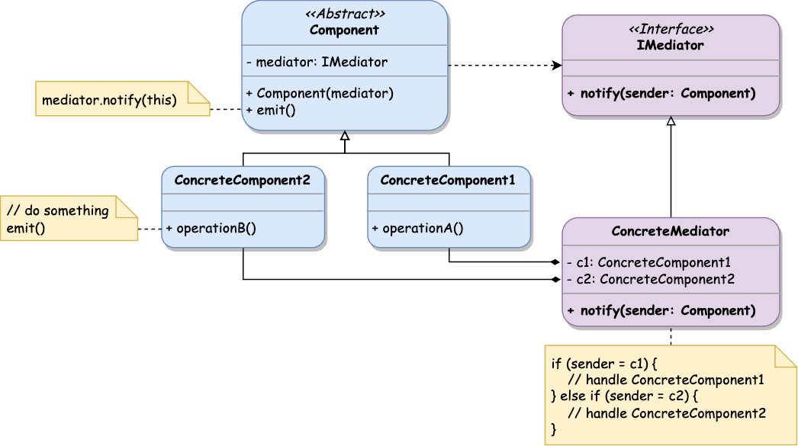

## Overview

**Behavioral patterns** distribute responsibilities between the objects and identify their communication process. These patterns help to organize complex execution flow by separating the logic between the objects.

### Materials

- 🌐 [Wikipedia - Behavioral pattern](https://en.wikipedia.org/wiki/Behavioral_pattern)
- 📝 [Source Making - Behavioral patterns](https://sourcemaking.com/design_patterns/behavioral_patterns)
- 📝 [Refactoring Guru - Behavioral Design Patterns](https://refactoring.guru/design-patterns/behavioral-patterns)
- ⌨️ [Design Patterns For Humans - Behavioral Design Patterns](https://github.com/kamranahmedse/design-patterns-for-humans#behavioral-design-patterns)
- 📚 [Design Patterns: Elements of Reusable Object-Oriented Software](https://www.amazon.com/Design-Patterns-Object-Oriented-Addison-Wesley-Professional-ebook/dp/B000SEIBB8)

## ⛓ Chain of Responsibility

**CoF** pattern lets pass requests through a chain of handlers. Each handler does its specific job and passes the request to the next handler in the chain.

The idea is to decouple the request sender and receiver and allow a few objects to handle the request. In this case, the request has an **implicit receiver**.

**CoF** pattern suggests turning particular process operations into independent objects called **handlers**. These objects are linked to a chain: each _handler_ object stores the reference to the next one and passes the request along the way.

The initial request travels along the chain until there are no more _handlers_ left or it is rejected by one of the _handlers_.

Another approach is when the only handler in the chain could process the request and passes it to the next handlers overwise. An example of this case is a browser page [events propagation](https://developer.mozilla.org/en-US/docs/Learn/JavaScript/Building_blocks/Events#event_bubbling), when the user events are passed up on the DOM tree until some element handler takes it.

#### Class Diagram


#### Structure

- **IHandler** interface specifies common handler methods
- **BaseHandler** is an optional abstract class that has some initial logic to store the next handler reference and pass a request to it
- **ConcreteHandler** class contains an actual processing logic in the specified method
- **Client** composes the chains of handlers and passes requests there

#### When to use

- When the system processes the request in different ways, but the actual way detected dynamically
- To execute several handler on the same object sequentially
- When the set of handlers and their order are defined dynamically in a runtime
- When the request can be handled by a few receiver objects and the one should be found automatically

#### Implementation



```typescript
interface IHandler {
  setNext(handler: IHandler): void;
  handle(request: any): void;
}

abstract class BaseHandler implements IHandler {
  private next: IHandler;

  public setNext(handler: IHandler): void {
    this.next = handler;
  }

  public handle(request: any): void {
    this.next?.handle(request);
  }
}

class ConcreteHandler1 extends BaseHandler {
  public handle(request: any): void {
    request.concreteHandler1 = true;
    super.handle(request);
  }
}

class ConcreteHandler2 extends BaseHandler {
  public handle(request: any): void {
    request.concreteHandler2 = true;
    super.handle(request);
  }
}
```


```typescript
// Configure the chain of handlers
const handler1 = new ConcreteHandler1();
const handler2 = new ConcreteHandler2();
handler1.setNext(handler2);

// Pass the request though the chain
const request = {};
handler1.handle(request);
console.log(request); // { concreteHandler1: true, concreteHandler2: true }
```



#### Notes

- The chain of handlers can be pre-defined in some way or assembled by the client, depending on the execution context.
- The client can pass the request to any handler in the chain, which is not required to be the first one.
- The request can be a **Command**, executing the same operation in different contexts linked into a chain.
- It might be good to have a special _catch_ handler that will be executed if no handlers have processed the original request.

#### Examples


The complete **Chain of Responsibility** implementation and examples are available .


## 🧾 Command

The **Command** pattern represents a request as a stand-alone object containing all the needed information and context. That command object can be passed to an appropriate handler to be processed immediately or later.

The **Command** pattern suggests communication between application layers using special objects rather than calling the service methods directly. Such objects contain the name of the requesting method, the object that owns this method, and the list of arguments. Different services can reuse and handle command objects using a declared interface.

#### Class Diagram


#### Structure

- **ICommand** interface declares a single method for the command execution
- **ConcreteCommand** class implements the command interface and contains all the necessary information to make a request (links the **Invoker** and the **Receiver**)
- **Invoker** class stores reference to a command object and triggers it at the requested time
- **Receiver** class contains business logic that is executed via the command
- **Client** initializes command objects with required parameters and receiver instance

#### When to use

- To track the history of the executed operations and make it possible to rollback them
- To postpone the request execution and schedule the invocation for a specific time or an action
- To design a transactional system that consists of macro operations with the same execution interface
- As an alternative to callback function arguments
- To provide a possibility of a system extension with the new logical actions without changing the existing classes

#### Implementation



```typescript
class Receiver {
  public operation(...params): void {
    console.log('Receiver operation called with', params);
  }
}

interface ICommand {
  execute(): void;
}

class ConcreteCommand implements ICommand {
  constructor(
    private receiver: Receiver,
    private params: any
  ) {}

  public execute(): void {
    this.receiver.operation(this.params);
  }
}

class Invoker {
  private command: ICommand;

  public register(command: ICommand): void {
    this.command = command;
  }

  public execute(): void {
    this.command?.execute();
  }
}
```


```typescript
const receiver = new Receiver();
const invoker = new Invoker();

const command = new ConcreteCommand(receiver, ['arg1', 'arg2']);
invoker.register(command);
invoker.execute();
```



#### Notes

- **ConcreteCommand** can perform the action logic independently or pass the execution call to the existing **Receiver** services.
- **Command** objects should be immutable and read-only.
- **Command** execution parameters can be declared as class attributes and be accessible by the **Receiver** service.
- **Command** objects might have an optional method called _undo()_ or _unexecute()_ that reverts the execution action.

#### Examples


The complete **Command** implementation and examples are available .



AWS JS SDK interface is built using the **Command** pattern: [client.ts](https://github.com/aws/aws-sdk-js-v3/blob/main/packages/smithy-client/src/client.ts), [command.ts](https://github.com/aws/aws-sdk-js-v3/blob/main/packages/smithy-client/src/command.ts).


## 🚶 Iterator

**Iterator** allows you to go over items in a collection without exposing their underlying representation (array, stack, linked list, etc.).

The pattern extracts the traversal behavior of a collection into a separate object called an _iterator_. This object encapsulates the traversal process details and provides a simple interface for accessing items and looping over them.

Usually, an _iterator_ provides a method that keeps returning elements from the collection until there are no items left. The interface should be the same for all the _iterators_.

**Iterator** can be implemented in an _external_ or _internal_ way. The client controls an _External iterator_, meaning that the external code must retrieve the following items explicitly, calling the `getNext()` method. An _internal_ iterator produces the traversal process within its own encapsulated logic, so the client can pass a function that will be executed over all the collection items.

#### Class Diagram


#### Structure

- **Iterator** interface declares collection traversal operations
- **Iterable** interface is used to specify a collection as iterable
- **ConcreteIterator** class stores a collection and implements a particular traversing logic to retrieve its items
- **ConcreteCollection** class stores collection items in any way and returns an **Iterator** object to loop over them
- **Client** manages **ConcreteCollection** and iterates over its items using the retrieved **Iterator** object

#### When to use

- To encapsulate the complexity of accessing different data structures
- To reuse the traversal logic across the system
- To provide a common access interface for a collection that is implemented with different data structures under the hood
- To support a few traversal algorithms for the same collection object

#### Implementation



```typescript
interface Iterator<Item> {
  getNext(): Item;
  hasNext(): boolean;
}

interface Iterable<Item> {
  createIterator(): Iterator<Item>;
}

class ConcreteCollection implements Iterable<string> {
  constructor(public items: string[]) {}

  createIterator(): Iterator<string> {
    return new ConcreteIterator(this);
  }
}

class ConcreteIterator implements Iterator<string> {
  private currentPosition = 0;

  constructor(private collection: ConcreteCollection) {}

  public getNext(): string {
    const currentItem = this.collection.items[this.currentPosition];
    this.currentPosition++;

    return currentItem;
  }

  public hasNext(): boolean {
    return this.currentPosition < this.collection.items.length;
  }
}
```


```typescript
const collection = new ConcreteCollection(['first', 'second', 'third']);
const iterator = collection.createIterator();

while (iterator.hasNext()) {
  console.log(iterator.getNext());
}
```



#### Notes

- The current state of the **Iterator** object should be independent to create and use more than one iterator of the same collection.
- Usually, the **Client** is not creating **Iterator** instances but retrieving them from the target collection instance. However, it is still possible to create **Iterators** explicitly.
- **Iterator** interface can declare additional helpful methods, such as `getTotal()`, `getPrevious()`, or `getCurrent()`.
- Many programming languages have built-in **Iterator** interfaces and functionality.
- It's possible to implement a few different **ConcreteIterators** for the same object to provide various ways of retrieving its data.
- **Iterator** can be used to traverse **Composite** objects tree.
- Method `createIterator()` is an example of a _factory method_ design pattern.
- Mutation of the source objects is dangerous for the depending active iterators. _Robust Iterators_ can adjust their internal state if the source object state is updated.

#### Examples


The complete **Iterator** implementation and examples are available .


## 🚦 Mediator

**Mediator** restricts direct communication between objects and couples them via a _mediator_ object. The _mediator_ object routes the calls to appropriate components.

#### Class Diagram



#### Structure

- **Component** abstract class stores mediator reference and includes a list of common methods for every concrete component
- **ConcreteComponent** class contains actual logic and communicates with other components via the **Mediator** interface
- **Mediator** interface declares common communication commands that are available for the system components
- **ConcreteMediator** stores the references to system components and redirects requests to appropriate methods

#### When to use

- To decouple the classes and avoid complex dependencies between them
- To make particular components reusable and portable
- When some component event requires actions on a bunch of different unrelated components

#### Implementation



```typescript
abstract class Component {
  constructor(private mediator: IMediator) {}

  public emit(): void {
    this.mediator.notify(this);
  }
}

interface IMediator {
  notify(sender: Component);
}

class ConcreteComponent1 extends Component {
  public operationA() {
    console.log('ConcreteComponent1.OperationA()');
  }
}

class ConcreteComponent2 extends Component {
  public operationB() {
    console.log('ConcreteComponent2.OperationB()');
  }
}

class ConcreteMediator implements IMediator {
  private c1: ConcreteComponent1;
  private c2: ConcreteComponent2;

  public setComponent1(component: ConcreteComponent1) {
    this.c1 = component;
  }

  public setComponent2(component: ConcreteComponent2) {
    this.c2 = component;
  }

  notify(sender: Component) {
    if (sender === this.c1) {
      this.c2.operationB();
    }
    if (sender === this.c2) {
      this.c1.operationA();
    }
  }
}
```


```typescript
const mediator = new ConcreteMediator();
const component1 = new ConcreteComponent1(mediator);
const component2 = new ConcreteComponent2(mediator);

mediator.setComponent1(component1);
mediator.setComponent2(component2);

component1.emit(); // Output: ConcreteComponent2.OperationB()
component2.emit(); // Output: ConcreteComponent1.OperationA()
```



#### Notes

- **Components** shouldn't rely on the concrete **Mediator** class but on its common interface.
- **Components** shouldn't be aware of each other and communicate only via a **Mediator** interface.
- **Mediator** stores the references to all the components and can manage their lifecycle.
- The **Mediator** object can become complex soon and difficult to manage.
- Components may exchange information with the **Mediator** object using the **Observer** pattern. In such a case, **Mediator** object acts as a publisher, and all its components are subscribers. 

#### Examples


The complete **Mediator** implementation and examples are available .


## 💾 Memento

**Memento** pattern allows capturing and storing the object's current state without knowledge of its class. Later, the object state can be restored.

This pattern delegates a snapshot creation to the original object that has full access to its own state.

The state snapshot should be stored in a special object called **memento**. Its state shouldn't be available for the "outside" and can be accessed only by the creator. Other objects can communicate with this object via a limited interface to get the required metadata (creation timestamp, meaningful name, etc.) but not the actual internal state.

The **Memento** can be implemented in a few different ways. Some programming languages allow using nested classes to restrict the _memento_ object access. In this case, the private _memento_ properties will be available only for its parent class.

If the programming language is not shipped with the nested classes, the _memento_ object can be restricted using an interface allowing only specified methods.

#### Class Diagram

- Implementation using nested classes (supported in C++, Java, C#):


- Common implementation:


#### Structure

- **Originator** class contains the general state and makes its snapshots using **Memento** objects
- **Memento** class holds a state snapshot that can be restored at will
- **Caretaker** class stores state historical snapshots, and triggers restore operations 

#### When to use

- When the application needs to have an "undo" mechanism to restore the historical state of a particular objects
- When snapshot object data has to be kept private and accessible only by the original object initiating it

#### Implementation



```typescript
class Originator {
  private state: Object = {};

  public setState(state: Object) {
    this.state = { ...state };
  }

  public save(): Memento {
    return new Memento(this.state);
  }

  public restore(memento: Memento): void {
    this.state = { ...memento.getState() };
  }
}

class Memento<T = Object> {
  constructor(private state: T) {}

  public getState(): T {
    return this.state;
  }
}

class Caretaker {
  private history: Memento[] = [];

  constructor(private originator: Originator) {}

  public backup() {
    const memento = this.originator.save();
    this.history.push(memento);
  }

  public undo() {
    const memento = this.history.pop();
    this.originator.restore(memento);
  }
}
```


```typescript
interface Memento {
  restore(): void;
}

interface Originator {
  save(): Memento;
}

class ConcreteOriginator implements Originator {
  private state: Object;

  public save(): Memento {
    return new ConcreteMemento(this, this.state);
  }

  public setState(state: Object) {
    this.state = { ...state };
  }
}

class ConcreteMemento implements Memento {
  constructor(
    private originator: ConcreteOriginator,
    private state: Object
  ) {}

  public restore(): void {
    this.originator.setState(this.state);
  }
}

class Caretaker {
  constructor(
    private originator: Originator,
    private history: Memento[] = []
  ) {}

  public backup() {
    const memento = this.originator.save();
    this.history.push(memento);
  }

  public undo(): void {
    const memento = this.history.pop();
    memento.restore();
  }
}
```



#### Notes

- **Memento** object should be immutable and initialized once created.
- **Memento** object should encapsulate its state and limit access to it. Only the **Originator** should be able to retrieve and use _memento_ state.
- Either **Memento** or **Caretaker** can trigger the state restore operation, depending on the implementation.
- Producing a vast number of **Memento** objects might consume lots of RAM.
- The **Command** object can act as a Caretaker and store a **Memento** object instance. Undo of this command will run Memento restore and revert **Originator** object to the previous state.

#### Examples


The complete **Memento** implementation and examples are available .


## 🔭 Observer

**Observer** pattern provides a subscription mechanism to notify a group of objects about the occurred events with the object they are observing.

The pattern suggests the following terminology:

- **Subject** is a part of an object state that other objects are interested in.
- **Publisher** object that contains that _subject_ modifies it and notifies the other objects.
- **Subscriber** object that is interested in _subject_ data and wants to receive its updates.

The **Observer** suggests adding a subscription mechanism to the **Publisher** class that will allow particular **Subscribers** to receive update events once the **Subject** is modified.

#### Class Diagram


#### Structure

- **Publisher** class stores a list of subscribers and notifies them when some event has happened
- **Subscriber** interface declares a handle mthod that has to be implemented on every subscriber
- **ConcreteSubscriber** class implements a specific handler and processes the events issued by the **Publisher**
- **Client** initializes **Subscribers** and registers them within a **Publisher** instance

#### When to use

- When an object update requires corresponding actions in related objects, which are defined dynamically
- When an object needs to retrieve some specific events once they occur without examining the target instance
- When the publisher object has to notify other objects with a particular event being unaware of the concrete receivers

#### Implementation



```typescript
interface ISubscriber {
  handle(event: Object): void;
}

class Publisher {
  private subscribers: ISubscriber[] = [];

  public subscribe(subscriber: ISubscriber): void {
    this.subscribers.push(subscriber);
  }

  public unsubscribe(subscriber: ISubscriber): void {
    this.subscribers = this.subscribers.filter(s => s!== subscriber);
  }

  public notify(event: Object): void {
    for (const subscriber of this.subscribers) {
      subscriber.handle(event);
    }
  }
}

class ConcreteSubscriber1 implements ISubscriber {
  public handle(event: Object): void {
    console.log('Subscriber1 received an event:', JSON.stringify(event));
  }
}

class ConcreteSubscriber2 implements ISubscriber {
  public handle(event: Object): void {
    console.log('Subscriber2 received an event:', JSON.stringify(event));
  }
}
```


```typescript
const publisher = new Publisher();

const subscriber1 = new ConcreteSubscriber1();
publisher.subscribe(subscriber1);

const subscriber2 = new ConcreteSubscriber2();
publisher.subscribe(subscriber2);

publisher.notify({ message: 'Some updates!' });
// Subscriber1 received an event: {"message":"Some updates!"}
// Subscriber2 received an event: {"message":"Some updates!"}

publisher.unsubscribe(subscriber1);
publisher.notify({ message: 'More updates!' });
// Subscriber2 received an event: {"message":"More updates!"}
```



#### Notes

- **Publisher** should notify its subscribers only over the **Subscriber** interface to avoid coupling with concrete classes.
- **Subscriber** can retrieve the necessary information from the **Publisher** object on its own. The **Publisher** should pass its reference along with an event in this case.
- **Subscribers** are notified in a random order, so the system shouldn't rely on sequential event processing.

#### Examples


The complete **Observer** implementation and examples are available .


## 🎰 State

**State** pattern allows an object to change its behavior once its internal state got changed.

It corresponds to a **finite-state machine** concept, meaning that at any moment, a program can be in one of the possible _finite states_. In every state, the program behaves differently and can switch the state immediately. The switching rules are called **transitions** which are also _finite_ and _predetermined_.

**State** pattern suggests creating new classes for every possible object state and moving the state-depending logic there. The original instance, called **context**, contains a reference to the current state object and delegates state-related work to it.

All the **state** objects must conform to the same interface, which makes it possible to switch from one state to another in the runtime.

#### Class Diagram


#### Structure

- **Context** contains a reference to the current **ConcreteState** object and delegates state-specific logic to it
- **State** interface declares a set of state-specific methods common for all the possible states
- **ConcreteState** implements state-specific methods and might alter the **Context** state

#### When to use

- When the object needs to have different behavior depending on the current state
- When the number of possible object states is finite
- When the class has a vast number of conditional logic that depends on specific class properties
- To avoid code duplication across similar object states and state transitions

#### Implementation



```typescript
interface IState {
  operation(): void;
}

class Context {
  private state: IState;

  constructor() {
    this.state = new ConcreteState1(this);
  }

  public setState(state: IState): void {
    this.state = state;
  }

  public operation(): void {
    this.state.operation();
  }
}

class ConcreteState1 implements IState {
  constructor(private context: Context) {}

  public operation(): void {
    console.log('State #1 is used');
    const nextState = new ConcreteState2(this.context);
    this.context.setState(nextState);
  }
}

class ConcreteState2 implements IState {
  constructor(private context: Context) {}

  public operation(): void {
    console.log('State #2 is used');
    const nextState = new ConcreteState1(this.context);
    this.context.setState(nextState);
  }
}
```


```typescript
const context = new Context();
context.operation(); // State #1 is used
context.operation(); // State #2 is used
context.operation(); // State #1 is used
```



#### Notes 

- Particular states may be aware of each other and initiate a transition from one state to another.
- Both **State** and **Context** objects might trigger the state transition.
- State objects can store a reference to the **context** object to retrieve the necessary information or initiate a transition.
- The pattern usage might be unnecessary if an object has only a few concrete states or rarely changes.
- The **State** interface can be converted into an abstract class to contain state methods implementation duplicated in various state classes.

#### Examples


The complete **State** implementation and examples are available .


## ♟ Strategy

**Strategy** pattern allows switching the algorithm or strategy at runtime based upon the situation.

The pattern suggests extracting all the algorithms into separate classes (**strategies**) from the class (**context**) that does the same work in many different ways.

The **context** class stores a reference to the currently used **strategy** and delegates the work to it. The **context** class is not coupled with the concrete strategies implementation and calls them using a generic interface. The **Client** logic decides which specific strategy must be used to process its task.

#### Class Diagram


#### Structure

- **Context** refers to the chosen **ConcreteStrategy** object and delegates work to it, using a common **Strategy** interface
- **Strategy** interface declares a method that executes an algorithm implemented in a particular strategy
- **ConcreteStrategy** implements different variations of the algorithm used by **Context**
- **Client** initializes a required strategy and passes it to the **Context**

#### When to use

- When the object can provide several variations of the underlying algorithm that must be selected in a runtime
- When several classes only differ in the way of implementing a particular behavior logic
- To isolate business logic from the main context class, which shouldn't be aware of its actual implementation
- When the suggested algorithm is selected using conditional statements inside the operation method

#### Implementation



```typescript
interface Strategy {
  execute(): void;
}

class Context {
  constructor(private strategy: Strategy) {}

  public setStrategy(strategy: Strategy): void {
    this.strategy = strategy;
  }

  public operation(): void {
    this.strategy.execute();
  }
}

class ConcreteStrategy1 implements Strategy {
  public execute(): void {
    console.log(`Process request using Strategy #1`);
  }
}

class ConcreteStrategy2 implements Strategy {
  public execute(): void {
    console.log(`Process request using Strategy #2`);
  }
}
```


```typescript
const strategy1 = new ConcreteStrategy1();
const strategy2 = new ConcreteStrategy2();

const context = new Context(strategy1);
context.operation(); // Process request using Strategy #1

context.setStrategy(strategy2);
context.operation(); // Process request using Strategy #2
```



#### Notes

- The **Client** is responsible for the strategy selection, so it must be aware of the existing options.
- **Strategy** pattern can be implemented with _lambdas_ or _anonymous functions_ instead of raising separate classes per each algorithm variation.
- **Strategy** is very similar to the **State** pattern, hoverer the main difference in their intents. Different **Strategies** are independent and unaware of each other, while **State** knows about the other possible states and can trigger the transition itself.  

#### Examples


The complete **Strategy** implementation and examples are available .


## 📋 Template Method

**Template Method** defines the skeleton in a superclass of how certain algorithms could be performed but lets subclasses override particular steps of these algorithms.

This pattern suggests breaking down an algorithm into a sequence of steps stored in separate methods, that are invoked in a proper order inside a single _template method_. To use the algorithm, the client code should create a subclass and override specific step methods but not the _template method_ itself.

There are a few types of steps:

- **abstract steps** must be implemented by every subclass
- **optional steps** provide a default implementation but can be overridden
- **hooks** are optional steps with an empty body providing additional extension points for an algorithm

#### Class Diagram


#### Structure

- **AbstractClass** contains the `templateMethod()`, which logic is split across the step methods
- **ConcreteClass** inherits the **AbstractClass** and implements or overrides specific step methods for the concrete algorithm

#### When to use

- When clients need to extend only particular steps of an algorithm but keep the whole structure unchanged
- When the several classes contain a similar algorithm but having minor implementation differences

#### Implementation



```typescript
abstract class AbstractClass {
  public templateMethod(): void {
    this.step1();
    if (this.step2()) {
      this.step3();
    }
  }

  protected abstract step1(): void;

  protected step2(): boolean {
    return true;
  }

  protected step3(): void {
    console.log('AbstractClass: Execute step #1');
  }
}

class ConcreteClass1 extends AbstractClass {
  protected step1(): void {
    console.log('ConcreteClass1: Execute step #1');
  }

  protected step2(): boolean {
    return false;
  }
}

class ConcreteClass2 extends AbstractClass {
  protected step1(): void {
    console.log('ConcreteClass2: Execute step #1');
  }

  protected step3(): void {
    console.log('ConcreteClass2: Execute step #3');
  }
}
```


```typescript
const concreteClass1 = new ConcreteClass1();
concreteClass1.templateMethod();
// ConcreteClass1: Execute step #1

const concreteClass2 = new ConcreteClass2();
concreteClass2.templateMethod();
// ConcreteClass2: Execute step #1
// ConcreteClass2: Execute step #3
```



#### Notes

- **Template method** is pretty limited if the client needs to alter an algorithm structure.
- **Template method** extends the **Factory Method** pattern, but some algorithm steps can still be implemented using the **Factory Method**.

#### Examples


The complete **Template Method** implementation and examples are available .


## 👀 Visitor
<!---------- EDITORIAL MARK ---------->
**Visitor** pattern allows extending an object's behavior through a specified interface without having to modify it.

The pattern suggests you move the unrelated logic into a separate class called **Visitor**. Also, the extendable class should contain only one `apply()` method that receives a **Visitor** instance and passes the current object context to it.

The concrete **Visitor** class implements the behavior for handling all the known target classes. It can be done in two different ways:

1. **Method overloading**. The **Visitor** methods have the same name and can identify the incoming visiting object instance by its class
2. **Different visiting method names**. The **Visitor** implements a specific method per every visiting class, and each visited class calls that method

The pattern uses the **Double Dispatch** technic that allows calling a proper method on a target class in a hierarchy. The visited object selects the **Visitor** method instead of letting the **Visitor** identify the appropriate class by its instance.

The problem and solution using the **Double Dispatch** approach are shown below:



```java
class Visitor {
  public void talkTo(Creature creature) {
    System.out.println("I am a creature");
  }
  public void talkTo(Animal animal) {
    System.out.println("I am an animal");
  }
  public void talkTo(Cat cat) {
    System.out.println("I am a cat");
  }
}

// Creature -> Animal -> Cat
class Creature {}
class Animal extends Creature {}
class Cat extends Animal {}

public class Main {
  public static void main(String args[]) {
    Creature cat = new Cat();
    new Visitor().talkTo(cat); // Outputs "I am a creature", but we need a Cat!
  }
}
```


```java
class Visitor {
  public void talkTo(Creature creature) {
    System.out.println("I am a creature");
  }
  public void talkTo(Animal animal) {
    System.out.println("I am an animal");
  }
  public void talkTo(Cat cat) {
    System.out.println("I am a cat");
  }
}

// Creature -> Animal -> Cat
class Creature {
  public void apply(Visitor visitor) {
    visitor.talkTo(this);
  }
}
class Animal extends Creature {
  public void apply(Visitor visitor) {
    visitor.talkTo(this);
  }
}
class Cat extends Animal {
  public void apply(Visitor visitor) {
    visitor.talkTo(this);
  }
}

public class Main {
  public static void main(String args[]) {
    Creature cat = new Cat();
    cat.apply(new Visitor()); // Outputs "I am a cat", that's what we need!
  }
}
```




A detailed explanation of the **Double Dispatch** mechanism see in the [Refactoring Guru - Visitor and Double Dispatch](https://refactoring.guru/design-patterns/visitor-double-dispatch) article.


#### Class Diagram


#### Structure

- **IVisitor** interface declares a method for every known **ConcreteElement** that receives the element instance via an argument
- **ConcreteVisitor** implements **IVisitor** interface and contains the logic that can be run on every known **ConcreteElement**
- **IElement** interface declares a single method that accepts an **IVisitor** instance and passes the current object context to it
- **ConcreteElement** implements the acceptance method from the **IVisitor** interface with its own context
- **Client** initiates the **Visitors** classes and runs them on the existing elements by calling the `accept()` method and passing a **ConcreteVisitor** instance to it

#### When to use

- When you need to add some logic to the existing complex structure, which consists of the different objects
- To be able to add some behavior to the existing classes without modifying them
- When the aimed logic has to be different depending on the target classes
- To move out the unrelated functionality from the class into other appropriate classes

#### Implementation



```typescript
interface IVisitor {
  visit(element: ConcreteElementA): void;
  visit(element: ConcreteElementB): void;
}

interface IElement {
  accept(visitor: IVisitor): void;
}

class ConcreteElementA implements IElement {
  constructor(public propA: any) {}

  public accept(visitor: IVisitor): void {
    visitor.visit(this);
  }
}

class ConcreteElementB implements IElement {
  constructor(public propB: any) {}

  public accept(visitor: IVisitor): void {
    visitor.visit(this);
  }
}

class ConcreteVisitor implements IVisitor {
  visit(element: ConcreteElementA): void;
  visit(element: ConcreteElementB): void;
  visit(element: ConcreteElementA | ConcreteElementB): void {
    if (element instanceof ConcreteElementA) {
      console.log(`Visit ConcreteElementA.propA: ${element.propA}`);
    }
    if (element instanceof ConcreteElementB) {
      console.log(`Visit ConcreteElementB.propB: ${element.propB}`);
    }
  }
}
```


```typescript
const elements = [
  new ConcreteElementA('Sun'),
  new ConcreteElementB('Moon')
];
const visitor = new ConcreteVisitor();

for (const element of elements) {
  element.accept(visitor);
}
/** 
 * Output:
 *  Visit ConcreteElementA.propA: Sun
 *  Visit ConcreteElementB.propB: Moon
 */
```



#### Notes

- **Visitor** methods can have the same name (e.g., `visit()`) but a different type of argument if the particular programming language supports method overloading.
- **Client**, in most cases, is using the **Composite** pattern to traverse over all the existing elements and call some operations on them.
- **Visitor** pattern still forces you to add new logic to the existing classes, but it allows you to introduce as many new **Visitor** classes as needed in the future.
- **Double Dispatch** technic solves the problem of compiled typed programming languages (Java, C#, etc.) supporting method overloading (not TypeScript).

#### Examples


The complete **Visitor** implementation and examples are available .

