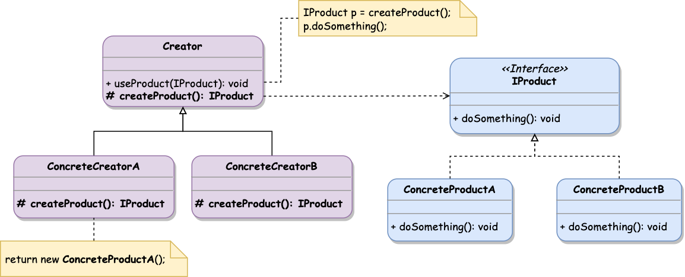
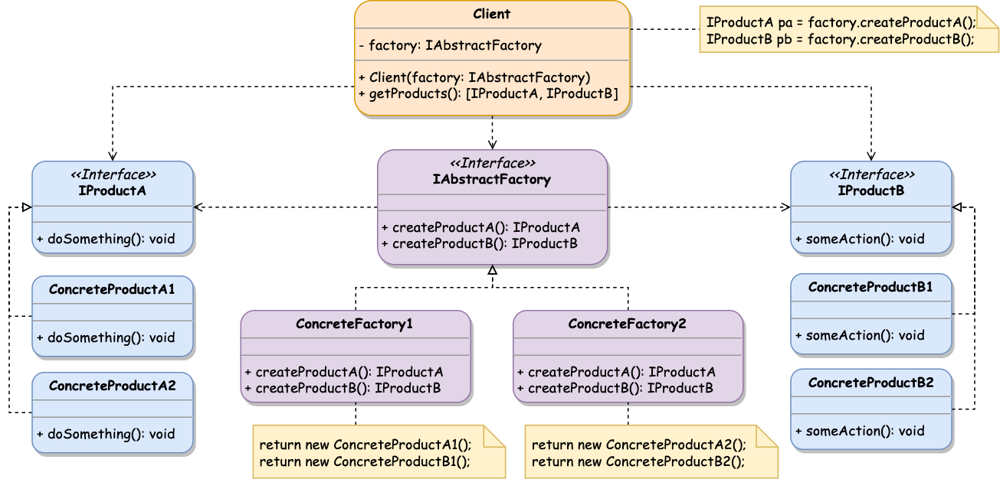
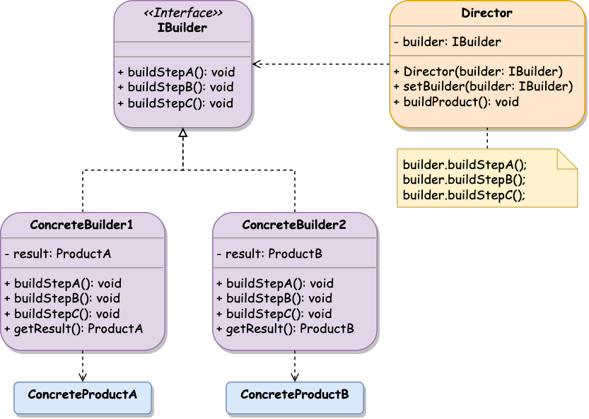
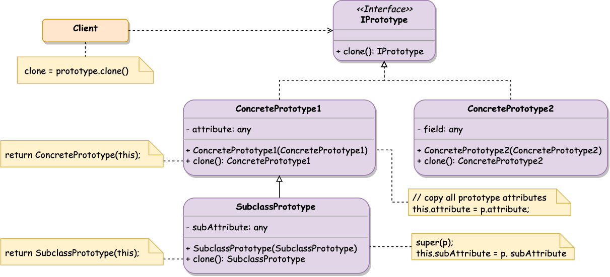
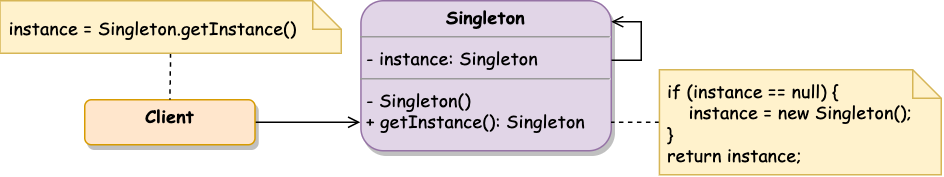
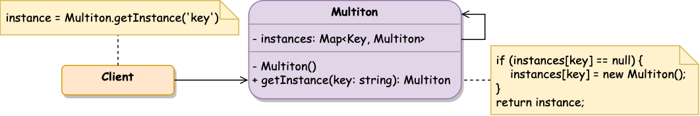
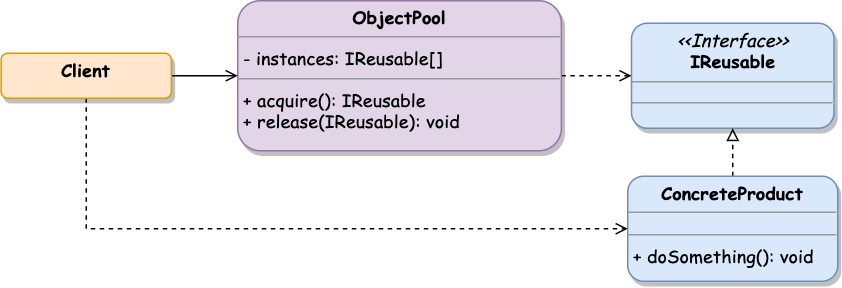

## Overview

**Creational patterns** represent how objects or groups of related objects are initialized. They help to make the system independent of how the objects are created and composed.

**Creational patterns** encapsulate the information about concrete classes used in a system and hide initialization details. Instead of the classes themselves, the system relies on their interfaces.

## 🏭 Factory Method 

**Factory Method** provides an interface for object creation via a _superclass_ that delegates initialization logic to its _child classes_.

#### Class Diagram



#### Structure

- **Product** describes an object's interface returned from the **Creator's** factory method and subclasses
- **ConcreteProduct** is a particular implementation of the **Product** interface, which will differ per **Creator** implementation
- **Creator** is a class containing a _factory method_ and returning contextual **Product** implementations by initiating the new objects
- **ConcreteCreator** is a class that extends the **Creator** class and overrides (implements) its factory method

#### When to use

- Provide a way to extend a system with the custom component implementation.
- Reuse the logic for new object creation.
- When there is a generic processing class, the client doesn’t know what exact objects it needs and decides it in a runtime.

#### Implementation



```typescript
interface IProduct {
  doSomething(): void;
}

class ConcreteProductA implements IProduct {
  public doSomething(): void {
    console.log('Use Concrete Product A');
  }
}

class ConcreteProductB implements IProduct {
  public doSomething(): void {
    console.log('Use Concrete Product B');
  }
}

abstract class Creator {
  protected abstract createProduct(): IProduct; // the factory method

  public useProduct(): void {
    const product = this.createProduct();
    product.doSomething();
  }
}

class ConcreteCreatorA extends Creator {
  protected createProduct(): IProduct {
    return new ConcreteProductA();
  }
}

class ConcreteCreatorB extends Creator {
  protected createProduct(): IProduct {
    return new ConcreteProductB();
  }
}
```



#### Notes

- The **Creator** class can initialize the **Product** objects and contain a logic that uses them.
- The **Creator** class can provide a default implementation in the `createProduct()` method instead of declaring it as blank _abstract_.
- The **Creator** class can return the **Product** object from various sources (cache, third-party) instead basic creation of the new instances.

#### Examples


The complete **Factory Method** implementation with examples is available .


## 🏘 Abstract Factory

**Abstract Factory** allows creating the group of related objects without specifying their concrete classes. This factory produces a family of products with a particular variant.

The example below demonstrates UI elements (products) family presented via platform-specific variants:

| Variant / Product | Input | Checkbox | RadioButton |
| --- | --- | --- | --- |
| Browser | `InputTag` | `CheckboxTag` | `RadioTag` |
| MacOS | `UIInput` | `UICheckbox` | `UIRadio` |
| Windows | `WinInput` | `WinCheckbox` | `WinRadioButton` |

#### Class Diagram



#### Structure

- **Product** interface declares a common product structure
- **ConcreteProduct** implements different variants of the abstract **Product**
- **AbstractFactory** interface declares creation methods per each abstract **Product**
- **ConcreteFactory** implements abstract factory methods returning **ConcreteProduct** objects
- **Client** uses only abstract **Product** and **AbstractFactory** interfaces to work with the concrete products

#### When to use

- When a system shouldn't depend on the included internal objects.
- When a group of related objects included in a particular module should be used together.
- A system needs to be configured by a group of related objects.
- A module needs to work with different variants of the same group of objects.
- You need to provide a library of components specified by their interfaces, not the actual implementation.
- To evolve the architecture implemented with **Factory Methods** pattern.

#### Implementation



```typescript
interface IProductA { // general Product A
  doSomething(): void;
}

interface IProductB { // general Product B
  someAction(): void;
}

class ConcreteProductA1 implements IProductA { // Product A, Variant 1
  doSomething(): void {}
}

class ConcreteProductA2 implements IProductA { // Product A, Variant 2
  doSomething(): void {}
}

class ConcreteProductB1 implements IProductB { // Product B, Variant 1
  someAction(): void {}
}

class ConcreteProductB2 implements IProductB { // Product B, Variant 2
  someAction(): void {}
}

// Abstract Factory producing variants of ProductA and ProductB
interface IAbstractFactory {
  createProductA(): IProductA;
  createProductB(): IProductB;
}

// Factory implementation, producing Variant 1
class ConcreteFactory1 implements IAbstractFactory {
  public createProductA(): IProductA {
    return new ConcreteProductA1();
  }

  public createProductB(): IProductB {
    return new ConcreteProductB1();
  }
}

// Factory implementation, producing Variant 2
class ConcreteFactory2 implements IAbstractFactory {
  public createProductA(): IProductA {
    return new ConcreteProductA2();
  }

  public createProductB(): IProductB {
    return new ConcreteProductB2();
  }
}

class Client {
  constructor(private factory: IAbstractFactory) {}

  getProducts(): [IProductA, IProductB] {
    return [
      this.factory.createProductA(),
      this.factory.createProductB()
    ];
  }
}
```



#### Notes

- **Client** class must use the interfaces provided by abstract classes, not by their concrete implementation.
- **ConcreteFactory** can be implemented as a **Singleton**.

#### Examples


The complete **Abstract Factory** implementation with examples is available .


## 👷 Builder

**Builder** lets you construct complex objects step by step. It allows to create different representations of the object using a construction code instructions.

#### Class Diagram



#### Structure

- **Builder** interface declares **Product** construction steps common for all builders
- **ConcreteBuilder** implements object construction steps
- **Product** is a resulting object created by **ConcreteBuilder**
- **Director** produces a list of building operations in a particular order to create a **Product** with a specified **Builder** implementation

#### When to use

- When a class provides a lot of configurations that need to be passed via its constructor.
- To create a different concrete object representation of some product (class).
- The complex object creation process is independent of object parts and the relation between them.

#### Implementation



```typescript
class ConcreteProductA {
  constructor(public param1 = 0, public param2 = false,public param3 = ''){}
}

class ConcreteProductB {
  constructor(public option1 = 1, public option2 = '') {}
}

interface IBuilder {
  buildStepA(): void;
  buildStepB(): void;
  buildStepC(): void;
}

class ConcreteBuilder1 implements IBuilder {
  private result = new ConcreteProductA();

  public buildStepA(): void {
    this.result.param1 = 1;
  }

  public buildStepB(): void {
    this.result.param2 = true;
  }

  public buildStepC(): void {
    this.result.param3 = 'Built with Concrete Builder 1';
  }

  public getResult(): ConcreteProductA {
    return this.result;
  }
}

class ConcreteBuilder2 implements IBuilder {
  private result = new ConcreteProductB();

  public buildStepA(): void {
    this.result.option1 = 2;
  }

  public buildStepB(): void {
    this.result.option2 = 'Built with Concrete Builder 2';
  }

  public buildStepC(): void {} // just ignore this step :)

  public getResult(): ConcreteProductB {
    return this.result;
  }
}

class Director {
  private builder: IBuilder | null = null;

  public setBuilder(builder: IBuilder) {
    this.builder = builder;
  }

  public buildProduct() {
    this.builder?.buildStepA();
    this.builder?.buildStepB();
    this.builder?.buildStepC();
  }
}
```



#### Notes

- The **Client** (or system code) is not receiving the built object directly from the **Director**. Instead, once the **Director** has finished building operations, the **Client** should take the result object from the **ConcreteBuilder**.

#### Examples


The complete **Builder** implementation with examples is available .


## 🧬 Prototype

**Prototype** pattern allows to clone existing objects without dependencies on their classes. This pattern delegates the cloning process to the actual object being cloned.

To make an object a prototype, it has to provide the `clone()` method that creates an object of the current class and copies the state (methods, public/protected/private fields) to the newly created instance.

#### Class Diagram



#### Structure

- **Prototype** interface declares a cloning method
- **ConcretePrototype** implements a cloning method from **Prototype** interface where coping current's object state in a new object instance and dealing with the corresponding edge cases
- **Client** makes a copy of any object that conforms **Prototype** interface

#### When to use

- When the code shouldn't depend on the concrete class of the cloned object.
- To reduce the number of subclasses that only differ in the way they initialize objects.
- To avoid building complex inheritance chains and factories for making various product variations.
- When the object can have a limited number of states, it might be simpler to create a corresponding amount of prototypes and clone them instead of reproducing the object state from scratch.

#### Implementation



```typescript
interface IPrototype {
  clone(): IPrototype;
}

class ConcretePrototype1 implements IPrototype {
  public attribute: any = 'default';

  constructor(prototype?: ConcretePrototype1) {
    if (prototype) {
      Object.assign(this, prototype); // copies all fields to 'this'
    }
  }

  public clone(): ConcretePrototype1 {
    return new ConcretePrototype1(this);
  }
}

class SubclassPrototype extends ConcretePrototype1 {
  private subAttribute = 'default';

  constructor(prototype?: SubclassPrototype) {
    super(prototype);
    if (prototype) {
      this.subAttribute = prototype.subAttribute;
    }
  }

  public clone(): SubclassPrototype {
    return new SubclassPrototype(this);
  }
}

const subclassPrototype = new SubclassPrototype();
subclassPrototype.attribute = 'modified';
subclassPrototype.subAttribute = 'modified';

const copy = subclassPrototype.clone(); // creates identical copy
```



#### Notes

- Prototype's `clone()` implementation can be tricky if the object has circular dependencies or non-primitive attributes (all the referenced objects need to be cloned as well).

#### Examples


The complete **Prototype** implementation with examples is available .


## 🥇 Singleton

**Singleton** pattern allows to create a single instance of the class and returns it for all future calls.

Another implementation called **Multiton** allows to manage a map of instances identified by their unique keys.

#### Class Diagram

Original **Singleton** class diagram:



Modified **Multiton** diagram:



#### Structure

- **Singleton** class, declaring a static method that returns the same instance per every invocation
- **Client** accessing **Singleton** class to retrieve the shared instance

#### When to use

- The object represents a single shared resource that has to be available everywhere (for example, a database connection or a file descriptor).
- To share the objects across the system safely as opposed to global variables.

#### Implementation



```typescript
class Singleton {
  static instance: Singleton = null;

  private constructor() {}

  public static getInstance(): Singleton {
    if (!this.instance) {
      this.instance = new Singleton();
    }
    return this.instance;
  }
}

console.log(Singleton.getInstance() === Singleton.getInstance()); // true
```



#### Notes

- **Singleton** `instance` and `getInstance()` must be implemented as _static_ class fields.
- **Singleton** constructor must be declared as _private_ to prevent the creation of new instances outside the class.
- In multithread environments, the processes should be synchronized to avoid the parallel creation of the singleton instance.
- Spawning a lot of singletons might affect the system design with the overused global data.

#### Examples


The complete **Singleton** and **Multiton** implementations are available .


## 🏊‍♂️ Object Pool

The **Object Pool** pattern is designed to reuse the already initiated objects rather than allocating and destroying them on demand. It's most efficient when object initialization is time-consuming, and the existing allocated objects can be reused (for example, database connection).

**Object Pool** creates a set of objects used by the _client_ logic for a relatively short period of time. When a _client_ needs the object, it takes that from the pool. After the object is no longer needed, it is returned to the pool for future usage by other system components. If the request object does not exist in the pool, it should be initialized.


In computer science, a **pool** is a collection of resources that are kept, in memory, ready to use, rather than the memory acquired on use and the memory released afterward.


#### Class Diagram



#### Structure

- **ObjectPool** is a class that manages the initialized objects
- **ConcreteProduct** is the class which instances will be stored on the pool
- **Client** is a system logic using objects from the pool

#### When to use

- When the same objects need to be reused across the app for the short time operations.
- When the frequently reused object's initialization is time expensive.
- For objects that store connection (database, sockets) or large objects (graphics, binaries).

#### Implementation



```typescript
class ConcreteProduct {
  constructor() {
    console.log('Concrete Product is initialized');
  }
}

class ObjectPool {
  private instances: ConcreteProduct[] = [];

  public acquire(): ConcreteProduct {
    if (this.instances.length > 0) {
      // removes the first array item and returns it
      return this.instances.pop();
    }

    // initializing the new instance
    return new ConcreteProduct();
  }

  public release(concreteProduct: ConcreteProduct): void {
    this.instances.push(concreteProduct);
  }
}

const objectPool = new ObjectPool();
const concreteProduct1 = objectPool.acquire();
const concreteProduct2 = objectPool.acquire();
console.log('Are products the same?', concreteProduct1 === concreteProduct2);

objectPool.release(concreteProduct1);
const concreteProduct3 = objectPool.acquire();
console.log('Are products the same?', concreteProduct1 === concreteProduct3);
```



#### Notes

- **Object Pool** is generally implemented via a **Singleton** to make the stored instances reusable across the whole app.
- **Object Pool** can have an additional object management logic such as time-to-live and the objects storage limitation.
- Make sure that the pollable objects can be reused and the application doesn't mutate them during the usage.
- Once the **Client** releases the object, it has to finish using it to prevent parallel usage once another service takes the object.

#### Examples


The complete **Object Pool** implementation is available .

