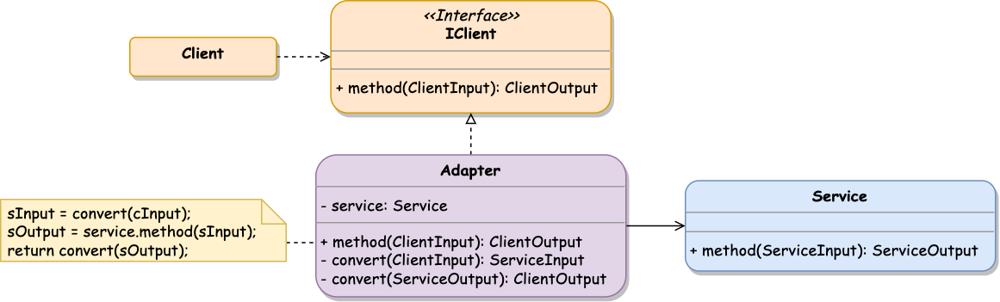
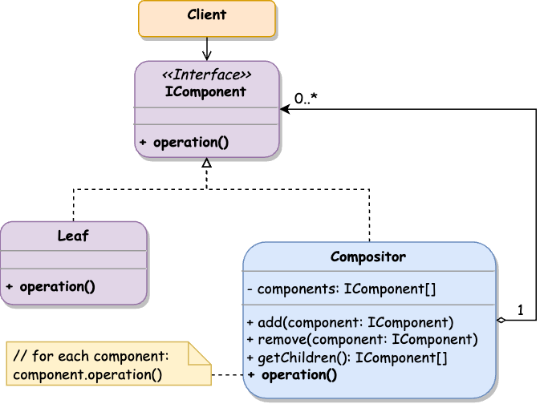

## Overview

**Structural patterns** define the way of assembling objects and classes into complex structures, keeping these structures flexible and efficient at the same time.

### Materials

- 🌐 [Wikipedia - Structural pattern](https://en.wikipedia.org/wiki/Structural_pattern)
- 📝 [Source Making - Structural patterns](https://sourcemaking.com/design_patterns/structural_patterns)
- 📝 [Refactoring Guru - Structural Design Patterns](https://refactoring.guru/design-patterns/structural-patterns)
- ⌨️ [Design Patterns For Humans - Structural Design Patterns](https://github.com/kamranahmedse/design-patterns-for-humans#structural-design-patterns)
- 📚 [Design Patterns: Elements of Reusable Object-Oriented Software](https://www.amazon.com/Design-Patterns-Object-Oriented-Addison-Wesley-Professional-ebook/dp/B000SEIBB8)

## 🔌 Adapter

**Adapter** pattern connects objects with incompatible interfaces and allows them to collaborate with each other. The _Adapter_ is a special object that converts the interface of one object to make it usable by other services.

#### Class Diagram



#### Structure

- **Client** contains business logic that uses **Service** functionality
- **IClient** interface that describes how **Client** works
- **Service** is a class that the **Client** can't use directly because of incompatible interfaces
- **Adapter** is a middleware class that proxies **Service** methods invocation from the **Client** and converts input/output parameters to the corresponding interfaces

#### When to use

- When there is an existing system or third-party class that does its job well but has an incompatible interface and can't be used directly from the target module
- To integrate modern services with a legacy codebase 
- For reusable classes that must be consumed by the future modules whose interfaces are unknown in advance 

#### Implementation



```typescript
// Client works with strings
interface IClient {
  method(input: string): string;
}

// Service works with numbers
class Service {
  public method(input: number): number {
    return input ** 2;
  }
}

class Adapter implements IClient {

  private service = new Service();

  // allows to call Service.method with a string argument
  public method(input: string): string {
    const serviceInput = this.convertInput(input);
    const serviceOutput = this.service.method(serviceInput);
    const clientOutput = this.convertOutput(serviceOutput);

    return clientOutput;
  }

  private convertInput(input: string): number {
    return Number.parseInt(input, 10);
  }

  private convertOutput(output: number): string {
    return output.toString();
  }
}

const adapter = new Adapter();
const result = adapter.method('64');
```



#### Notes

- **Adapter** can implement a required functionality that the **Client** requests but missing in the adopted class.
- **Adapter** is used for already existing classes, while the **Bridge** is used to build new connections.

#### Examples


The complete **Adapter** implementation and examples are available .


## 🌉 Bridge

**Bridge** pattern is used to split a large class (or classes) into separate hierarchies (_abstractions_ and _implementations_) that can be managed independently.

If the object has some additional characteristic, it can be extracted into a separate class hierarchy instead of extending the existing classes. The old and new classes will be connected via a _bridge_ represented by a common interface.

The **Bridge** pattern consists of _abstraction_ and _implementation_:

- **Abstraction** is a high-level control interface describing the underlying entities.
- **Implementation** layer provides a logic that conforms to **Abstraction** interfaces.

#### Class Diagram


#### Structure

- **Abstraction** provides high-level control logic that relies on the **Implementation**
- **Implementation** declares an interface that is common for all concrete implementations. An **Abstraction** can communicate with the **ConcreteImplementation** only over this interface
- **Client** links the **Abstraction** with a **ConcreteImplementation** and works with its methods
- **RefinedAbstraction** (optional) may provide various control logic flows

#### When to use

- To divide a monolithic class that has a few variants of some logical functionality
- To extend a module in several independent dimensions
- When you need to switch implementations in the runtime
- When the implementation changes shouldn't affect the client's abstraction

#### Implementation



```typescript
interface Implementation {
  method1(): void;
  method2(): void;
}

class ConcreteImplementation1 implements Implementation {
  public method1(): void {
    console.log('Method1 from Implementation1 is called');
  }

  public method2(): void {
    console.log('Method2 from Implementation1 is called');
  }
}

class ConcreteImplementation2 implements Implementation {
  public method1(): void {
    console.log('Method1 from Implementation2 is called');
  }

  public method2(): void {
    console.log('Method2 from Implementation2 is called');
  }
}

class Abstraction {
  constructor(private implementation: Implementation) {}

  public feature(): void {
    this.implementation.method1();
    this.implementation.method2();
  }
}

const implementation = new ConcreteImplementation2();
const abstraction = new Abstraction(implementation);
abstraction.feature();
```



#### Examples


The complete **Bridge** implementation with examples is available .


## 🪆 Composite

**Composite** composes objects into tree structures and allows working with them as if they were individual objects. This pattern makes sense only when the system model has a tree structure.

The idea is that each object in a tree can manage its nested objects via a common interface. Once a method is called on a root object, it is passed down the tree to get the result by examining all the underlying entities.

#### Class Diagram



#### Structure

- **IComponent** interface declares the common operations for composable **Leafs** and **Compositors** in the tree
- **Leaf** is an elemental building block of a system that contains logic and doesn't have nested elements 
- **Compositor** is a container class that holds nested **Leafs** or other containers

#### When to use

- When the system is represented by a tree-like structure
- To produce the same operations on both _primitive components_ and _complex containers_
- When the system hierarchy has a recursive composition

#### Implementation



```typescript
interface IComponent {
  operation(): void;
}

class Leaf implements IComponent {
  public operation(): void {
    console.log('Leaf operation called');
  }
}

class Compositor implements IComponent {
  private components: IComponent[] = [];

  public add(component: IComponent): void {
    this.components.push(component);
  }

  public remove(component: IComponent): void {
    this.components = this.components.filter(c => c !== component);
  }

  public getChildren(): IComponent[] {
    return this.components;
  }

  public operation(): void {
    for (const component of this.components) {
      component.operation();
    }
  }
}

const compositor = new Compositor();
compositor.add(new Leaf());
compositor.add(new Leaf());

compositor.operation(); // call operation on all nested leafs
```



#### Notes

- Usually, **Leaf** primitive components do the actual work when **Composite** complex containers delegate this work to their sub-elements.
- **Compositor** class is unaware of its concrete classes and works with them through a common interface.
- The **Component** might contain the reference to its parent element in the tree, which should be set once the component is added to the tree.
- The **Composite** container can _cache the results_ of its nested component operations to improve the performance of the tree traversal. In this case, any child component update should reset the cache of its parent containers.

#### Examples


The complete **Composite** implementation with examples is available .


## 👔 Decorator

**Decorator** allows attaching new behavior to objects by wrapping them into a special method that contains this additional functionality.

**Decorator** pattern is designed around the _wrapper_ object, which is linked with some _target_ one and delegates all the invocations to it. The _wrapper_ object has the same methods and interfaces as the wrapped one.

#### Class Diagram


#### Structure

- **IComponent** interface describes class methods that will be decorated
- **ConcreteComponent** is the decorated object class
- **Decorator** abstract class stores the component instance and declares the same interface as an original object
- **ConcreteDecorator** implements additional functionality added to the component

#### When to use

- To assign extra behaviors to existing objects at runtime without making inherited classes
- To add functionality to a particular object, not to the general class
- When it is impossible to apply the inheritance for extending class logic
- When a class needs to have a number of small independent extensions

#### Implementation



```typescript
interface IComponent {
  operation(): void;
}

class ConcreteComponent implements IComponent { // decorated class
  public operation(): void {
    console.log('Component\'s operation() called');
  }
}

abstract class Decorator implements IComponent { // base decorator
  constructor(private component: IComponent) {}

  public operation(): void {
    console.log('Decorator\'s operation() called');
    return this.component.operation();
  }
}

class ConcreteDecorator extends Decorator {
  // override parent class method with additional logic
  public operation(): void {
    console.log('ConcreteDecorator\'s operation() called');
    return super.operation();
  }
}

const component = new ConcreteComponent();
const decoratedComponent = new ConcreteDecorator(component);
const doubleDecoratedComponent = new ConcreteDecorator(decoratedComponent);

doubleDecoratedComponent.operation();
/** Result:
 * ConcreteDecorator's operation() called
 * BaseDecorator's operation() called
 * ConcreteDecorator's operation() called
 * BaseDecorator's operation() called
 * Component's operation() called
 */
```



#### Notes

- **Decorator** must add new functionality to the object methods without changing their interface.
- A few decorators can be applied on the same object sequentially as they represent additional independent logic layers.
- An abstract **Decorator** class can be skipped if only one **ConcreteDecorator** is planned.

#### Examples


The complete **Decorator** implementation with examples is available .


## 🏬 Facade

**Facade** provides a simplified interface for accessing libraries, frameworks, or complex sets of classes.


#### Class Diagram


#### Structure

- **Client** uses **System** features through the **Facade** interface instead of calling them directly
- **Facade** provides access to the specific **System** functionality
- **System** represents a bunch of related classes and objects that operate together and has own initialization and communication logic

#### When to use

- To avoid tight coupling between the application and the complex modules by connecting them using a limited interface
- When you need a limited declarative interface for the independent systems without the knowledge of their internal details
- When an external system needs to be included as a separate layer
- To connect a few different systems and make them communicate via a single unified interface

#### Implementation



```typescript
class SubSystemA {
  public operationA(): void {
    console.log('SubSystemA - operationA()');
  } 
}

class SubSystemB {
  public operationB(): void {
    console.log('SubSystemB - operationB()');
  } 
}

class SubSystemC {
  public operationC(): void {
    console.log('SubSystemC - operationC()');
  } 
}

class Facade {
  private subSystemA = new SubSystemA();
  private subSystemB = new SubSystemB();
  private subSystemC = new SubSystemC();

  public facadeOperation(): void {
    this.subSystemA.operationA();
    this.subSystemB.operationB();
    this.subSystemC.operationC();
  }
}

const facade = new Facade();
facade.facadeOperation();
```



#### Notes

- **Facade** pattern provides a unified access interface for a particular system, but the client can still use system components directly if needed.
- The system, hidden by the **Facade**, knows nothing about it and doesn't store any facade references.
- **Facade** class can be declared abstract to allow different system usage variants without changing the client's codebase.
- **Facade** can be implemented as a _singleton_ to initiate only one set of system classes.

#### Examples


The complete **Facade** implementation with examples is available .


## 🍃 Flyweight

**Flyweight** pattern minimizes memory usage by sharing common data between multiple similar objects instead of storing all the details in each object.

Object state consists of the following parts:
- **Intrinsic state** - the constant data that other objects can only read but not modify.
- **Extrinsic state** - the data that can be set and accessed by other objects.

**Flyweight** suggests extracting the _extrinsic state_ from the object and passing it to specific methods which rely on it. Only the _intrinsic state_ should be stored in the object to be reused in different contexts. As a result, the system will have fewer **flyweight** objects as they only differ in the _intrinsic state_.

The object that only stores an _intrinsic state_ is called a **flyweight**.

The _extrinsic state_ can be stored in a container object or a separate context class aggregating these properties and having a reference to the particular **flyweight** object.

**Flyweight** object has to be immutable and does not allow to change its state via setters and/or public properties.

Usually, the **flyweight** objects management is implemented via a factory method that applies an _intrinsic state_ as an argument and returns the desired object (newly initiated or already existing in the factory's cache).

#### Class Diagram


#### Structure

- **Flyweight** interface declares the part of the object state that can be shared (_intrinsic state_) and the operations depending on a unique external state (_extrinsic state_)
- **ConcreteFlyweight** class implements the **Flyweight** interface and represents concrete flyweight objects
- **UnsharedConcreteFlyweight** is an optional implementation of the **Flyweight** interface that contains both intrinsic state_ and _extrinsic state_
- **FlyweightFactory** stores already created flyweight objects or initializes new ones based on a shared portion of data (_intrinsic state_)
- **Context** class stores a portion of unique data (_extrinsic state_) along with the corresponding **ConcreteFlyweight** object

#### When to use

- When the system operates a vast number of heavy objects, which affects the available RAM
- When there are a lot of similar objects having a common piece of the state which can be shared
- When some properties are duplicated among the object and hold large data (binaries, graphics)
- To create and manage a lot of tiny objects

#### Implementation



```typescript
type IntrinsicState = { color: string; };
type ExtrinsicState = { coordinates: [number, number]; };

interface IFlyweight {
  operation(state: ExtrinsicState): void;
}

class Flyweight implements IFlyweight {
  constructor(private intrinsicState: IntrinsicState) {
    console.log(`Flyweight created: ${JSON.stringify(intrinsicState)}`);
  }

  public operation(state: ExtrinsicState): void { // uses "external" state
    const [x, y] = state.coordinates;
    console.log(`Draw ${this.intrinsicState.color} point at (${x},${y})`);
  }
}

class FlyweightFactory {
  private static cache: Map<string, IFlyweight> = new Map();

  public static getFlyweight(state: IntrinsicState): IFlyweight {
    const key = this.getObjectHash(state);
    if (!this.cache.has(key)) {
      this.cache.set(key, new Flyweight(state));
    }
    return this.cache.get(key);
  }

  private static getObjectHash(obj): string {
    return Object.entries(obj).map(([k, v]) => `${k}:${v}`).join('|');
  }
}

class Context {
  private flyweight: IFlyweight;
  private extrinsicState: ExtrinsicState;

  constructor(intrinsic: IntrinsicState, extrinsic: ExtrinsicState) {
    this.flyweight = FlyweightFactory.getFlyweight(intrinsic);
    this.extrinsicState = extrinsic;
  }

  public operation(): void {
    this.flyweight.operation(this.extrinsicState);
  }
}

new Context({ color: 'red' }, { coordinates: [1, 1] }).operation();
new Context({ color: 'red' }, { coordinates: [5, 3] }).operation();
new Context({ color: 'red' }, { coordinates: [6, 1] }).operation();
```



#### Notes

- **Flyweight** objects with their _intrinsic_ (shared) state must be immutable.
- **Flyweight** approach might save RAM, but it affects CPU resources for the runtime computations.
- **Flyweight** provides a shared interface but does not force it. Therefore, it's possible to have flyweight objects with an unshared state if needed.


The complete **Flyweight** implementation is available .


## 🛡 Proxy

**Proxy** provides a placeholder for another object. It controls access to the original object and can perform some operations in between.

#### Class Diagram


#### Structure

- **IService** interface describes the methods of the **Service** class that will be proxied
- **Service** is the original class to be proxied
- **Proxy** implements **IService** interface and stores **Service** instance to pass the incoming requests to it
- **Client** works with the **Proxy** object via the **IService** interface

#### When to use

- To implement custom functionality over third-party objects
- For the lazy initialization to postpone the service run right after the system starts
- For access control to prevent or limit particular object usage by different actors
- When a few services work with the same object to lock the object while it is currently in use
- To monitor and log the requests to an object and track object users
- To cache time-consuming operation results (for example, database queries or network requests)

#### Implementation



```typescript
interface IService {
  operation(): void;
}

class Service implements IService { // original service
  public operation(): void {
    console.log('Origin operation() invocation');
  }
}

class Proxy implements IService { // service proxy

  constructor(private service: IService) {}

  operation(): void {
    console.log('Before operation() called');
    const result = this.service.operation();
    console.log('After operation() called');

    return result;
  }
}

const service = new Service();
const proxy = new Proxy(service);
proxy.operation();
```



#### Notes

- **Proxy** and **Decorator** patterns have a similar structure but differ in their intentions.
- **Proxy** manages the object lifecycle on its own, while **Decorator** is controlled by the client.


The comparison of **Adapter**, **Decorator**, and **Proxy**:
- **Adapter** provides a different interface for an object.
- **Decorator** follows the same object interface and adds new functionality.
- **Proxy** preserves the initial functionality and controls access to it.


#### Examples


The complete **Proxy** implementation with examples is available .

