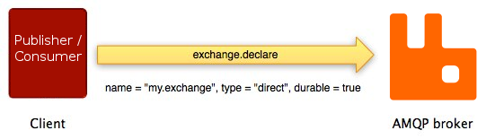

## AMQP Concepts

**AMQP (Advanced Message Queue Protocol)** - is a messaging protocol that enables conforming client applications to communicate with conforming messaging middleware brokers.

Message broker receives messages from **publishers** and routes them to **consumers**.

In AMQP, **messages** are published to **exchanges** that distribute message copies to the different **queues** using **bindings** (special rules). Then, the broker delivers those messages to **consumers** that are subscribed to **queues** they are interested in.

A **Publisher** might specify various **message attributes** (some kind of message metadata). Those attributes might be used by the broker or the consuming applications.

To prevent message receiving and processing failures, AMQP provides a mechanism of **message acknowledgements**. In this case, a consumer application notifies the broker once the message has been received and handled correctly. Only after that message broker can remove that message from its queue.

AMQP is a programmable protocol, which means that routing schemas and rules are defined by the
applications themselves, not a message broker administrator. That gives the applications more freedom but requires an attentive configuration to avoid possible conflicts.

## Exchanges

**Exchanges** are AMQP entities where messages are sent to. Exchanges are routing the messages to queues using routing mechanism that depends on **Exchange Type** and **binding** rule. There are 4 exchange types provided by AMQP message broker:

| Exchange type | Default pre-declared names |
| --- | --- |
| **Direct** | (Empty string) and `amq.direct` |
| **Fanout** | `amq.fanout` |
| **Topic** | `amq.topic` |
| **Headers** |`amq.match` (and `amq.headers` in RabbitMQ) |

Exchanges are declared with several attributes:
- **Name** - exchange name
- **Durability** - if an exchange is restored after broker's restart: **durable** or **transient**
- **Auto-delete** - exchange is deleted once the last queue is unbound from it
- **Arguments** - optional arguments for plugins and broker-specific features

### Default Exchange

The **Default exchange** is a **direct** exchange without a name (empty string), pre-declared by the broker. Every created queue is bound to it automatically with a **binding key** which is the same as the queue name.

The default exchange makes it seem like it is possible __to publish messages directly to queues__,
but technically it still uses exchange routing mechanism under the hood.

For instance, if we define a new queue called `my-messages`, the AMQP broker will bind it to the
default exchange using "my-messages" binding key. Therefore, all the published messages to the
default exchange with "my-message" routing key will be routed to the `my-messages` queue.

### Direct Exchange

The message is routed to the queues whose **binding key** exactly matches the **routing key** of the
message.

This type is ideal for the unicast message routing. It is often used to distribute tasks between
multiple workers in a [Round-robin](https://en.wikipedia.org/wiki/Round-robin_scheduling) manner.

- A **queue** binds to the exchange using a **routing key** `K`
- When a new message with **routing key** `R` is sent to the **Direct exchange**, it is routed to
  the **queue** if routing key is matched: `K`=`R`

### Fanout Exchange

The message is routed to all the queues bound to it and the routing key is ignored.

### Topic Exchange

Does a pattern match between the message **routing key** and the **routing pattern** that was used
to bind a queue to an exchange.

Topic exchange is used to implement various "pub/sub" pattern variations and the multicast
routing of messages. Once the problem involves multiple consumers that need to selectively receive
messages, topic exchange should be considered.

- `*`: can substitute for exactly one word
- `#`: can substitute for zero or more words

Example use cases:
- Background task processing done by multiple workers that do own specific set of tasks
- Orchestration of services of different kinds in the cloud
- Data updates that involve categorization or tagging

### Headers Exchange

Uses message **header attributes** for routing and ignores a routing key. Could be applied when the
message needs to be routed based on multiple attributes rather than a single routing key. Message is
routed to the queue if its header values are matched with the values specified upon the queue
binding to the exchange.

As soon as it is possible to use multiple headers for matching, AMQP broker needs to know if it
should consider messages with any of the headers matching, or all of them. To specify that behavior,
there is an `x-match` binding argument which accepts `all`, `any`, `any-with-x`, `all-with-x` values.


For `x-match: all | any` all the headers beginning with `x-` will be ignored for matching. To use
`x-` headers `x-match` must have `any-with-x` or `all-with-x` value.


## Queue

Messages placed onto the queue are stored until the consumer retrieves them. Once receiver consumed
the message successfully, consumer send **ACK** (acknowledgment) to the queue, then AMQP broker will
delete the message from the queue.

Queues are sharing some properties with exchanges and have a few additional ones:
- **Name** - queue name
- **Durability** - if queue is restored after broker's restart
- **Exclusive** - if used only by single connection and deleted once connection is closed
- **Auto-delete** - deleted when the last consumer unsubscribe from it
- **Arguments** - optional arguments for plugins and broker-specific features

Before using a queue, it has to be declared. Queue declaration has no side effects if it already
exists with the same attributes (overwise queue declaration will fail with `406 PRECONDITION_FAILED`).

### Queue Names

Queue names may be up to **255 bytes** of **UTF-8** characters.

Queue names started with `amqp.` are reserved by the broker (declaration of a such queue will fail
with `403 ACCESS_REFUSED`).


AMQP broker will generate a **unique queue name** if an empty string is passed as a name argument.


### Queue Durability

If a queue is declared with `durability: durable` argument, its metadata will be stored **on disk**.
For the `durability: transient` queue all the metadata is stored in **memory**.

If the data durability is important for the application, there are **durable** queues with
**persisted** messages should be used.

## Bindings

**Bindings** are AMQP entities that route published messages to appropriate queues. Binding might
have an optional **routing key** attribute as an additional instruction, that is used in some
exchange types.

To instruct an exchange **E** to route messages to a queue **Q**, **Q** has to be bound to **E**.

This additional layer allows implementing various routing scenarios between publisher and consumer.
It also leads to system decoupling, when the consumers know nothing about the publisher and we don't
need to change publishing logic in case of adding new consumers to the system communication.

## Consumers

AMQP broker stores messages in queues until the subscriber application will consume them. For
consumers there are a few ways to retrieve a message:

- **Push-based approach** (recommended) - subscribe to a queue and broker will deliver messages
- **Pull-based approach** (not recommended) - open a pull connecting and retrieve messages by
  consumer itself

## Messages

### Message Acknowledgements

Consumer application may occasionally fail to process individual messages because of processing
errors, application crush itself or network issues. To keep messages until they are successfully
delivered and handled, AMQP provides two acknowledgements modes:

- Broker sends a message to a consumer (using `basic.deliver` or `basic.get-ok` methods)

- Consumer sends back an acknowledgement (using `basic.ack` method)
  Explicit model when consumer application decides when to send an acknowledgement: right after
	receiving a message or once the message were fully processed.

If a consumer dies without sending an acknowledgement, the message will be redelivered to another
available consumer or stay in a queue until consumer will be restored, if there are no any.

### Rejecting Messages

If the message processing has failed for whatever reason, the consumer can notify the broker about
that by rejecting a message. When rejecting a message, a consumer might ask the broker to discard or
requeue it.


Make sure you do not create an **infinite message delivery loop** by requeueing a message over and over again.


### Prefetching Messages

In AMQP it is possible to specify how many messages each consumer can be sent at once before sending
the next acknowledgement. It might be considered as some kind of load balancing for the message
batches.

### Message Attributes and Payload

AMQP messages have **attributes** that are used by the AMQP broker to handle and route them. There
are some examples:

- Content type
- Content encoding
- Routing key
- Delivery mode
- Message priority
- Message publishing timestamp
- Expiration period
- Publisher application id

Some attributes are optional and known as **headers**.

Messages also have a **payload**, that is treated as a byte array. The AMQP broker is not accessing
or modifying the payload. Payload is optional and it is possible to publish a message without it.

Messages may be published with a persistent attribute that will instruct the broker to persist them to disk.


The **durable** exchange / queue doesn't make all the involved messages **persistent**. Message
persistence depends on the **persistence mode** of the message itself.



Publishing messages as persistent _affects performance_ (just like with data stores, durability 
comes at a certain cost in performance).


## Connections

AMQP is an application-level protocol that uses **TCP**. The connection is typically long-lived and
can be protected using **TLS**. For the disconnection, the application should gracefully close the AMQP connection instead of closing the underlying TCP connection.

## Channels

The channel could be considered as a **lightweight connection** that shares a single TCP connection.
It allows having multiple connections to the broker, but keeping only one TCP connection to reduce
the usage of consumers system resources and simplify firewalls configuration.

Every protocol operation is performed on a channel and it's completely separated from other channels.
That's why every protocol method needs the **channel ID**, to identify which channel the method is for.

A channel only exists in the context of connection and once the connection is closed, all its
channels are closed altogether.


For multi-thread applications, it is recommended to open a new channel per thread/process and not
share channels between them. 


## Virtual Hosts

AMQP includes the concept of **virtual hosts** that allows the broker to host multiple isolated 
environments with their own users, exchanges, queues, and other AMQP entities.

## AMQP 0-9-1 structure

AMQP is structured as a number of **methods**. Protocol methods are grouped into **classes**.

For example, `exchange` class includes the following methods:
- `exchange.declare`
- `exchange.declare-ok`
- `exchange.delete`
- `exchange.delete-ok`

These operations are **requests** (sent by clients) and **responses** (sent by brokers).

To declare a new exchange, the client sends the request to the broker using `exchange.declare`
method with several parameters. They allow the client to specify exchange properties.

If the operation succeeds, the broker responds with the `exchange.declare-ok` method:

## AMQP Extensions

AMQP provides a possibility for the implementation of various extensions, such as:

- **Custom exchange types** - developing new routing schemas, for example, geo-based routing
- **Additional broker features** - for example, per-queue message TTL
- **Additional plugins** - for instance, UI broker management tool
- **Custom AMQP 0-9-1 methods** - extend default AMQP API with additional logic

## Examples


AMQP usage examples in **Node.js** are available [here](https://github.com/DanilaFadeev/software-design-sources/tree/main/architecture/rabbitmq).


## Resources
- [AMQP 0-9-1 Model Explained](https://www.rabbitmq.com/tutorials/amqp-concepts.html)
- [AMQP 0-9-1 Quick Reference](https://www.rabbitmq.com/amqp-0-9-1-quickref.html)
