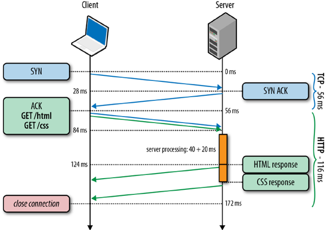
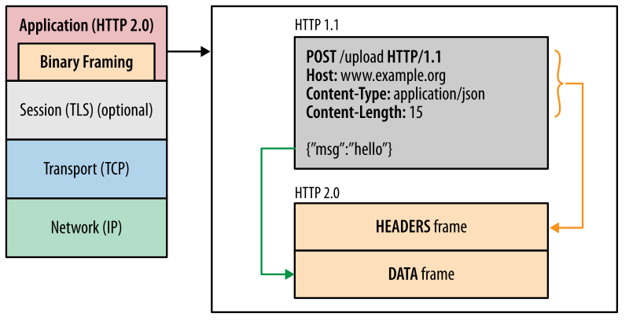
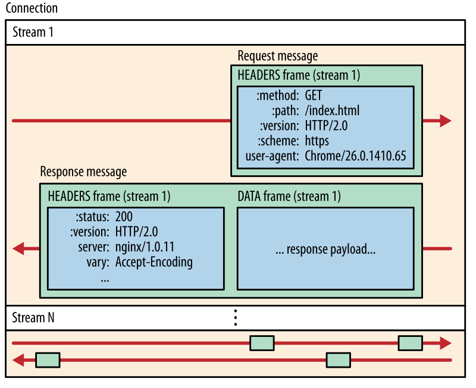

## Introduction

**HTTP** (Hyper Text Transfer Protocol) is a basic protocol used for the communication between a web-server and its client applications. It stands on the application-level protocol of the [OSI model](https://en.wikipedia.org/wiki/OSI_model) and works over TCP/IP. The protocol was initially presented by Tim Berners-Lee in 1991.

### Protocol Highlights

- **Simple.**
  The HTTP protocol is designed to be simple and human-readable. Therefore, the raw content of the Requests and Responses can be understood without any additional formatting.

- **Flexible.**
  The communication process between a server and a client might be extended by adding custom headers, cookies, and payload.

- **Stateless.**
  There is no state pre-served between different requests. Each request contains all the required information to be handled by the web server. That request might be considered as single transaction.

### Terminology

- **Client** - a tool or program that sends HTTP requests to the server. There are various clients, for instance, web-browser, search engine robots, Postman, CURL utility, mobile apps, etc.

- **Web-Server** - web application, processing HTTP requests and returning expected responses to the clients. A server might be shared across multiple machines (instances) but serving the same IP address.

- **Proxy** - an intermediate service or server that intercepts requests/responses in communication between a client and the targeting server. It's forwarding messages and might modify or transform their content.

- **Resource** - the target of an HTTP request. It can be anything, for example, documents, images, stylesheets, etc.

- **HTTP Message** - the data exchanged between a server and a client. It's represented as textual information encoded in [ASCII](https://en.wikipedia.org/wiki/ASCII) and span over multiple lines.

## HTTP Resource identification

Each resource requested via HTTP protocol is identified using **Uniform Resource Identifier (URI)**. The most popular form of URI is the **Uniform Resource Location (URL)**. Another example is **Uniform Resource Name (URN)** which identifies a resource by name in a specific namespace.

```
### Uniform Resource Location (URL)
http://www.example.com:80/path/to/myfile.html?key1=value1&key2=value2#SomewhereInTheDocument

### Uniform Resource Name (URN)
urn:isbn:9780141036144
```

### URL Schema


- **Protocol.**
  The schema of the protocol indicates which protocol the client must use. The most common schemas are `http://` and `https://`.

- **Authority.**
  The name of the domain or the IP address of the requested server.
  Example: `https://software-design.netlify.app/`

- **Port.**
  The port to be used for the server connection. By default, HTTP protocol is using `80` and HTTPS - `443`.

- **Path.**
  The path to the resource on the server. Technically, it might not be a physical path of the resource location, and a server could generate it automatically (virtual path).

- **Query.**
  Extra query parameters, provided in a key/value pairs format, separated with the "_&_" symbol.
  Example: `?data=2023-01-01&full=true&sort=desc`.

- **Fragment.**
  An anchor for a specific part of the requested resource. It's used only on the client side, mainly for the response navigation, and never sent to the server. Example: `#heading-2`.

### MIME Types

HTTP resources should inform client applications about their content types. That will help to process the response from the server correctly.

The type of the resources is passed in the `Content-Type` header in a **Multipurpose Internet Mail Extensions (MIME)** type format. MIME types are defined and standardized in the [RFC 6838](https://datatracker.ietf.org/doc/html/rfc6838) specification.

MIME-type consists of 3 parts: type, subtype, and optional parameter: `type/subtype;parameter=value`.

MIME types are case-insensitive but are traditionally written in lowercase. The parameter values can be case-sensitive.

The are two classes of existing MIME types:
- **Discrete types** - represent a single file or resource that uses one type.
- **Multipart types** - defines a resource composed of different parts that might have their own types. It can encapsulate multiple files sent in the same transaction.

| MIME type | Description | Type class |
| --- | --- | --- |
| `application/*` | Any binary data that are not related to other existing types | _D_ |
| `audio/*` | Audio or music data | _D_ |
| `font/*` | Font/typeface data | _D_ |
| `image/*` | Image or graphical data | _D_ |
| `model/*` | Model data for a 3D object or scene | _D_ |
| `text/*` | Textual human-readable data | _D_ |
| `video/*` | Video data or files | _D_ |
| `message/*` | Encapsulates other messages | _M_ |
| `multipart/*` | Data that consists of multiple components with different MIME types | _M_ |

## HTTP Session

1. **Establishing a connection**

In the first step, the client application connects to a server using an underlying transport layer protocol (usually **TCP**). The target server is identified by the domain name or IP address and the port. If the port is not specified, `80` port is used (or `443` for the HTTPS protocol).

2. **Sending a client request**

Once the connection is established, the client sends an **HTTP request** to the connected server. The request consists of an _HTTP method_, _path_, _protocol version_, a list of _headers_, and an optional request _body_. 

An **HTTP request** has the following structure:

- A start-line describing the requests to be implemented
  - `GET` - HTTP method that represents the intended operation
  - `/` - The path of the requesting resource
  - `HTTP/1.1` - The version of the HTTP protocol
- An optional set of HTTP headers in a key-value pairs format (e.g. `Accept: */*`)
- A blank line indicating all meta-information for the request has been sent
- An optional body containing data associated with the request

```http
GET / HTTP/1.1
Accept: */*
Host: software-design.netlify.app
Accept-Encoding: gzip, deflate, br
Connection: keep-alive
```


Request/response messages have a human-readable text format up to HTTP/2. The up-following versions transmit the messages using a binary format.


3. **Receive a server response**

Once a server has processed the client's request, it replies with an HTTP response similar to the request message. HTTP response message consists of:

- A start-line describing the response summary
  - `HTTP/1.1` - The version of the HTTP protocol
  - `200 OK` - The response status code with the corresponding message
- An optional set of HTTP headers specifying the request (e.g. `Server: Netlify`)
- A blank line indicating all meta-information for the request has been sent
- An optional body containing data associated with the request

```http
HTTP/1.1 200 OK
Access-Control-Allow-Origin: *
Cache-Control: public,max-age=31536000
Content-Type: text/html; charset=UTF-8
Date: Sun, 29 Jan 2023 21:34:58 GMT
Referrer-Policy: strict-origin
Server: Netlify
Vary: Accept-Encoding
 
<!doctype html><html>Content</html>
```

4. **Close connection**

Depending on the HTTP protocol version and connection option, the established connection will be closed in some time.



## HTTP Request Methods

The **HTTP** protocol defines a list of request methods to specify the intended operation on a requested resource.

According to the purpose of a request method, it might have the following characteristics:

- **Safe** - doesn't change the state of the server. It also means that the method is performing a _read-only_ operation. Even though the server could produce some alter processes for such methods (e.g. logging), the methods are still **safe** because the client doesn't request that.

- **Idempotent** means that producing a request multiple times will lead to the same effect. Even for these methods, the response status codes may differ: for example, the first `DELETE` request will remove the resource and return a `200 OK` status code, but all the following requests will be completed with a `404 NOT FOUND`. While describing a method as **idempotent**, only the server's _current state_ is considered.

- **Cacheable** - the response that could be cached and reused later.


All **safe** methods are **idempotent**, but not all the **idempotent** are **safe**.



The **safeness** or **idempotence** of a method is not guaranteed by the server and some applications may break the constraint.


| Method    | Description | Body | Safe | Idempotent | Cacheable |
| --------- | ----------- | ---- | ---- | ---------- | --------- |
| `GET`     | Retrieve resource data  | ❌ | ✅ | ✅ | ✅ |
| `POST`    | Sends data. Data type specified in `Content-Type` header | ✅ | ❌ | ❌ | ⚠️ |
| `PATCH`   | Applies _partial_ modification to a resource | ✅ | ❌ | ⚠️ | ❌ |
| `PUT`     | Creates or replaces an existing resource | ✅ | ❌ | ✅ | ❌ |
| `DELETE`  | Removes a resource | ⚠️ | ❌ | ✅ | ❌ |
| `CONNECT` | Starts the communication with a resource | ❌ | ❌ | ❌ | ❌ |
| `OPTIONS` | Requests permitted options and do preflight requests | ❌ | ✅ | ✅ | ❌ |
| `TRACE`   | Returns the entire response for proxy-debugging purposes | ❌ | ✅ | ✅ | ❌ |
| `HEAD`    | Requests only response headers without their body | ❌ | ✅ | ✅ | ✅ |


Both `PATCH` and `PUT` methods are performing the resource update. The key difference is how they process that operation.

The `PATCH` method is aimed at partial resource update - typically, we can pass a set of fields in the request body, and only they will be updated. The rest of the existing properties will stay the same.

The `PUT` method completely overwrites the requested resource, so if we skip the values for the existing fields, they will be deleted.


## HTTP Status Codes

**HTTP status codes** are sent by a server in response to a client's request. The code consists of 3 digits, where the first digit specifies the response class. The digital code comes with a human-readable _status message_. For example:

```http
HTTP/1.1 404 Not Found
```

Responses are grouped into five standard classes:

- `1xx` **Informational** - Request received/processing
- `2xx` **Success** - Request accepted and successfully received
- `3xx` **Redirect** - The requested resources were moved somewhere
- `4xx` **Client Error** - Request is incorrect or incomplete and rejected the server
- `500` **Server Error** - Server failed to process the accepted request

The full list of supported status codes is defined in the [RFC 9110](https://httpwg.org/specs/rfc9110.html#overview.of.status.codes) specification.

## Redirection

**URL redirection** (forwarding) is a way to inform the client that the requested resource is not available at the specified location. That's useful to preserve existing links and bookmarks after changing the URLs.

Redirects are done using `3xx` status codes with the specified `Location` header. A web browser process that type of response and redirects the user automatically.


### Types of redirects

1. **Permanent redirections.** Comes with `301 Moved Permanently` and `308 Permanent Redirect` statuses. Informs that the URL is no longer used. Search engines and robots will update the stored URL for the resource.
2. **Temporary redirections.** Can have `302 Found`, `303	See Other`, or `307 Temporary Redirect` statuses. It means that the resource can't be accessed by the current URL but should be back some time. Search engines and robots won't update the stored URL for this resource.
3. **Special redirections.** `300 Multiple Choice` informs that a few redirect options are listed in the body. `304 Not Modified` redirects to the locally cached copy and means that the cached response is still valid


If the `Location` header redirects to the initially requested resource, it will lead to the redirection loop. A web browser should generally handle this kind of error.


### Redirect use cases

- **Domain aliasing**. Redirect from _example.com_ to _www.example.com_. It also can force the `https://` protocol. Helps handle the movement to another domain.
- **Keep links working**. Keep the links saved on the client's side working once their location has been changed.
- **Prevent duplicated unsafe requests**. For the resent `POST`/`PUT`/`DELETE` requests, redirect the client to the previous response page with `303 See Other` status.
- **Temporary responses to long requests**. Similar to the mentioned above, it notifies the client that the requested operation is currently processing and redirects to the action progress page.

### Examples


Redirects usage examples in **Node.js** are available .


## Cookies

**HTTP Cookie** - a small piece of information that a server sends to a client. If the client is a web browser, it stores these cookies and sends them back to the server in the following requests.

The common use cases of the cookies mechanism:

- **Session management.** Storing some session information (for instance, login details), which helps to achieve a connection state within the stateless HTTP protocol
- **Personalization.** Preserve client's preferences and settings
- **Tracking.** Recording and analyzing user behavior and any other helpful information

### Creating cookies

A server can send one or more `Set-Cookie` headers in response to a client's request. A browser usually stores these cookies and sends them back using the `Cookie` header.

See the complete `Set-Cookie` header reference at [MDN Set-Cookie](https://developer.mozilla.org/en-US/docs/Web/HTTP/Headers/Set-Cookie).

An example of server response setting some cookies:
```http
HTTP/2.0 200 OK
Content-Type: text/html
Set-Cookie: yummy_cookie=choco
Set-Cookie: tasty_cookie=strawberry

[page content]
```

Then, the web browser will be responding with these cookies:
```http
GET /sample_page.html HTTP/2.0
Host: www.example.org
Cookie: yummy_cookie=choco; tasty_cookie=strawberry
```

### Cookie's lifetime

**Session cookies** are deleted when the session ends. This behavior is controlled by the browser. These cookies are created by default if no permanent options are specified.

**Permanent cookies** are deleted when `Expires` attribute date comes or the `Max-Age` period is exceeded.

```http
Set-Cookie: firstkey=myvalue; Expires=Thu, 31 Oct 2021 07:28:00 GMT;
Set-Cookie: secondkey=myvalue; Max-Age=3600;
```

### Restrict Cookie access

A cookie with a `Secure` attribute is only transferred via HTTPS protocol (except the localhost).

A cookie with a `HttpOnly` attribute is not accesable from the JavaScript Document API and only sent to the server. 

```http
Set-Cookie: secretKey=phrase; Secure; HttpOnly
```

### Cookie scope

The `Domain` attribute specifies which host can receive a cookie. If the domain is not specified, the same host that sent the cookie is used (excluding subdomains). If the domain is set, it's subdomains are included.

The `Path` attribute specifies the URL path on which the `Cookie` header will be sent.

```http
Set-Cookie: forDomain=true; Domain=netlify.app
Set-Cookie: user=sample; Path=/app
```

### Examples


HTTP Cookie usage examples in **Node.js** are available .


## Caching

HTTP protocol response might contain specific headers responsible for the results caching strategy. By these headers, the client or the proxy service will know how to cache the resources from the server to avoid unnecessary requests if the content hasn't been changed. That helps to reduce the service communication load both on the client and server side.

An official HTTP protocol specification defines two cache types: **private caches** and **shared caches**.

### Private Cache

The **private cache** is stored on the client side (typically a browser) and belongs to a specific user.

The private cache could be specified by the following header:

```http
Cache-Control: private
```


If the response has an `Authorization` header, it cannot be stored in the private cache.


### Shared Cache

The shared cache is available for all clients who requested web-server resources and implemented on the middleware level, such as CDNs, reverse proxies, service workers, etc.

The cache could be disabled using the following header (for instance, in the case of programmatic management):

```http
Cache-Control: no-store
```


Some CDNs are using their own cache control headers, so it might be helpful to double-check the target CDN configuration options.



| Header | Description |
| --- | --- |
| `Cache-Control: max-age=604800` | The cache will be stored for one week (_specified in seconds_) since the received response |
| `Age: 86400` | Informs the client about the response's age of the result stored in the global shared cache |
| `Expires: Tue, 28 Feb 2022 22:22:22 GMT` | Another way of content's TTL representation, but the `max-age` is still more reliable and preferred |
| `Vary: Accept-Language` | Specify that responses on the same URL but different `Accept-Language` header values should be cached individually |
| `If-Modified-Since: Tue, 22 Feb 2022 22:00:00 GMT` | Asks the server if the content was modified. If so, the server responds with the status `304 Not Modified` and an empty body that improves performance |
| `ETag: "33a64df5"` | Content identifier generated by the server. It commonly represents a hash of the content body or a version number |
| `If-None-Match: "33a64df5"` | Asks the server if the content was modified by comparing the cached ETag value. The server may respond with the `304 Not Modified` status and blank body. Overwise returns `200 OK` with the newest body |
| `Cache-Control: no-cache` | Will force the client to send a validation request before reusing any stored response. The server might respond with the `200 OK` or the `304 Not Modified` statuses |
| `Cache-Control: max-age=0, must-revalidate` | The same meaning as the `no-cache` option shown above |
| `Cache-Control: no-store` |  |
| `Cache-Control: private` |  |
| `Cache-Control: no-store, no-cache, max-age=0, must-revalidate, proxy-revalidate` | Workaround for outdated implementations that ignore a `no-cache` option |
| `Cache-Control: max-age=31536000, immutable` | Specifies that the content never changed and revalidation is not required |



That's not possible to delete stored cached until its `max-age` is expired. You can try with a `Clear-Site-Data: cache` header, but it's not supported by all the browsers. Usually, the cache will be stored unless the user manually performs a reload, force-reload, or clear-history action.


## HTTP Versions

### HTTP/0.9

The initial simplest version of the **HTTP** protocol. It is pretty limited and intended to transmit only HTML files.

The key parts of the **HTTP/0.9** version:
- Only `GET` method allowed
- All the requests are single line
- No _headers_ in both requests and responses
- No status codes and errors. If an error occurs, it's included in the response body

The example **HTTP/0.9** protocol request:
```http
GET /contacts.html
```

The example **HTTP/0.9** protocol response:
```html
<html>
  A very simple HTML page
</html>
```

### HTTP/1.0

Extends the previous version and adds more generic functionality. It's defined by the [RFC 1945](https://datatracker.ietf.org/doc/html/rfc1945) specification.

The list of new features:
- Each request contains a protocol version
- Introduced a status code in the response
- Added HTTP headers
- The response content is differentiated with the `Content-Type` header

The example **HTTP/1.0** protocol request:
```
GET /contact.html HTTP/1.0
User-Agent: NCSA_Mosaic/2.0 (Windows 3.1)
```

The example **HTTP/1.0** protocol response:
```http
200 OK
Date: Tue, 15 Nov 1994 08:12:31 GMT
Server: CERN/3.0 libwww/2.17
Content-Type: text/html
<HTML>
A page with an image
  
</HTML>
```

### HTTP/1.1

The first standardized version of HTTP aimed to resolve the interoperability problems between browsers and servers. **HTTP/1.1** was first published as [RFC 2068](https://datatracker.ietf.org/doc/html/rfc2068) in January 1997.

It had come with a list of improvements:

- Reusable connection (no longer needed to raise separate connections to fetch the embedded resources on a page)
- Support of the chunked responses
- Cache-control mechanisms
- Content negotiations via specific headers (by language, encoding, and type)
- The `Host` header that allows access to different domains from the same IP address

```http
GET /architecture/service-communication/http HTTP/1.1
Host: software-design.netlify.com
User-Agent: Mozilla/5.0 (Macintosh; Intel Mac OS X 10.9; rv:50.0) Gecko/20100101 Firefox/50.0
Accept: text/html,application/xhtml+xml,application/xml;q=0.9,*/*;q=0.8
Accept-Language: en-US,en;q=0.5
Accept-Encoding: gzip, deflate, br
```

```http
200 OK
Connection: Keep-Alive
Content-Encoding: gzip
Content-Type: text/html; charset=utf-8
Date: Wed, 20 Jul 2016 10:55:30 GMT
Etag: "547fa7e369ef56031dd3bff2ace9fc0832eb251a"
Keep-Alive: timeout=5, max=1000
Last-Modified: Tue, 19 Jul 2016 00:59:33 GMT
Server: Apache
Transfer-Encoding: chunked
Vary: Cookie, Accept-Encoding

(content)
```

### HTTP/2

This version was developed by Google as an experimental protocol (**SPDY**) to deal with the growing size of web pages and applications. The primary change of this protocol is improved performance.

In the previous **HTTP/1.x** versions, the secure connection is optional, while **HTTP/2** considers it required - most browsers implement support for **HTTP/2** only over **SSL/TLS** secure protocols.

The key difference with the previous **HTTP/1.1** version:

- **HTTP/2** is a **binary protocol**, while the previous versions were text ones. Now it's not possible to construct the response message manually
- **HTTP/2** is a **multiplexed protocol** that allows sending parallel requests over the same connection
- **HTTP/2** **compresses headers** to remove the overhead during the data transmission
- A server can populate a client’s cache (**server push** mechanism)

The **HTTP/2** protocol extends the previously existing standards, meaning that all the HTTP concepts stay the same. However, the protocol changes how the data is formatted and transferred between the client and server.

**HTTP/2** has bumped its major version (2) because it's no longer backward compatible with the previous versions because of the new binary framing layer.

#### Binary Framing Layer
<!-- Processed up to here !!!!!!!!!!!!!!!!!!!!!!!! -->
Unlike the plaintext **HTTP/1.x** protocol, all the **HTTP/2** communication is split into smaller messages and _frames_, encoded in binary format.



- **Frame** - the smallest unit of the HTTP/2 communication, contains a frame header that identifies the frame's owning stream.

- **Message** - A group of frames corresponding to the response/request message. It consists of more or more frames.

- **Stream** - Bidirectional flow of bytes within an established connection that transmits messages. Each stream has a unique identifier and might have priority information. All streams work within a single TCP connection.

**HTTP/2** breaks down the HTTP protocol communication into an exchange of _binary-encoded frames_, which are then mapped to messages that belong to a particular stream, all of which are multiplexed within a single TCP connection. This is the foundation that enables all other features and performance optimizations provided by the HTTP/2 protocol.



The **HTTP/2** protocol is defined by the [RFC 7540](https://httpwg.org/specs/rfc7540.html) specification.

### HTTP/3 (HTTP over QUIC)

The main feature of the **HTTP/3** protocol is that it uses **QUIC** instead of TCP on the transport layer.

**QUIC** runs multiple streams over UDP and implements packet loss detection for each stream. 

## Resources
- 📹 [HTTP Crash Course & Exploration](https://www.youtube.com/watch?v=iYM2zFP3Zn0&ab_channel=TraversyMedia)
- 📝 [HTTP | MDN](https://developer.mozilla.org/en-US/docs/Web/HTTP)
- 📝 [Caching Tutorial for Web Authors and Webmasters](https://www.mnot.net/cache_docs/)
- 📝 [Introduction to HTTP/2](https://web.dev/performance-http2/)

<!--
TODO:
- Cookies - SameSite, Cookie prefixes, Security
- CORS
- Range Requests
- Security section
- HTTP2
- HTTP3 (QUIC)
- Compression
- Proxy
- Connection management
- Protocol upgrade mechanism
- Cache - review and extend the section
-->
