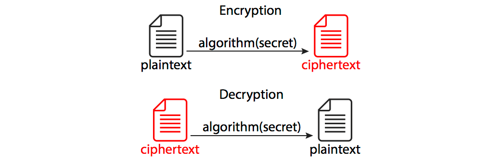
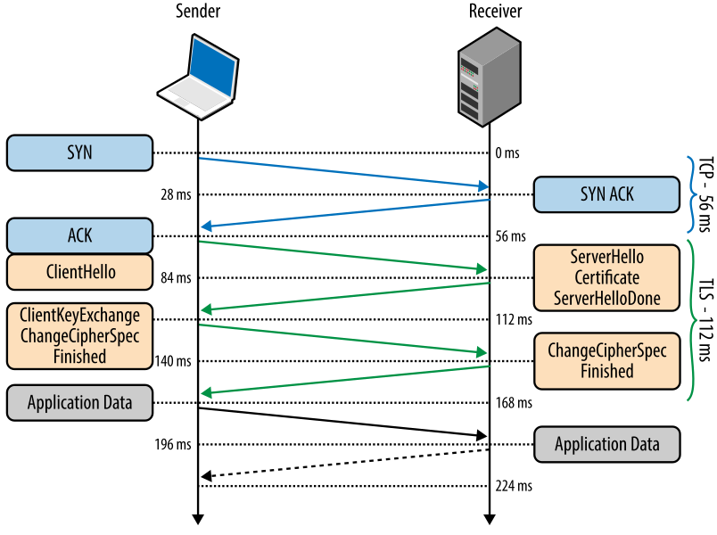

**Hypertext transfer protocol secure (HTTPS)** is the secure version of HTTP, which is the primary protocol used to send data between a web browser and a website. HTTPS is encrypted in order to increase the security of data transfer.

## SSL

**Secure Sockets Layer (SSL)** is an Internet security protocol. Its purpose is to ensure <u>privacy</u>, <u>authentication</u>, and data <u>integrity</u> in Internet communication.

SSL was developed in 1995 and later, in 1999, was updated to become TLS. However, the term SSL and TLS are often used interchangeably because SSL 3.0 has been replaced with TLS 1.0, which follows the SSL principles.

### What does SSL?

- **SSL** encrypts data that is transferred between a server and a client. If someone intercepts the data in the middle, he will not be able to decrypt and access it.
- **SSL** initiates a _handshake_ process between the communicating machines to verify them.
- **SSL** signs the transferred data to prove data integrity and verify that it wasn't modified at the time of transferring

## Involved Cryptography

**Encryption** - a process of converting readable data (**plaintext**) into its coded unreadable version (**ciphertext**).

**Decryption** - turning the process of **encryption** back and extracting the source information.

To encrypt/decrypt information, components must agree on the used _encryption algorithm_ (cipher function) and its parameters (including a _secret_ key).

Encryption methods:

1. **Symmetric** - both components share a common **secret key**.

This method requires both components to know a **secret** value to encrypt/decrypt messages. The problem with this flow is that this secret value needs to be shared in some way before the communication begins.

Symmetric encryption protects the actual data in transit since it's much faster than asymmetric encryption.



2. **Asymmetric** - one component has a pair of **secret** and **public** keys.

Asymmetric encryption uses **public** and **secret** keys to perform communication. The source information is encrypted using a public key and might be decrypted only with a corresponding secret key.

Asymmetric encryption is used to exchange the **secret** for the first time. The first asymmetric part of the handshake is also known as **key exchange**, and why the actual encrypted communication uses algorithms known as **cipher methods**.


## SSL/TLS Handshake

The handshake happens whenever a client starts communication with a server over **HTTPS protocol** after a **TCP** connection has been established via a TCP handshake.

The general handshake algorithm is described below:

1. **Client's 'hello' message:** Initiates a handshake with the message that contains a _supported TLS version_, _clipper suites_, and _client random_ (a random string of bytes).
2. **Server's 'hello' message:** Response from the server with the server's _SSL certificate_, chosen _cipher suite_, and _server random_ (a random string of bytes).
3. **Authentication:** The client verifies the SSL certificate with the authority that issued it.
4. **The premaster secret:** The client sends a random string (premaster secret) encrypted with the public server key (retrieved from the SSL certificate).
5. **The decryption of premaster secret:** The server decrypts the received _premaster secret_ using the private key stored on the server.
6. **Session keys generated:** Both client and server generate session keys based on the _client random_, _server random_, and _premaster secret_.
7. **The client is ready:** The client sends a 'finished' message encrypted with a session key
8. **The server is ready:** The server sends a 'finished' message encrypted with a session key
9. **Connection established:** The handshake is completed, and communication continues with the session keys.



## SSL Certificates

**SSL Certificate** (also called TLS certificate) - a digital certificate that authenticates a website's identity and enables an encrypted connection.

SSL certificates include:

- The domain name that the certificate was issued for
- Which person, organization, or device it was issued to
- Which certificate authority issued it
- The certificate authority's digital signature
- Associated subdomains
- Issue date of the certificate
- The expiration date of the certificate
- The public key (the private key is kept secret)

SSL Certificates might be represented in different formats. There is a good [SSL Certificate Formats](https://www.tutorialsteacher.com/https/ssl-certificate-format) article describing them.


**SSL certificates** commonly have _.cer_ file extension and can be viewed in Chrome, different online tools, or in the command line using `openssl x509 -in certificate.cer -text -noout`.



Getting the SSL certificate from the website:
`openssl s_client -connect software-design.netlify.app:443 2>/dev/null | openssl x509`


### SSL Certificate Types

SSL certificates might be issued for a single domain or a few domains at the same time. Here are the common types of SSL certificates:

- **Single Domain.** The certificate applies to only one domain (subdomains are excluded). All the routes of that domain are secured. For instance, if the **single domain** certificate was issued for the `example.com` (`www.example.com`) domain, it will not cover its subdomains (`*.example.com`) but cover its routes (e.g. `example.com/articles`).

- **Wildcard.** The certificate applies to the issued domain and all its subdomains. For instance, if a **wildcard** domain was issued to `example.com`, all its subdomains `*.example.com` (e.g. `blog.example.com`) will also be secured.

- **Multi-Domain.** The certificate is issued to the list of different distinct domains. Each domain can share this certificate. Multi-domain certificates allow for a single unique IP address for multiple domain names.

### SSL Certificates generation

Here is the process for getting a valid SSL certificate:

1. Create a **private** and **public** key pair, and prepare a **Certificate Signing Request (CSR)**
2. Contact a **Certification Authority (CA)** and request an SSL certificate based on the **CSR**
3. Install the certificate on the HTTP server

#### Generate on Unix-based system

1. Make sure that the `openssl` toolkit is installed:
```bash
openssl version
```

2. Generate a private key and CSR using the following command:
```bash
openssl req -newkey rsa:2048 -nodes -keyout example.com.key -out example.com.csr
```

You will be asked to enter information that will be incorporated into your certificate request.

#### Self-signed certificates

It's possible to create a self-signed certificate instead of requesting a CA to do it. It could be used for testing purposes, but this certificate will not be trusted by browsers.

```bash
openssl req -x509 -newkey rsa:4096 -keyout key.pem -out cert.pem -sha256 -days 365
```

#### Let's Encrypt CA

[Let's Encrypt](https://letsencrypt.org/) is a **Certificate Authority** that provides free SSL certificates using an automated domain validation process. That's done via a certificate management agent running on the web server.

Here are the main steps for issuing certificates with LE CA:

**1. Domain validation.** The certificate management agent generates a key pair and proves to Let's Encrypt that the server controls the subject domain.

**2. Certificate issuance.** Once Let’s Crypt CA ensures that the domain corresponds to the server application, the agent creates **CSR** to be processed.

**3. Certificate renewal (Optional).** The server might set up a certificate renewal process as a CRON job to keep the certificate up to date.

However, there are some Let's Encrypt limitations that should be noticed:

- Certificates expire after 90 days. It's important to have a renewal process configured
- Some hosting services might not provide a straightforward connection
- There is no Customer Support service that can help in case of any issues
- Let's Encrypt has some request limitations. See [Rate Limits](https://letsencrypt.org/docs/rate-limits/)

## Examples


HTTPS usage examples in **Node.js** are available [here](https://github.com/DanilaFadeev/software-design-sources/tree/main/architecture/https).


## Resources

- 📹 [SSL, TLS, HTTPS Explained](https://www.youtube.com/watch?v=j9QmMEWmcfo&ab_channel=ByteByteGo)
- 📝 [What is SSL? | SSL definition](https://www.cloudflare.com/learning/ssl/what-is-ssl/)
- 📝 [The Complete Guide To Switching From HTTP To HTTPS](https://www.smashingmagazine.com/2017/06/guide-switching-http-https/)
- 🖼 [How HTTPS works (comic)](https://howhttps.works/)

<!--
TODO:
CA verification (chain-of-trust), roots and mention about pre-installed database
-->