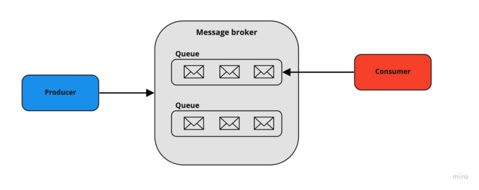

## Overview

A **Message Broker** is a software component that allows applications, systems, and services to communicate and exchange data.

Message brokers are software modules included in **Messaging Middleware** or **Message-Oriented Middleware (MOM)** solutions. 

**Message Brokers** are capable of validating, storing, routing, and delivering messages to their intended destinations.

### Terminology

- **Message** - any type of data accepted by the message broker
- **Producer** - the service that publishes any kind of data (messages) to the message broker to be stored and distributed. 
- **Consumer** - the service that receives and handles data (messages) from the message broker.
- **Queue (Topic)** - data structure used by the message broker for storing messages using FIFO
logic.
- **Exchanger** - logical configuration/entity that is used for routing messages.

### Message Broker Models

- **Point-to-Point Messaging**
  
	**Producer** and **Consumer** have one-to-one relationship. Each produced message in the queue is 
	sent and consumed by a single recipient. The current model is used when a message must be sent and
	consumed only once.

	This model reminds a common REST approach. The key difference is its asynchronous nature which 
	guarantees that the message won't be lost in case of failure of the consumer because it's stored
	in the message broker queue.

	**Example**. Bob is sending a newsletter to all his relatives and friends. Alice is the only consumer to receive Bob’s parcels in such a case.

- **Publish/Subscribe Messaging ("pub/sub")**

  **Producer** and **Consumer** have one-to-many relationship. **Producer** publishes messages to a
	queue, and multiple subscribed consumers are receiving those messages. It means that topic 
	messages are distributed to all the consumer services.

	**Example.** Bob is sending parcels to Alice. In such a case, Alice is the only consumer that has
	to receive Bob's parcels.

## Best Use Cases

- Provided communication between services that may not be running at the same time
- Improved system performance by introducing asynchronous processing
- Increased reliability by guaranteeing the transmission of messages
- E-commerce order processing and fulfillment
- Financial transactions and payment processing

## Advantages of usage 👍

- **Improves systems' availability** Publishers are able to publish messages, even if a consumer is 
not active
- **Improves systems' reliability**. All the published requests (messages) wouldn't be lost in case
of consumer failure. The messages will stay in the queue until a consumer is restored and process the pending messages
- **Acts as an intermediate buffer**. System is more applied for the high-load traffic per small amount of time. All the time-consuming incoming operations are not started in parallel but sequentially
- **Provides message redelivery**. Most of the message brokers provide message redelivery
functionality out of the box
- **Allows the decoupling of application components**. Message Brokers might be used as a
communication layer between different services, no matter what technologies they have written at

## Disadvantages of usage 👎

- **System complexity is growing.** Message Broker is an additional system component that needs to
be maintained and secured
- **Debugging can be more challenging**. Once the operations are done in separate stages, it's more complex to identify the root of the issues in case something has gone wrong
- **There is a learning curve**. Message Brokers come with a batch of options and configurations
that need to be managed for archiving the expected system behavior
- **Become a single point of failure**. As a connection layer, the Message Broker plays a critical
role and might affect the whole system in case of an outage.

## Choice criteria

- **Maturity of the project**

  There are plenty of different message brokers with their specific features and use cases. Some are proven by time, and some just come to the market. The project maturity, in most cases, defines the size of the community and learning materials. It’s highly recommended to estimate the possibility of getting all the required information and support for using some specific message broker in enterprise solutions.

- **SDKs and language support**

	Make sure that your project technologies are compatible with the message broker. A message broker
	is intended to be data-agnostic and provides different SDKs to communicate with it.

- **Deployment and maintaining**

	A message broker is an additional complex component of the software system that needs to be configured and maintained. Because of the vast number of options available, hosting and operating it on-premise might be tricky. Take a look at available cloud-based hosting solutions to see how they can simplify that job.

- **Features available out of the box**

	Some applications require additional specific communication logic such as priority queues,
	messages expiration, tricky messages routing, etc. Choosing the right message broker providing
	those features will save development time and reliability.

## Examples of message brokers

#### RabbitMQ

Open-source message broker written in Erlang. Provides a possibility for **complex routing** using
different types of exchanges that bind with queues. **RabbitMQ** comes with a simple UI management
tool that allows to manage and monitor the running broker.

#### AmazonMQ
An alternative cloud version of RabbitMQ and Apache ActiveMQ, provided by Amazon Web Services. It 
reduces your operational responsibilities by managing the setup and maintenance of a message broker
for you.

#### Apache Kafka
Open-source queue broker and log-like messaging system. Because of its nature, Kafka **can handle a high volume** of messages. Provides excellent reliability using a partition mechanism that keeps a system operating even if some cluster is down.

Apache Kafka is designed to handle real-time streaming data, like logs and metrics. One of the key
features is historical messages storage in topic, even when consumer has processed them. In addition, it allows you to see the changelog and replay published events from the begging.

#### Amazon SQS
Amazon Simple Queue Service (SQS) is a queuing cloud service provided by Amazon. It uses a
**pull-based** mechanism, which means that consumers have to pick messages on their own.

As a cloud solution, it has an on-demand pricing plan and removes infrastructure overhead. The
configuration is relatively simple and straightforward. We don't need to worry about service
availability and scaling because Amazon manages that for us.

#### Amazon SNS
Amazon Simple Notification Service (SNS) is a cloud service provided by Amazon which is used for
delivering different types of notifications, as it stands by its name. Uses **push-based** mechanism
that notifies the subscribers themselves.

Amazon SNS supports AWS Lambda and AWS SQS notifications as well as mobile push notifications,
HTTP(S) endpoints, email addresses, and SMS messages.

#### Redis
Lightweight in-memory database that could be used as a message broker. Unless the lower reliability, it provides an extremely fast way to access data that could be stored in various supported formats (lists, maps, sets, etc.).

## Resources

- [Message Brokers: Key Models, Use Cases & Tools Simplified 101](https://hevodata.com/learn/message-brokers/)
- [5 use cases of message brokers. When you should consider adopting a message broker in your system?](https://tsh.io/blog/message-broker/)
- [Message Brokers vs. Enterprise Service Buses](https://www.baeldung.com/cs/message-broker-vs-esb)
