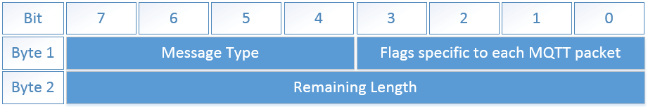
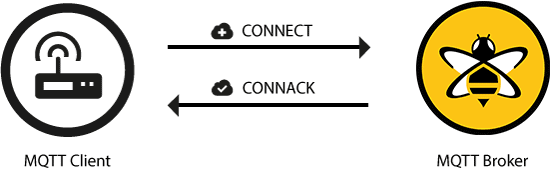
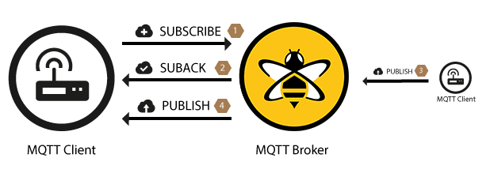

## Overview

**MQTT (MQ Telemetry Transport)** is a simple lightweight **publish / subscribe** binary protocol mostly used for **Internet of Things (IoT)**. Almost every embedded device has a library that implements MQTT protocol for sending and receiving messages.

The first version of MQTT was published in 1999 by Andy Stanford-Clark (IBM) and Arlen Nippe
(Cirrus Link) for connecting Oil Pipeline telemetry systems over satellite. It was aimed to share
the data between devices with low bandwidth, minimal battery loss, and limited resources.

MQTT is designed on top of **TCP/IP**, but there is a branching, **MQTT-SN**, that works over
Bluetooth, UDP, ZigBee, and other networks. On October 29, 2014 MQTT became an officially approved
[**OASIS Standard**](https://en.wikipedia.org/wiki/OASIS_(organization)).

By default, MQTT uses **1883** port for TCP/IP and **8883** for the SSL connection.

MQTT has some alternatives, such as [Web Application Messaging Protocol](https://wamp-proto.org/), [Streaming Text-Oriented Messaging Protocol](https://en.wikipedia.org/wiki/Streaming_Text_Oriented_Messaging_Protocol)
and [Alternative Message Queueing Protocol](https://en.wikipedia.org/wiki/Advanced_Message_Queuing_Protocol).


There are free and open MQTT message brokers that could be used for testing purposes: [broker.hivemq.com](http://www.mqtt-dashboard.com/),
[test.mosquitto.org](https://test.mosquitto.org/), [mqtt.eclipseprojects.io](https://iot.eclipse.org/projects/sandboxes/).


## MQTT Basics

MQTT connecting system is built with the following components:

- **Broker** - is responsible for receiving and filtering incoming messages, and sending those
messages to subscribed clients. It also holds session data and does authentication and
authorization.
- **Publisher** - any device that publishes messages to MQTT topics
- One or More **Clients** - any device that runs an MQTT library and connects to an MQTT broker over
  the network.

MQTT clients are using special commands to communicate with an MQTT Broker:
- **CONNECT** - to establish the connection
- **DISCONNECT** - to break up the connection
- **PUBLISH** - to publish a new message into the specific topic
- **SUBSCRIBE** - to subscribe to one or many topics for receiving their messages
- **UNSUBSCRIBE** - to unsubscribe from the topic

MQTT message consists of the following parts: **Fixed Header**, **Dynamic Header**, and
**Binary payload**. The structure of the fixed header is illustrated below:

- **Message Type** – is the type of the command, for instance: `CONNECT`, `SUBSCRIBE`, `PUBLISH`, etc.
- **Flags specific to each MQTT packet** - the space for the additional options
- **Remaining Length** - the length of the dynamic header and message payload

### Messages filtering

- **Subject-based filtering**
  The filtering is based on a message topic. The topic name is a string with a hierarchy structure
	that allows filtering using basic expressions. Both publishers and subscribers have to know the
	name of the topic to use.

- **Content-based filtering**
  Messages are filtered based on a specific content language. The bad thing is that message content
	must be known beforehand and can't be encrypted.

- **Type-based filtering**
  Using strongly-typed OOP languages, the filtering could be done based on message Class / Type.

### Protocol features
- Data agnostic to the content of the payload
- Provides three types of message delivery: **at most once**, **at least once**, and **exactly once**
- The use of TCP/IP
- Small transport overhead because of the fixed-length header of 2 bytes
- Pub/Sub pattern with one-to-many message distribution
- Simple implementation

### Topics

The topic is a UTF-8 string that is used by MQTT broker to filter and route messages. Topics are
lightweight and don't need to be created before the message publishing. The topic consists of one or
more topic levels. Each topic level is separated by a forward slash (topic level separator).

**Topic naming notes:**
- Topic must contain **at least 1 character**
- Topic name **allows empty spaces**
- Topic is **case-sensitive**
- Topic **shouldn't be started with $** because it reserved for internal statistic

Topic naming examples:
- `myhome/groundfloor/livingroom/temperature`
- `USA/California/San Francisco/Silicon Valley`
- `5ff4a2ce-e485-40f4-826c-b1a5d81be9b6/status`
- `Germany/Bavaria/car/2382340923453/latitude`

### Topics Wildcards

MQTT subscriber clients can use wildcards in a topic name to receive messages for a few topics.

#### Single Level: "+"

Plus (+) symbol is used to replace one topic level.

This example would have the following results:

- ✅ `myhome/groundfloor/livingroom/temperature`
- ✅ `myhome/groundfloor/bathroom/temperature`
- 🚫 `myhome/roof/livingroom/temperature`
- 🚫 `myhome/groundfloor/livingroom/brightness`
- 🚫 `neighbor/groundfloor/livingroom/temperature`

#### Multi Level: "#"

Hash (#) symbol is used to replace one or more topic levels. Must be placed **as the last character**
in the topic and **preceded by a forward slash**.

This example would have the following results:

- ✅ `myhome/groundfloor/livingroom/temperature`
- ✅ `myhome/groundfloor/bathroom/temperature`
- ✅ `myhome/groundfloor/livingroom/brightness`
- ✅ `myhome/groundfloor/livingroom/temperature/level`
- 🚫 `myhome/roof/livingroom/temperature`

## MQTT commands

### MQTT Connect

The MQTT protocol is based on **TCP/IP**. Both client and broker need to have a **TCP/IP stack**.
MQTT clients are connected via MQTT broker and never connected directly to each other.

The client sends a **CONNECT** message to the broker. The broker responds with a **CONNACK** message
with a status code. Once the connection is established, the broker keeps it open.


| Parameter | Required | Description | Example |
| --- | --- | --- | --- |
| clientId | Yes | Identifies each MQTT client | "client-1" |
| cleanSession | Yes | Is broker should store any information about the client | `true` |
| username | No | Client authentication and authorization | "hans" |
| password | No | Client authentication and authorization | "letmein" |
| lastWillTopic | No | This message notifies other clients when a client disconnects ungracefully. | "/hans/will" |
| lastWillQos | No | This message notifies other clients when a client disconnects ungracefully. | 2 |
| lastWillMessage | No | This message notifies other clients when a client disconnects ungracefully. | "unexpected exit" |
| lastWillRetain | No | This message notifies other clients when a client disconnects ungracefully. | `false` |
| keepAlive | No | Time in seconds of the longest PING message interval | 60 |



| Parameter | Description | Example |
| --- | --- | --- |
| sessionPresent | Whether the broker already has a persistent session available from previous interactions | true |
| returnCode | Whether the connection attempt was successful or not | 0 |



| Return Code |	Definition |
| --- | --- |
| 0	| Connection accepted |
| 1	| Connection refused, unacceptable protocol version |
| 2	| Connection refused, identifier rejected |
| 3	| Connection refused, server unavailable |
| 4	| Connection refused, bad user name or password |
| 5 |	Connection refused, not authorized |


### MQTT Publish

MQTT Client can publish messages right after the connection to the MQTT broker. Each message must contain a **topic** the broker will use for routing that message to the interested subscribers
Also, a message might have a data-agnostic **payload** that will be transmitted in byte format.

When **MQTT Client** sends a published message to the **MQTT broker**, the broker reads the message,
acknowledges the message (according to the **QoS Level**), and processes the message. However, the publisher client didn’t receive feedback from the MQTT broker about the delivery result.


| Parameter | Description | Example |
| --- | --- | --- |
| `packetId` | Uniquely identifies a message | "4314" |
| `topicName` | Hierarchically structured string with forward slashes as delimiters | "myhome/livingroom/temperature" |
| `qos` | Number indicates the Quality of Service Level (QoS) of the message | 1 |
| `retainFlag` | Whether the message is saved by the broker. New subscribers receive the last retained message on that topic | `false` |
| `payload` | The actual data-agnostic binary content of the message | "temperature:32.5" |
| `dupFlag` | Indicates that the message is a duplicate | `false` |


### MQTT Subscribe

To receive messages from a specific topic, the client sends a **SUBSCRIBE** message to MQTT broker.
A single subscription request might contain multiple subscriptions.


| Parameter | Description | Example |
| --- | --- | --- |
| `packetId` | Uniquely identifies a message | "4314" |
| `qos1` | Number indicates the Quality of Service Level (QoS) | "4314" |
| `topic1` | Hierarchically structured string with forward slashes as delimiters | "topic/1" |


To confirm the subscription, MQTT broker sends a **SUBACK** message to the client.


| Parameter | Description | Example |
| --- | --- | --- |
| `packetId` | Uniquely identifies a message, the same with **SUBSCRIBE** request identifier | "4314" |
| `returnCode1` | One return code for each topic/QoS-pair | 2 |


Once the client sends a **SUBSCRIBE** message to the MQTT broker and receives a **SUBACK** message
as a response, it starts receiving the published messages based on topics and their wildcards.

## Differences in MQTT and Message Queue


**MQ** in MQTT is not stand by Message Queue, but refers to **MQseries product** from IBM


- **A message queue stores messages until they are consumed**
  In a **Message Queue** system, the message is stacked in a queue until some consumer handles it.
	**MMQT** allows a message to not be processed if there are no clients subscribed to the topic.

- **A message is only consumed by one client**
  Standard queues are consumed by the only client, but in MQTT all the topic subscribers receive the
	messages.

- **Queues are named and must be created explicitly**
  Queues are more strict and need to be created explicitly. MQTT's topic is more flexible and could
	be created on the fly.

## MQTT Best Practices

- **Don't use a leading slash in a topic.**
  Using a leading slash in the topic name introduces an unnecessary zero-character hierarchy level
	which has no benefits and might lead to confusion

- **Don't use spaces in a topic.**
  UTF-8 has many different space types, so it becomes harder to read and debug

- **Keep topic name short and consistent.**
  The topic name is included in each message, so huge topics require more size for embedded devices

- **Use specific topics, not general ones.**
  Publish individual device sensors data into separate topics

- **Don't subscribe to all the topics using # wildcard.**
  The client might face a high-load with all the MQTT broker messages. If you need to retrieve all
	the broker messages, use an MQTT broker extension for that purpose.

## Examples


MQTT usage examples in **Node.js** are available [here](https://github.com/DanilaFadeev/software-design-sources/tree/main/architecture/mqtt).


## Resources
- [MQTT Essentials](https://www.hivemq.com/mqtt-essentials/)
- [MQTT: The Standard for IoT Messaging](https://mqtt.org/)
- [Getting Started with Node.js and MQTT](https://blog.risingstack.com/getting-started-with-nodejs-and-mqtt/)
- [Beginners Guide To The MQTT Protocol](http://www.steves-internet-guide.com/mqtt/)
- [MQTT V3.1 Protocol Specification](http://public.dhe.ibm.com/software/dw/webservices/ws-mqtt/mqtt-v3r1.html)
