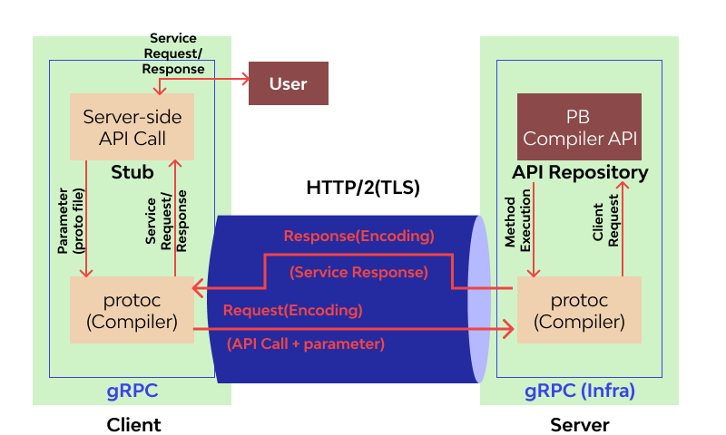

## Overview

**gPRC** is a high-performance open-source communication framework that was introduced in 2015 by Google. It's built on top of the _HTTP2 protocol_ and uses _Protocol Buffers_ as the interface description language.


The **g** in the **gRPC** abbreviation stands for something different in [every release](https://github.com/grpc/grpc/blob/master/doc/g_stands_for.md).


### RPC

Using the **Remote Procedure Calls (PRC)** approach, _a client application can directly call a method on a server application_, even if they are hosted on separate machines and written in different programming languages.

The main idea is that a service specifies the methods which can be called remotely and declare its input/output parameters. Using such a way of communication, a client can follow the provided specifications and talk to the remote service within a known typed interface.


**gRPC** primarily uses a _synchronous_ request-response model but can operate in _asynchronous_ or _streaming_ mode after the connection is established.

There are the modes that **gRPC** can work in:
- **Unary PRC**
- **Server streaming RPC**
- **Client streaming RPC**
- **Bidirectional streaming RPC**

**gRPC** has matured through its heavy battle-testing at Google, and many other major tech companies such as Square, Lyft, Netflix, Docker, Cisco, and CoreOS have adopted it.

The framework is widely used in a _microservice architecture_, where the application is broken down into small services communicating with each other over a network.

### Architecture

**gRPC** organizes communication between the **server** and the **client**.

The **client** produces a local procedure call with the defined parameters sent to the **server**. Next, the client's _stub_ serializes the procedure invocation parameters using Protobuf and forwards the request to the local library. Finally, the OS makes a call with the serialized data to the remote gRPC server using the `HTTP/2` protocol.

The **server** receives the request packets and calls the server _stub_ procedure, decoding the data using Protobuf. The decoded data is passed to the stub implementation that processes the requested operation and sends back the encoded response to the **client**.



### 👍 Advantages

- **Performance and Efficiency.**
  On average, gRPC performs up to _10x faster_ than usual JSON APIs. The serialized binary messages are smaller and transferred via **HTTP2** protocol with all its features. The binary format makes gRPC much more efficient compared to textual format protocols.

- **Schemas and validations.**
  gRPC comes with Protocol Buffers definitions that consist of strict-typed schemas and interfaces for communication out of the box. There is no need to use third-party instruments to ensure stable and reliable API contracts.

- **Bidirectional streaming.**
  Thanks to the HTTP/2 protocol, gRPC provides various types of streams that allow a client and a server to exchange real-time messages in both directions.

- **Language independent.**
  gRPC is implemented for many popular programming languages such as Node.js, Java, Python, etc. A gRPC client and server are not required to use the same technology to talk to each other. The only condition has gRPC interface implementation is in place.

- **Code generation.**
  Protocol Buffers compiler allows generating server stubs and message builders for every supported language, simplifying the creation of Client SDK on various platforms.

- **Built-in features.**
  Many important things are already included, such as authentication, encryption, compression, load balancing, etc.

- **Security**
  Because of HTTP/2 and binary messages format, gRPC ensures a secure data transfer. gRPC encourages the use of SSL/TLS to authenticate and encrypts data exchanged between the client and server.

### 👎 Disadvantages

- **Not suitable for public APIs.**
  Most external consumers use the traditional REST approach. Also, gRPC is strict and does not provide enough flexibility that, for example, GraphQL does. External clients must have the `.proto` definitions to communicate with a gRPC-driven service.

- **Limited Browser Support.**
  It's impossible to call a gRPC service directly from a web browser. The only way is to use a proxy layer and **gRPC-web**.

- **Non-readable messages.**
  All the messages are transferred in binary format, so to see message content, you need to use additional tools that allow working with the Protobuf payload.

- **Complex schema updates.**
  As the gRPC's compiler generates a codebase to work with defined schema, it might take additional effort in the case of radical schema changes. At the same time, once a schema is updated, the changes (represented via `.proto` files) must be shared with the rest of the components.

- **Relatively small community.**
  The gPRC is not as popular as the other communication interfaces, so finding the correct answer for tricky issues may not be quick.

### ⚖️ Comparison

#### RESTful

| Feature | gRPC | JSON API |
| --- | --- | --- |
| Language agnostic | **Yes** | **Yes** |
| HTTP version | **HTTP/2** | HTTP 1.1* |
| Interface schemas | **Protobuf** | Third-party tools** |
| Human-readable | No | **Yes** |
| Data transfer format | **Binary** | Plain Text |
| Data types support | **Rich** | Basic |
| Data transferring speed | **Fast** | Slower |
| Community | Lower | **Large** |

\* Traditional REST style uses `HTTP 1.1`, but it is still possible to take the `HTTP/2`. However, REST is not designed to use all the `HTTP/2` features, and configuration will need additional effort.

\*\* REST doesn't come with any strict interface schemas and their validation. Instead, it requires a service definition tool like Swagger/OpenAPI.

#### Apache Thrift

**Apache Thrift** is a similar RPC framework developed by Facebook/Apache. It uses its own interface definitions language and provides code generation for various programming languages.

| Feature | gPRC | Apache Thrift |
| --- | --- | --- |
| Performance | Fast | **A little faster** |
| Protocol | HTTP/2 | Any* |
| Streaming | **Native support** | Via addons |
| Community | **Larger** | Smaller |

\* Apache Thrift provides an abstraction over network IO and can run on different transport implementations, such as _TCP_, _HTTP_, etc.

#### GraphQL

**GraphQL** is more suitable for public APIs that are exposed to consumers directly, where the clients need more control over the data that consume from the server. However, it adds an overhead that might be redundant for private services communication.

### Use Cases

The **gRPC** framework is oriented toward microservices communication. Therefore, it can be used for most synchronous message-exchanging scenarios.

However, it's not recommended for asynchronous communication, where message persistence is required (message brokers like Kafka or RabbitMQ can do that job). It's also not the best choice for the publicly exposed API interfaces, which is better to provide using well-known RESTful or GraphQL styles.

The most appropriate use cases:
- Real-time communication between internal microservices
- Multi-programming language environments
- Systems with limited resources and latency network
- When efficient and fast communication is the priority
- Device-to-Device and Device-to-Cloud communication for embedded systems

## Protocol Buffers

By default, **gRPC** uses [Protocol Buffers](https://protobuf.dev/overview/) as a messaging mechanism that serializes underlying data according to the declared structure.

**Protocol Buffers** (Protobuf) is Google's serialization/deserialization protocol that provides definition interfaces and client's code generation. It comes with its own **Interface Definition Language (IDL)**, which allows describing the entities and service methods.

The Protobuf compiler, **protoc**, generates code that loads `.proto` files into memory in runtime and uses them to work with binary messages. That flow works much more efficiently than text format messages (JSON, HTML) because encoded messages are smaller. 

### Messages

Protocol buffer data is structured as **messages** containing valuable information described in `name/value` pairs called **fields**. The **message** definitions are defined in **proto** files that have a `.proto` file extension.

```protobuf
message Person {
  string name = 1;
  int32 id = 2;
  bool has_ponycopter = 3;
} 
```

### Services

The other piece is a protocol buffer **service** that describes available methods (operations) and their input/output types. In other words, **service** is a collection of remote methods exposed to a client.

Protocol buffer service methods _can have only one input parameter and one output_. If a method needs to apply a few parameters, they should be grouped within a single message.

```protobuf
service Greeter {
  rpc SayHello (HelloRequest) returns (HelloReply) {}
}
```

### Data Types

#### Scalar Value Types:

| Type | Keywords | Default |
| --- | --- | --- |
| Double | `double`, `float` | `0` |
| Integer | `int32`, `int64`, `uint32`, `uint64`, `sint32`, `sint64`, `fixed32`, `fixed64`, `sfixed32`, `sfixed64` | `0` |
| Boolean | `bool` | `false` |
| String | `string`, `bytes` | `""` |

#### Enumerations

Enums present a value from a defined list of declared options. Every `enum` declaration must have a constant that maps to `0` (used as the _default value_) and be specified as the first element.

The `reserved` keyword is used for some values/constants that are removed and shouldn't be reused in the future to preserve backward compatibility.

```protobuf
enum Status {
  option allow_alias = true; // optional to enable aliases

  reserved 2, 15, 9 to 11, 40 to max; // restricts values usage
  reserved "FOO", "BAR"; // restricts keys usage

  OK = 0;
  ERROR = 1;
  BAD_REQUEST = 1; // the alias for the 'ERROR' constant
}

message ServerResponse {
  Status status = 1;
}
```

#### Nested Types

That's possible to define a nested message type to keep the definitions close to their parent. However, the nested types are not fully encapsulated and can be used outside, referring to their parent (`<Parent>.<Type>`).

```protobuf
message Response {
  message ResponseData {
    string title = 1;
    int32 price = 1;
  }

  repeated ResponseData data = 1;
}

message SearchResponse {
  Response.ResponseData item = 1;
}
```

#### Special Types

The complete reference is available at the [Protocol Buffers Well-Known Types](https://protobuf.dev/reference/protobuf/google.protobuf/).

```protobuf
import "google/protobuf/any.proto";
import "google/protobuf/timestamp.proto";

message Response {
  map<string, int32> statusCodes = 2; // key-value pairs object
  repeated string tags = 3; // array of strings

  Any status = 1; // allows any type
  Timestamp requestedAt = 4; // date format
}
```

### Versions

Currently, there are two Protocol Buffers syntax versions: **proto 2** and **proto 3**.

The [proto2](https://protobuf.dev/programming-guides/proto/) is the initially published version that is still fully supported.

The [proto3](https://protobuf.dev/programming-guides/proto3/) is available for all the programming languages, supported by gRPC, and has a nicer declaration syntax compared to its previous version. It is the current version that is recommended for new projects.

The version is specified in the `.proto` file using the **syntax** keyword:

```protobuf
syntax = "proto3";
```

## Code Generation

**Protocol Buffers** provide code generation for the targeting programming language. Its compiler (`protoc`) can generate data access classes in a selected language using existing `.proto` definitions. These classes will have properties accessors (`get`/`set`) and functionality that allows to serialize/deserialize data (because it's transferred in binary format).

The general process of **gRPC** integrations consists of the following steps:

1. Create a service interface definition using `.proto` files 
2. Generate server-side and client-side in appropriate programming languages
3. Implement _a server_ application:
    - Implement the logic of the declared service methods
    - Run a gRPC server that binds the implemented service
4. Implement _a client_ application:
    - Connect to the remote gRPC server
    - Invoke the remote methods using client-side generated code


### Node.js

Although `@grpc/grpc-js` library uses dynamic code generation (`.proto` files are loaded at runtime), it's possible to use an appropriate plugin to pre-generate the JavaScript stubs definitions.

```bash
$ npm install --save grpc-tools google-protobuf
$ npx grpc_tools_node_protoc --js_out=import_style=commonjs,binary:. --grpc_out=grpc_js:. greeter.proto
```

This command will generate the following files that will be used for the gRPC server and client:
- `greeter_grpc_pb.js` - server stubs
- `greeter_pb.js` - message builders

If you want to use these files in the **ES Modules** project, change their file extension to `.cjs`.


The complete example is available [here](https://github.com/DanilaFadeev/software-design-sources/tree/main/backend/grpc/nodejs-static-codegen).


### Python

Protocol Buffers compiler (`protoc`) allows generating a gRPC-base code using a plugin. For example, the _python_ code can be created by the following commands:

```bash
$ pip3 install grpcio grpcio-tools # install dependencies
$ python3 -m grpc_tools.protoc -I. --python_out=. --pyi_out=. --grpc_python_out=. ./greeter.proto
```

Assuming we have a `greeter.proto` protobuf definition file, it will create the following files:

- `greeter_pb2_grpc.py`
- `greeter_pb2.py`
- `greeter_pb2.pyi`

For each Protocol Buffer service definition, the primary elements are created (`greeter_pb2_grpc.py` file):

- **Stub** (`GreeterStub`) - a class the clients use to connect to the created gRPC server.
- **Servicer** (`GreeterServicer`) - a base class for the service methods implementation. Its methods should be overwritten in the child class to provide the gRPC service logic.
- **Registration Function** (`add_GreeterServicer_to_server`) - a function used to register an implemented servicer with a `grpc.Server` object.

The `greeter_pb2.pyi` file will contain builder classes for each **message** in the Protobuf definition. These classes should be used to work with the specified gRPC entities.


The complete example is available [here](https://github.com/DanilaFadeev/software-design-sources/tree/main/backend/grpc/python-codegen).


## Streaming

The **stream** is a sequence of multiple requests/responses. **Streams** are a core feature of the _gRPC_ framework that allows for performing many processes in a single request. That's possible by the _multiplexing_ capability of the HTTP/2 protocol.

### Server Streaming

In a **server-streaming RPC** mode, the client sends a single request, and the server returns a stream of messages as the response. After sending all the server responses, the server marks the end of the stream by sending the server's status details as trailing metadata to the client. During the streaming process, the client reads messages from the stream until no messages are left.

```protobuf
service Location {
  rpc Track(Empty) returns (stream Point);
}
```

The server has access to a _writable stream_ object. Once all the messages are sent, the stream must be ended.

```javascript
function Track(stream) {
  // start streaming data from the server
  stream.write({ latitude: 22.4395, longitude: 34.8312 });
  stream.write({ latitude: 22.5103, longitude: 34.8082 });
  stream.write({ latitude: 22.5492, longitude: 34.7911 });

  stream.end(); // complete the streaming
}
```

The client is also accessing the `stream` and reading the messages from there:

```javascript
const trackStream = client.Track(); // initiate the procedure call
trackStream.on('data', point => {}); // read messages from the stream
trackStream.on('end', () => console.log('Stream has ended')); // completion
```

### Client Streaming

In a **client-streaming RPC** mode, the client sends a sequence of messages to the server using a provided stream. The server returns a single response with the result of processing to the client. The response might be returned anytime, even without waiting for all the client messages to be received.

The server can stop processing the client's stream and cancel it, in which case the client will be notified and stop producing new messages.

The message sequence is passed in a single independent RPC call.

```protobuf
service Location {
  rpc Share(stream Point) returns (Empty);
}
```

The server has access to a _readable stream_ object with the client's messages:

```javascript
function Share(stream, callback) {
  stream.on('data', point => {}); // process client's message

  stream.on('end', () => {
    callback(null, result);  // the result response
  });
}
```

The client is accessing a _writable stream_ for the message publishing:

```javascript
const shareStream = client.Share((error, response) => {
  // server's response once all client's messages are sent
});

// stream client's messages
stream.write({ latitude: 22.4395, longitude: 34.8312 });
stream.write({ latitude: 22.5103, longitude: 34.8082 });
stream.write({ latitude: 22.5492, longitude: 34.7911 });

// notify that all the messages are sent
shareStream.end();
```

### Bidirectional Streaming

In a **bidirectional RPC** mode, both the client and server exchange a sequence of messages independently. On both ends, _read-write_ streams are available to send and receive messages. The order of messages in each direction is preserved.

The **bidirectional RPC** procedure has to be initiated by the client call, but after that, the communication is performed based on the business logic, where both client and server can produce their messages in any order.

```protobuf
service Location {
  rpc Tune(stream Point) returns (stream TuneOptions);
}
```

The server has access to the read-write stream, which means it can send messages to the client and read the client's messages at the same time:

```javascript
function Tune(stream) {
  stream.on('data', point => { // process client's message
    // respond to a client immediately ("ping-pong")
    stream.write({ tune: Math.random() }); 
  }); 

  stream.on('end', () => { stream.end() }); // once no more client's messages
}
```

The client is working the same _read-write_ stream:

```javascript
let tune = 0;
const tuneStream = client.Tune();

// listen for server's messages
tuneStream.on('data', options => { tune = options.tune; });

// stream client's messages
tuneStream.write({ latitude: tune + 1, longitude: tune + 1 });
tuneStream.write({ latitude: tune + 1, longitude: tune + 1 });
tuneStream.write({ latitude: tune + 1, longitude: tune + 1 });

tuneStream.end(); // complete the client's stream
```

## Examples

Various gRPC examples in **Node.js** and **Python** are available [here](https://github.com/DanilaFadeev/software-design-sources/tree/main/backend/grpc).


## Resources
- 📝 [gRPC Documentation](https://grpc.io/docs/what-is-grpc/)
- 📝 [Protocol Buffers Documentation](https://protobuf.dev/overview/)
- 📝 [What Is GRPC? Meaning, Architecture, Advantages](https://www.wallarm.com/what/the-concept-of-grpc)
- 📚 [gRPC: Up and Running](https://www.amazon.com/gRPC-Running-Building-Applications-Kubernetes/dp/1492058335)

<!--
TODO:
1. Deep dive into gRPC's architecture
2. Compare to WebSockets protocol
3. Review gRPC built-in features: Deadlines, Authentication, Interceptors, Metadata, Load Balancing
-->
