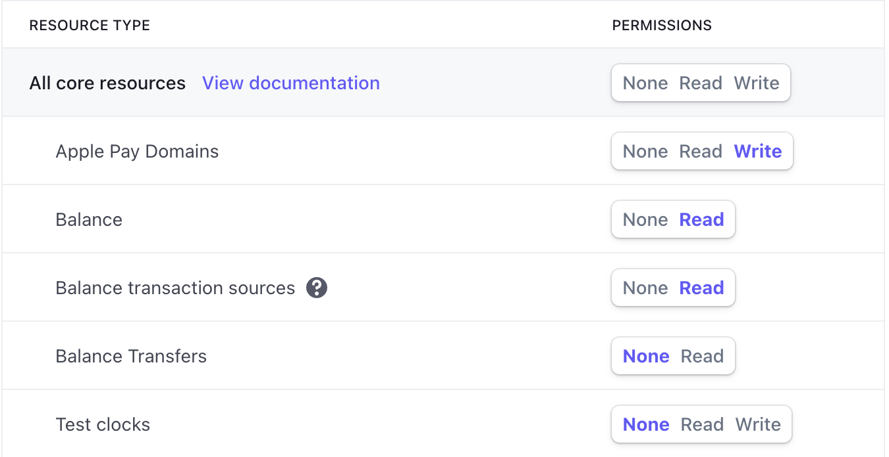
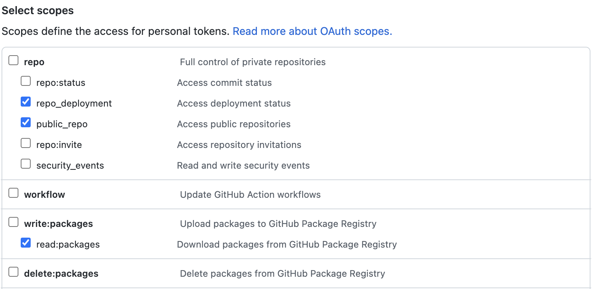
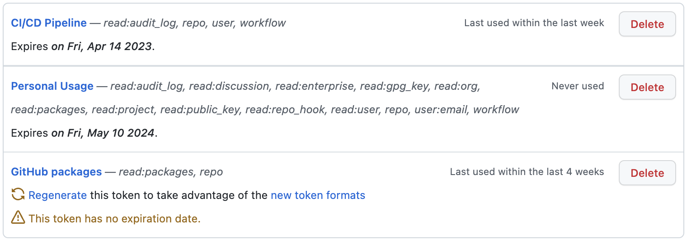
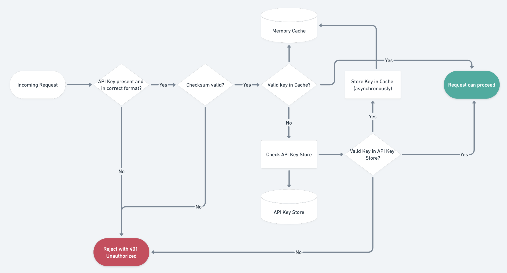
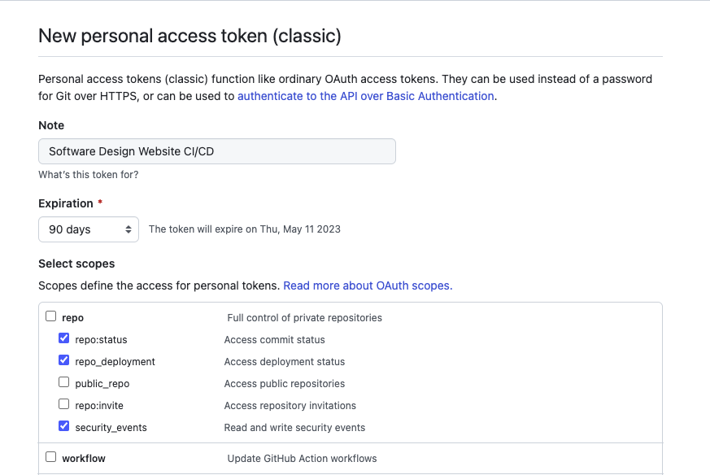

## Overview

**API Key** is a unique identification key assigned to an API client. It's typically an alphanumeric string included in every API call that a server can receive and validate.

**API Keys** are widely used to protect public APIs because they are pretty secure and easy to use rather than JWT tokens. Many large companies, such as GitHub, Stripe, SendGrid, use this strategy.

The most common use cases for **API Keys**:

- **Protecting Public API:** API Keys provide a straightforward way for developers to use a third-party API service.

- **Blocking Anonymous Traffic:** API Keys can identify client applications and prevent malicious activity or traffic.

- **Control API Calls:** Limit API usage by rate-limiting the incoming traffic or requests.

- **Filtering and Monitoring:** Filter logs and monitor API usage for specific API consumers identified with associated API Keys.

### Basic intention

**API Keys** have two primary purposes:

1. **Authentication:** the key identifies the client requesting an API. Each client has its own key to distinguish it from other clients.

2. **Authorization:** by the received key, an API can identify the client's permissions. It allows adding some API usage limitations for a specific client. For example, an API key could limit the number of hourly allowed requests or restrict access to particular services.

**API** application checks the provided key in the performed request with the client database and decides whether to accept or deny the request.

Additionally, API can _monitor the activity_ of the individual API keys since every authenticated request comes with an associated API key. That allows API to identify harmful traffic and block incoming requests from a particular API user.

### Scope and permissions

**API Keys** might have a configurable scope of assigned permissions that defines which operations can be performed and what resources can be accessed. That gives more granular access needed for a specific client's application.

The level of access might be based on the system resources (`users`, `tasks`, etc.) and available operations (`read`, `read/write`, etc.).

For example, [Stripe](https://stripe.com/docs/keys) allows configuring access permissions for all the available system resources:



A similar scope principle works for GitHub's [personal access tokens](https://docs.github.com/en/developers/apps/building-oauth-apps/scopes-for-oauth-apps):



### Metadata

For better usability and identification, **API Keys** might have additional metadata to be searchable and recognizable. The traditional metadata fields are `name`, `description`, `creation_date`, `last_used_date`, `expiration_date`, and `tags`.

Here is how GitHub displays the list of existing API Keys with additional information that makes it easier to identify and get the purpose of each generated key:



### Retrievable vs Irretrievable

**Irretrievable** keys are shown only once right after the creation. The client needs to copy the generated key and store it somewhere before leaving the API key creation interface. Typically, the key is not stored on the server's database, but only its hash. That means that the lost key _can't be recovered_, only recreated.


**Irretrievable** keys should be hashed using the _SHA256 algorithm_ and stored as a _primary key_ in the database.


**Retrievable** API Keys are stored in the server's database and can be viewed anytime after creation. The database storing those keys needs to be encrypted to improve security.

**Irretrievable** keys are more secure, but **Retrievable** keys are easier to verify.

The choice should depend on how sensitive the protected information is. For instance, Stripe payment service uses **Irretrievable** keys because its data needs to be highly secured.

## Comparison

### Login/Password drawbacks

The most common way of user authentication is a _username/password_ pair generated by the user. That might lead to the following issues:

- **Weak security.** As the user generates the password, it can be easily guessed in the case of simplicity. We might add some password format rules (such as minimum length or presence of special characters), but the user still can use elementary combinations hackable via a brute-force attack.

- **Shared credentials.** Users can use the same username/password combination for different services. If one of the services leaks the credentials, it will impact the rest of the user accounts.

- **Single scope.** The username/password combination identifies an API user and provides full access. It's not possible to limit the privileges and require separate credentials for different scopes.

### API Keys benefits 

API keys are aimed to solve the mentioned issues of _username/password_ authentication and provide more reliable access for the automated services and applications:

- **Generated on API side.** All the API Keys are produced by API following the required security standards. It prevents weak password usage generated by the client user.

- **Private consuming.** API key is not representing a username, so only the API knows the user owning the particular API Key.

- **Easy to revoke.** If the API Key was compromised, it could be simply removed, avoiding locking its user completely.

- **Access scope separation.** A single user might have more than one API Key, providing different access scopes and limitations. That might be helpful if the user implements a few clients requiring different privileges.

### The difference with API Tokens

**API Keys** and **API Tokens** might look pretty similar at first glance. They both are just text strings used for user identification and attached to every client's request. But from the usage perspective, these strings have different purposes.

There are the main differences:

- **API Token** typically contains some information about the user, while **API Key** is just a random unique meaningless string.
- **API Keys** define the source of the requesting entity, whereas **API Tokens** identify the user and their rights.
- **API Tokens** have a shorted expiration time rather to **API Keys**.
- **API Tokens** are generated during authentication processes and might be refreshed later. **API Keys** are generated by the authenticated user request and live until expired or manually deleted.

## Implementation

### Keys creation

There are two API Keys that might be used - the public and private ones. The "public" key can be shared with collaborators or used on the frontend application side as it's more limited in access. The "private" key gives more access, so it should be protected and used only on the server side and stored via hidden configs or environment variables.

They must be unique to identify the user and random to stay unguessable.

Implementation with **Python**:

```python
from secrets import token_hex, compare_digest

# create a token
token = token_hex(16)

# process constant-time compare
isEqual = compare_digest(token, '3d08150b16562cbf0d92614d6b12bafc') 
```

Implementation with **Node.js**:

```javascript
const { randomBytes, timingSafeEqual } = require('crypto');

// create a token
const token = randomBytes(16).toString('hex');

// process constant-time compare
const isEqual = timingSafeEqual(
  Buffer.from(token, 'utf8'),
  Buffer.from('3d08150b16562cbf0d92614d6b12bafc', 'utf8')
);
```


The idea behind the **constant-time compare** is to compare all input bytes using constant time. Only when all the bytes were compared the ultimate result of the method is returned. This approach is used to prevent attacks that use the time of processing queries to guess secret values (called **Timing Attacks**).


### Passing an API Key

There is no single standard for **API Key** transporting. However, there are a few widely spread ways to handle that.

1. **Via HTTP request header.**

HTTP allows custom headers (typically started with `x-` prefix), which can be used to pass an API Key. The most common HTTP header for the API Key is `x-api-key`. For example, it is used by the [AWS API Gateway](https://docs.aws.amazon.com/apigateway/latest/developerguide/api-gateway-api-key-source.html) service to authorize incoming requests.

```http
GET / HTTP/1.1
Host: example.com
X-API-KEY: abcdef12345
```

Another HTTP header that might be used is the `Authorization`. It can be passed with the following schemas:
- `Authorization: Basic <BASE64_API_KEY>` - the API Key is encoded in _Base64 format_.
- `Authorization: Bearer <API_KEY>` - the API Key passed as it is.

2. **Via query string parameter**

Sometimes, it might be challenging to pass the HTTP headers for the requested resource. To solve this, API Key might be included in the URL using a query parameter (`api_key` or simply `key`).

- `https://api.nasa.gov/insight_weather/?api_key=DEMO_KEY&feedtype=json&ver=1.0`
- `https://maps.googleapis.com/maps/api/js?key=YOUR_API_KEY&callback=initMap`

3. **Via request body**

If the API implies that HTTP requests having a request body (primarily `POST` requests), the **API Key** might be included in the request payload along with the rest of the options.

This method is not recommended in most cases because the API Key is mixed with the request data, which breaks [the REST](https://restfulapi.net/) convention and restricts `GET` queries.

```http
POST / HTTP/1.1
Host: example.com

{ "api_key": "xxx" }
```

### Key Verification

The **API key** hashes can be stored using **in-memory** cache solutions to reduce the latency on every API request. There are many solutions, such as **Redis** or **Memcached**.

From the security perspective, it's important to store only the API Key's hashed version in the cache.



## Security

API Keys identify a project to an API and specify the resources a project can access. That's not a completely secure way because of the following reasons:

- API is not identifying a particular user making a request, only the project or service using the API key
- API keys are stored on the client side and might be compromised
- API keys have a long expiration time, so stolen keys can be used a lot until the owner manually regenerates them

Because of the following issues, it might be better to use an **API token** that aims to identify the acting user and has s shorter lifetime.

### Security recommendations

- **Never embed an API key into the code.**
  API Keys should be stored in private configs or environment variables.

- **Always use HTTP/SSL protocol.**
  As the API Key is sent on every request, use HTTPS protocol to ensure that data is encrypted in transit.

- **One API key per project.**
  Assign a separate API key per project (service) and add the corresponding description. If one of the used keys is leaked, you can simply regenerate it without affecting the rest of the projects.

- **Apply for least-privilege permissions.**
  If the API provides a way to specify the API key permissions, grant only the permissions required to perform a task. That will make the API key more secure and prevent permitting irrelevant operations.

## Best Practices

- **Prefix API key**

  It would be easier to identify the purpose of the token. For example, [Stipe](https://stripe.com/docs/keys) uses the following prefixes: `sk_live_XXX`, `sk_test_XXX`, `pk_live_XXX`, and `pk_test_XXX`. It shows if the token is public/private and live/test. Also, the agreed pattern might be used by some security scanning tools, like [GitHub’s secret scanning](https://docs.github.com/en/code-security/secret-scanning/about-secret-scanning) to prevent leaking keys in the codebase.

- **Specify expiration date**
  
  Like any secret, API keys need to be rotated regularly. If the API key is stolen or not used anymore, it will be automatically deleted after the specified time. Expiration time could be default or defined by the user. It's not recommended to have a key expiration of **> 1 year**.

- **Allow multiple API keys**
  
  Allow users to have multiple API keys. That's required for the old key regeneration and replacement in the production application without downtime. It should be possible for a user to have at least two API keys.

- **Introduce API Key metadata**
  
  Give a user possibility to tag his API keys or attach a text description. That will simplify the management and will remind the purpose of the generated keys. Also, the creation date should be displayed, which helps to differentiate between old and new keys.

- **Hide API Keys in the UI**
  
  This point is more relevant for the **retrievable** keys that a user can access from the management UI. The existing API keys should be hidden somehow (for example, with asterisks `*`) until they are explicitly requested.

## Examples

### Stripe

Stripe is a famous payment processing service. It provides an API interface to interact with its functionality and automate many operations. To use the existing API, the client needs to have API Keys that can be generated via Stripe Dashboard.

The Stripe API uses [API keys](https://stripe.com/docs/keys) to authenticate requests. You can view and manage your API keys in [the Stripe Dashboard](https://stripe.com/login?redirect=/account/apikeys).

Authentication to the API is performed via **HTTP Basic Auth**. Provide your API key as the basic auth username value. You do not need to provide a password:

```bash
curl -u "YOUR_SECRET_KEY:" https://api.stripe.com/v1/charges
```

### GitHub

GitHub API provides a flexible _Access Token mechanism_ for authentication. It allows specifying expiration date and permitted scope of resources. See the [Creating a personal access token](https://docs.github.com/en/authentication/keeping-your-account-and-data-secure/creating-a-personal-access-token) for more details.

Once the personal access token is generated, it can be used for the GitHub API requests:

```bash
curl -u "USERNAME:TOKEN" https://api.github.com/user
```



### Google Maps

Google Maps Platform products are secured from unauthorized use by restricting API calls to those that provide proper authentication credentials. These credentials are in the form of an API key - a unique alphanumeric string that associates your Google billing account with your project, and with the specific API or SDK.

You must include an API key with every request. Also, HTTPS is required for requests that use an API key.

```html
<script async defer src="https://maps.googleapis.com/maps/api/js?key=YOUR_API_KEY&callback=initMap"></script>
```

### Custom examples


Api Keys implementation examples in **Node.js** are available .


## Resources

- 📹 [What Are API Keys, And Why Are They So Important?](https://www.youtube.com/watch?v=sNn23dPRUS8&ab_channel=BigTechCoach)
- 📝 [What is an API Key? (And Are They Secure?)](https://blog.hubspot.com/website/api-keys)
- 📝 [On API Keys Best Practices](https://blog.mergify.com/api-keys-best-practice/)
- 📝 [The Difference Between API Keys and API Tokens](https://nordicapis.com/the-difference-between-api-keys-and-api-tokens/)
