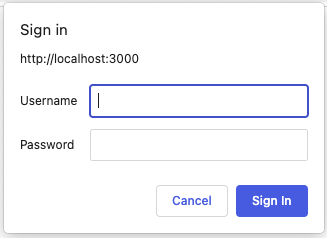
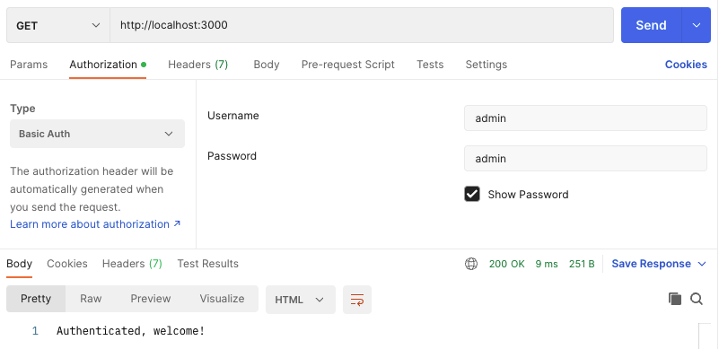

## Overview

**HTTP Basic Auth** is a simple authentication method using username/password pair credentials for HTTP requests.

These credentials are encoded in **Base64** format and transmitted through the `Authorization` header. The header value starts with the `Basic` keyword. Here is an example header:

```http
GET / HTTP/1.1
Host: example.com
Authorization: Basic YWRtaW46YWRtaW4=
```

The **Basic** authentication schema is described in the [RFC 7617](https://datatracker.ietf.org/doc/html/rfc7617) HTTP specification.

## Authentication Flow

1. The client makes a standard request to the server resource protected with the **Basic Auth** mechanism.
2. The server responds with a `401 Unauthorized` status code and an additional `WWW-Authenticate` header containing a **Basic** type challenge.
3. The client application will ask the user for the corresponding credentials:
    - Get the _username_ and _password_ (if the client is a web browser, it will prompt a dialog modal)
    - The credentials will be captured in `username:password` format and encoded in **Base64**
4. The following client request will contain an authorization header containing the requested credentials: `Authorization: Basic <BASE_64_KEY>`.


That's possible to specify an optional `realm` directive for the `WWW-Authenticate` header. Its value is used to separate domain-protected areas using different credentials. The browser will connect the user credentials to the `realm` value and send the corresponding `Authorization` header.

For example, we might have two protected areas (routes) with separate credentials per each:

```http
# Request: GET /users/ HTTP/1.1

HTTP/1.1 401 Unauthorized
WWW-Authenticate: Basic realm='users'
```

```http
# Request: GET /tasks/ HTTP/1.1

HTTP/1.1 401 Unauthorized
WWW-Authenticate: Basic realm='tasks'
```


A similar flow works for _proxy authentication_. The only difference is HTTP headers. In the case of proxies, the `407 Proxy Authentication Required` status and the `Proxy-Authenticate` header must be used.


## Recommended use cases

- **Server-to-Server environments.**
  If a few server applications communicate with each other over secured HTTPS protocol, Basic Auth could be applied as an authentication technic. If these servers are hosted inside a single private network, that's even better.

- **Temporarily restricting public access.**
  It might be used to limit access to a read-only resource during the implementation of the initial prototype. That will hide it from the public and allow access only to people who have the access credentials.

- **Token-based permissions.**
  The **Basic Auth** value can be considered an authentication token for a token-based API.

## Advantages of usage 👍

- **Built-in browser support.** Most modern browsers can indicate the **Basic Auth** header and display the corresponding modal dialog asking for credentials. Then, the authentication header will be attached to every request automatically.

- **Standardized method.** This method is defined by the HTTP specification, which means typical HTTP protocol clients know how to process the Basic Authentication.

- **Easy to implement.** The method is relatively simple and might be implemented via a header check logic. Hoverer, some web servers, such as Apache or Nginx, have a built-in module for that.

## Disadvantages of usage 👎

- **Security drawbacks.** The **Basic Auth** mechanism sends encoded credentials, not encrypted. This method should be used only over a secure connection (HTTPS) to prevent credentials interception.

- **Long-living passwords.** A client captures the initially inputted credentials and uses them for the following requests. There is no token expiration mechanism, and credentials might be compromised.

- **Hard to revoke/logout.** Basic Auth gives full access to the user. Then, it's no way to revoke the access rather than to change the password. To sign out, the user needs to send a request with incorrect permissions to clean the Basic Auth cache, which is not controlled by the server.

## Usage

### Browser

The initial request to the resource protected with **Basic Auth** will display the following modal dialog in the browser:



Once you type your username/password and press the "Sign In" button, the previous request will be replayed but with an additional `Authorization` HTTP header containing the credentials encoded in Base64 format.

Navigating to other web pages of the requested domain will use the same credentials, so that every request will contain the captured `Authorization` header.

### Postman

In the request **Authorization** tab, choose **Basic Auth** from the **Type** dropdown list.

In the request **Headers**, the **Authorization** header passes the API a Base64 encoded string representing your username and password values, appended to the text `Basic`.



### CURL

To send Basic Auth credentials with the [Curl](https://curl.se/) tool, you must pass the `-u login:password` command-line option. Curl will automatically encode it using Base64 format and attach it to the `Authorization: Basic [token]` request header.

```bash
curl -u "admin:admin" http://localhost:3000
```

## Examples


Basic Auth implementation examples in **Node.js** and **Nginx** are available [here](https://github.com/DanilaFadeev/software-design-sources/tree/main/backend/basic-auth).


## Resources
- 📹 [Basic Authentication | Authentication Series](https://www.youtube.com/watch?v=mwccHwUn7Gc&ab_channel=theroadmap)
- 📝 [MDN - HTTP authentication](https://developer.mozilla.org/en-US/docs/Web/HTTP/Authentication)
- 📝 [Why I Love Basic Auth](https://www.rdegges.com/2015/why-i-love-basic-auth/)
