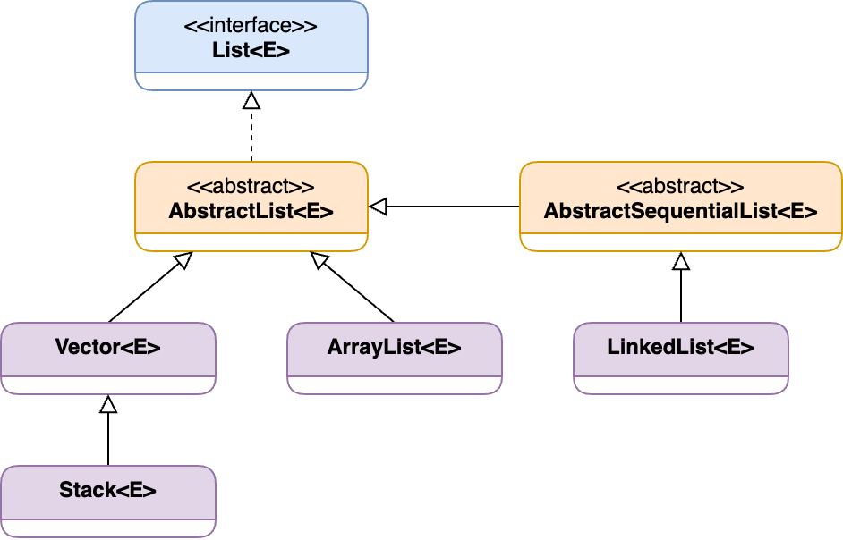
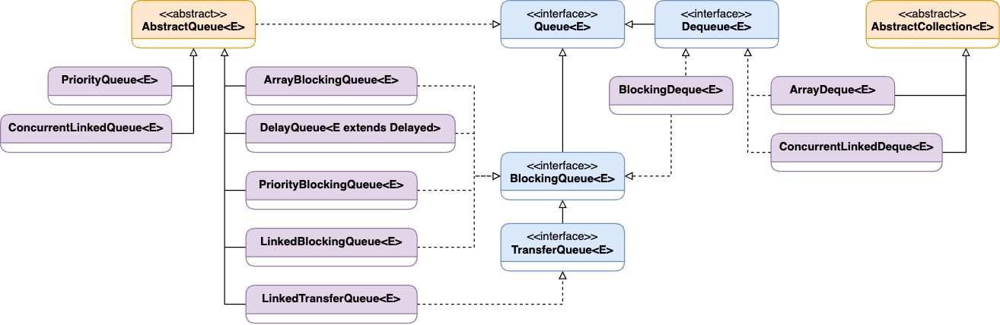

**Collections Framework** is the architecture to represent and manipulate various _Collections_ in Java. It consists of the following parts:

1. **Interfaces** provide abstract data types to represent the collection.
2. **Implementation Classes** are concrete implementations of the existing collection interfaces.
3. **Algorithms** provide common features for collection manipulation, such as sorting, searching, and shuffling.


**Collection Framework** was introduced in Java JDK 1.2. Before that, Java had only **Arrays**, **Stack**, **Vectors**, and **Hashtables** for grouping objects.


#### Advantages

- **Consistent API.** The framework provides a set of interfaces implemented by all the classes. It means that all the similar classes have a common set of methods, which makes them simpler to memorize and use.

- **Reduces programming effort.** The developer shouldn't re-implement common data structures in most scenarios and can use already existing ones. In the case of custom implementations, it's not necessary to design a new structure but to work with the provided abstractions.

- **Increases system quality.** Provided implementations are using effective and tested algorithms under the hood. The main goal is to choose the proper collection implementation.

## Hierarchy

Java collection classes and interfaces are stored in the `java.util` package. The collection interfaces are divided into two groups: `java.util.Collection` and `java.util.Map`.

<!-- ## Collection Interface

A **Collection** represents a group of objects (elements). -->

## List

The **List** interface provides a way to store ordered elements sequentially. It allows positional access and insertion of elements. Classes that implement the interface: **ArrayList**, **LinkedList**, **Vector**, and **Stack**.

The **List** interface uses **ListIterator** to iterate through the elements in forward and backward directions.



#### Common operations:

- **Adding** new elements to the existing list: `add(Object)`, `add(int index, Object)`
- **Accessing** elements: `get(int index)`
- **Updating** existing elements: `set(int index, Object)`
- **Removing** elements: `remove(Object)`, `remove(int index)`
- **Checking** the element presentence: `contains(Object)`
- **Retrieving the position** of the specific element: `indexOf(element)`, `lastIndexOf(element)`

#### Time complexity:

| Class / Operation | Data Structure | `add()` | `remove()` | `get()` |
| --- | --- | --- | --- | --- |
| **ArrayList** | Resizable Array | O(N) | O(N) | O(1) |
| **LinkedList** | Doubly Linked List | O(1) | O(1) | O(N) |
| **Vector** | Resizable Array | O(N) | O(N) | O(1) |
| **Stack** | Stack | O(1) | O(1) | O(N) |

### ArrayList

**ArrayList** class provides dynamic arrays in Java, which can be slower than regular arrays but helpful in cases where the size of an array is frequently changed. In other words, it provides the functionality of a dynamic array where the size is not fixed and can be adjusted in runtime.

Under the hood, **ArrayList** uses a plain array of a bigger size. That size automatically increases when we add more items or decreases when we remove them.

**ArrayList** stores data till the ArrayList size is full. After that, the size doubles if we want to store more elements. Below there is the simplified algorithm of how the **ArrayList** expands:

1. Reserves a bigger-sized memory on heap memory
2. Copies existing elements to the new memory
3. Deletes the old memory

#### Important notes:

- **ArrayList** is initialized with the default capacity of 10 elements, but this value changes when we add or remove elements
- **ArrayList** allows us to access the list randomly
- To store _primitive types_, we must use wrapper classes (for instance, **Integer**, **Boolean**, etc.)
- **ArrayList** is not _synchronized_ (the **Vector** class does)
- **NULL** and duplicated values are allowed
- The insertion order is preserved

```java
// Declaration
public class ArrayList<E> extends AbstractList<E>
  implements List<E>, RandomAccess, Cloneable, java.io.Serializable

// Constructors
public ArrayList()
public ArrayList(int initialCapacity)
public ArrayList(Collection<? extends E> c)
```

**Usage example:**

```java
List<String> langs = new ArrayList<>();

langs.add("Java");           // [Java]
langs.add("Python");         // [Java, Python]
langs.add("Ruby");           // [Java, Python, Ruby]
langs.add("Erlang");         // [Java, Python, Ruby, Erlang]

langs.add(1, "Elixir");      // [Java, Elixir, Python, Ruby, Erlang]
langs.add(3, "Elixir");      // [Java, Elixir, Python, Elixir, Ruby, Erlang]

langs.contains("Elixir");    // true
langs.indexOf("Elixir");     // 1
langs.lastIndexOf("Elixir"); // 3

langs.remove("Elixir");      // [Java, Python, Elixir, Ruby, Erlang]
```

### LinkedList

**LinkedList** class is implemented on top of the _linked list_ data structure that stores its elements as a separate node. Every node consists of two parts: actual data and the link to the next node. The nodes are linked using pointers and addresses.

- **LinkedList** works as a dynamic array, so we don't need to specify its capacity on initialization.
- **LinkedList** uses a double-linked list containing two pointers - for the forward and the backward nodes.
- **LinkedList** comes with efficient insertion and deletion operations because it's not required to shift the existing items but rather update the links on sibling nodes.
- It's simple to iterate over the elements in both directions
- **LinkedList** requires more memory compared to the **ArrayList** because it also stores the node references
- It's not possible to access an element by its index, so we need to iterate over the list until we find the match

```java
// Declaration
public class LinkedList<E> extends AbstractSequentialList<E>
  implements List<E>, Deque<E>, Cloneable, java.io.Serializable

// Constructors
public LinkedList()
public LinkedList(Collection<? extends E> c)
```

**Usage example:**

```java
LinkedList<String> workingDays = new LinkedList<>();

workingDays.add("Monday");
workingDays.add("Tuesday");
workingDays.add("Wednesday");
workingDays.add("Thursday");
workingDays.add("Friday");

// Forward iteration
for (String day : workingDays) {
  System.out.print(day + " ");
}

// Backward iteration
Iterator<String> descendingIterator = workingDays.descendingIterator();
while (descendingIterator.hasNext()) {
  System.out.print(descendingIterator.next() + " ");
}
```

### Vector

**Vector** implements a resizable array and works similarly to **ArrayList**.

- **Vector** is synchronized and has some legacy methods the collections framework doesn't provide
- Due to its synchronized nature, it provides worse performance for the core operations
- **Vector** iterator is _fail-fast_ (throws an exception in case of concurrent modification)
- It was present in the initial Java versions, and it's still supported

> Using the **Vector** class is not recommended if there is no need for synchronization features. It comes with slower performance and unnecessary overhead.

```java
// Declaration
public class Vector<E> extends AbstractList<E>
  implements List<E>, RandomAccess, Cloneable, java.io.Serializable

// Constructors
public Vector()
public Vector(int initialCapacity)
public Vector(int initialCapacity, int capacityIncrement)
public Vector(Collection<? extends E> c)
```

**Usage example:**

```java
Vector<String> mammals= new Vector<>();

// Using the add() method
mammals.add("Dog");
mammals.add("Horse");

// Using index number
mammals.add(2, "Cat");
System.out.println(mammals); // [Dog, Horse, Cat]

// Using addAll()
Vector<String> animals = new Vector<>();
animals.add("Crocodile");

animals.addAll(mammals);
System.out.println(animals); // [Crocodile, Dog, Horse, Cat]
```

### Stack

**Stack** class implements _stack_ data structure (last in, first out).

- **Stack** is thread-safe
- **Stack** is considered deprecated, and for single-thread logic, it's recommended to use **ArrayDeque**

```java
// Declaration
public class Stack<E> extends Vector<E>

// Constructors
public Stack()
```

**Usage example:**

```java
Stack<String> trace = new Stack<>();
trace.push("com.example.task01.Test.main(Solution.java:6)");
trace.push("com.example.task01.Test.convertStringToInt(Solution.java:10)");
trace.push("java.base/java.lang.Integer.parseInt(Integer.java:770)");
trace.push("java.base/java.lang.Integer.parseInt(Integer.java:614)");

System.out.println("Exception in thread \"main\":");
while (!trace.isEmpty()) {
  System.out.println("\t" + trace.pop());
}

// Exception in thread "main":
//	java.base/java.lang.Integer.parseInt(Integer.java:614)
//	java.base/java.lang.Integer.parseInt(Integer.java:770)
//	com.example.task01.Test.convertStringToInt(Solution.java:10)
//	com.example.task01.Test.main(Solution.java:6)
```

## Queue

**Queue** interface maintains a specific order of element extraction (for example, FIFO). It is used to insert new elements at the end of the queue and remove them from the beginning of the queue.

The **Queue** interface is implemented by several classes, including **LinkedList**, **ArrayDeque**, **PriorityQueue**, and **ArrayBlockingQueue**.

The **Queue** implementations from the `java.util` package are **Unbounded Queues**, whereas implementations from the `java.util.concurrent` package are **Bounded Queues**.



#### Common operations:

- **Adding** elements to the end of the queue: `add(Object)`, `offer(Object)`
- **Removing** elements at the front of the queue: `remove()`, `poll()`
- **Accessing** front element without removing it: `element()`, `peek()`
- **Checking** the element presentence: `contains(Object)`
- **Retrieving** an element by its index: `get(int index)`

#### Time complexity:

| Class / Operation | Data Structure | `add()` | `remove()` | `get()` |
| --- | --- | --- | --- | --- |
| **PriorityQueue** | Priority Heap | O(log(N)) | O(log(N)) | O(log(N)) |

### PriorityQueue

**PriorityQueue** is based on the priority heap and ordered by natural ordering (which can be changed by providing a custom **Comparator** at queue construction time).

This queue is used when its elements need to be stored and handled based on their priority.

- **PriorityQueue** doesn't allow NULL values and non-comparable objects
- **PriorityQueue** is not thread-safe (the thread-safe alternative is **PriorityBlockingQueue**)

```java
// Declaration
public class PriorityQueue<E> extends AbstractQueue<E>
  implements java.io.Serializable

// Constructors
public PriorityQueue()
public PriorityQueue(int initialCapacity)
public PriorityQueue(Comparator<? super E> comparator)
public PriorityQueue(int initialCapacity, Comparator<? super E> comparator)
public PriorityQueue(Collection<? extends E> c)
public PriorityQueue(PriorityQueue<? extends E> c)
public PriorityQueue(SortedSet<? extends E> c)
```

**Usage example:**

```java
Queue<Integer> ages = new PriorityQueue<>();
ages.add(10);
ages.add(5);
ages.add(99);
ages.add(18);

while (!ages.isEmpty()) {
  System.out.print(ages.poll() + " ");
}
// Output: 5 10 18 99
```

## Map

The **Map** interface represents a mapping between a _key_ and a _value_.

- A **Map** must contain only unique _keys_, and each _key_ can map to at most one _value_.
- The order of the stored elements depends on the specific implementation.


#### Time complexity:

| Class / Operation | Data Structure | `get()` | `put()` | `remove()` |
| --- | --- | --- | --- | --- |
| **HashMap** | Hash Table | O(1) | O(1) | O(1) |
| **LinkedHashMap** | Hash Table + Linked list | O(1) | O(1) | O(1) |
| **TreeMap** | Red-Black Tree | O(log(N)) | O(log(N)) | O(log(N)) |
| **ConcurrentHashMap** | Hash Table | O(1) | O(1) | O(1) |
| **ConcurrentSkipListMap** | Skip List | O(log(N)) | O(log(N)) | O(log(N)) |
| **EnumMap** | Array | O(1) | O(1) | O(1) |
| **IdentityHashMap** | Hash Table | O(1) | O(1) | O(1) | 

<!-- ### Interfaces 📐

#### SortedMap

**SortedMap** interface extends **Map** interface and provides a total ordering of its elements, based on the natural order of keys. The main difference between **SortedMap** and common **Map** that elements in a **SortedMap** are stored in a sorted order.

#### NavigableMap

**NavigableMap** extends the **SortedMap** interface with comparison operations (lower, higher, ceiling, floor).

#### ConcurrentMap

**ConcurrentMap** provided by the `java.util.concurrent` package. It's also known as a synchronized Map and implemented by **ConcurrentHashMap** and **ConcurrentSkipListMap** classes. 

#### ConcurrentNavigableMap -->

### HashMap

**HashMap** class provides a basic implementation of the **Map** interface.

- Stores key-value pairs
- Fast access time (usually `O(1)`)
- Uses _hash function_ to map keys to indexes in an array
- Supports **null** keys and values
- Unordered, which means that the order of elements is not preserved
- Allows duplicate values, but not duplicate keys
- Not thread-safe, because multiple threads can access the same hashmap simultaneously
- Have a capacity and a load factor, which indicates when the hashmap has to be resized

```java
// HashMap class constructors:
new HashMap();
new HashMap(int initialCapacity); // default 16
new HashMap(int initialCapacity, float loadFactor); // default 16 and 0.75
new HashMap(Map map);
```

### LinkedHashMap

**LinkedHashMap** has a similar implementation to the **HashMap** but also maintains an order of inserted elements. The data is stored in the form of nodes.

- Keys are sorted in an insertion order
- It may have one **null** key and multiple **null** values

```java
// Declaration
public class LinkedHashMap<K,V> extends HashMap<K,V> implements Map<K,V>

// Constructors
public LinkedHashMap()
public LinkedHashMap(int initialCapacity)
public LinkedHashMap(int initialCapacity, float loadFactor)
public LinkedHashMap(Map<? extends K, ? extends V> m)
```

**Items order preserve example:**

```java
Map<String, Integer> linkedHashMap = new LinkedHashMap<>();
linkedHashMap.put("first", 1);
linkedHashMap.put("second", 2);
linkedHashMap.put("third", 3);
System.out.println(linkedHashMap); // {first=1, second=2, third=3}

Map<String, Integer> hashMap = new HashMap<>();
hashMap.put("first", 1);
hashMap.put("seconds", 2);
hashMap.put("third", 3);
System.out.println(hashMap); // {seconds=2, third=3, first=1}
```

### TreeMap

**TreeMap** is implemented using a _Red-Black tree_, which provides efficient performance for common operations, such as adding, removing, and retrieving elements, with an average `O(log n)` time complexity.

- **TreeMap** does not allow null keys. However, values might be null.
- Keys are sorted in a natural order.

```java
// Declaration
public class TreeMap<K,V> extends AbstractMap<K,V>
  implements NavigableMap<K,V>, Cloneable, java.io.Serializable

// Constructors
public TreeMap()
public TreeMap(Comparator<? super K> comparator)
public TreeMap(Map<? extends K, ? extends V> m)
public TreeMap(SortedMap<K, ? extends V> m)
```

**Example:**

```java
TreeMap<Integer, String> treeMap = new TreeMap<>();

treeMap.put(1, "One");
treeMap.put(3, "Three");
treeMap.put(5, "Five");

treeMap.put(0, "Zero");
treeMap.put(2, "Two");
treeMap.put(4, "Four");

System.out.println("TreeMap: " + treeMap);
// TreeMap: {0=Zero, 1=One, 2=Two, 3=Three, 4=Four, 5=Five}
```

### ConcurrentHashMap

**ConcurrentHashMap** is a thread-safe implementation of the **Map** interface, which means multiple threads can access it simultaneously without synchronization issues.

The object is divided into a number of _segments_ according to the concurrency level (16 by default). To perform an update operation, the thread must lock the particular segment in which the thread wants to operate (**Segment locking** or **Bucket locking**).

- The class is **thread-safe** so that multiple threads can operate on a single object without any complications
- Threads can produce read operations without locking the **ConcurrentHashMap** object
- It doesn't support **null** values for keys and values
- It provides methods for performing atomic operations (`putIfAbsent()`, `replace()`, `remove()`)
- It is able to achieve high performance because of its fine-grained locking mechanism
- Requires additional memory overhead compared to other synchronization mechanisms

```java
// Declaration
public class ConcurrentHashMap<K,V> extends AbstractMap<K,V>
  implements ConcurrentMap<K,V>, Serializable

// Constructors
public ConcurrentHashMap()
public ConcurrentHashMap(int initialCapacity)
public ConcurrentHashMap(Map<? extends K, ? extends V> m)
public ConcurrentHashMap(int initialCapacity, float loadFactor)
public ConcurrentHashMap(int initialCapacity, float loadFactor, int concurrencyLevel)
```

### ConcurrentSkipListMap

**ConcurrentSkipListMap** keys are sorted by natural order (or by using a **Comparator**) at the time of construction. It has the expected time cost of `O(log N)` for insertion, deletion, and searching operations. The class is _thread-safe_, meaning all the basic operations can be processed concurrently.

The class can be used for good average performance for search operations. At the same time, using it in cases where too many add/remove operations is not recommended.

- It doesn't allow **null** keys and values
- More efficient for searching elements compared to **ConcurrentHashMap**
- It uses a concurrent variation of **SkipList** data structure providing `log(n)` time cost for main operations
- It has additional operations for searching elements: `firstKey/lastKey`, `higherKey/lowerKey`, `ceilingKey`, `floorKey`

```java
// Declaration
public class ConcurrentSkipListMap<K,V> extends AbstractMap<K,V>
  implements ConcurrentNavigableMap<K,V>, Cloneable, Serializable

// Constructors
public ConcurrentSkipListMap()
public ConcurrentSkipListMap(Comparator<? super K> comparator)
public ConcurrentSkipListMap(Map<? extends K, ? extends V> m)
public ConcurrentSkipListMap(SortedMap<K, ? extends V> m)
```

### HashTable

- **Null** values can't be used as a key (because **null** is not an object and doesn't have the `hashCode()` method)
- It is similar to **HashMap** but _synchronized_ (Thread-safe), which can lead to slower performance compared to other implementations
- Considered deprecated in favor of **HashMap**

```java
// Declaration
public class Hashtable<K,V> extends Dictionary<K,V>
  implements Map<K,V>, Cloneable, java.io.Serializable

// Constructors
public Hashtable()
public Hashtable(int initialCapacity)
public Hashtable(int initialCapacity, float loadFactor)
public Hashtable(Map<? extends K, ? extends V> t)
```

**Hashtable** is implemented as an array of buckets that stores the key/value pairs. The target bucket is determined by the `hashCode()` method, invoked on the _key_, which returns a non-negative integer. If two different objects have the same _hash-code_, it's called a **collision**. 


### Properties

- **Properties** is a subclass of **Hashtable**
- Used to store a list of mappings where both key and value are strings
- It can be used to retrieve the properties of the system, properties files
- If the external properties record changes, it will be picked up without re-compilation.
- **Properties** provide methods to load/store data using a stream

```java
// Declaration
public class Properties extends Hashtable<Object, Object>

// Constructors
public Properties()
public Properties(int initialCapacity)
public Properties(Properties defaults)
private Properties(Properties defaults, int initialCapacity)
```

**Usage examples:**

```java
// Prints operation system name
Properties sysProps = System.getProperties();
System.out.println("User System: " + sysProps.get("os.name"));

// Saves system properties to a file
Writer writer = new FileWriter("system.properties");
sysProps.store(writer, "System properties");

// Prints system properties to a console in the XML format
sysProps.storeToXML(System.out, "");
```

### WeakHashMap

**WeakHashMap** is similar to **HashMap** except for the Garbage Collection behavior. Elements in a **WeakHashMap** can be removed by the GC if there are no other references to the _key_ object.

**WeakHashMap** uses _Weak Reference Objects_ to reference the entry values.

It's useful to avoid memory leaks in caching-related logic when the desired lifetime of cache records is determined by external references to the key `(not the value!)`.

```java
// Declaration
public class WeakHashMap<K,V> extends AbstractMap<K,V>
  implements Map<K,V>

// Constructors
public WeakHashMap()
public WeakHashMap(int initialCapacity)
public WeakHashMap(int initialCapacity, float loadFactor)
public WeakHashMap(Map<? extends K, ? extends V> m)
```

**Usage example:**

```java
public static void process(Map<Integer, String> map) {
  Integer key = new Integer(1); // 1. Create key object
  map.put(key, "one");          // 2. Add record to the map
  key = null;                   // 3. Delete reference to the key
  System.gc();                  // 4. Run Garbage Collector
}

public static void main(String[] args) {
  WeakHashMap<Integer, String> weakMap = new WeakHashMap<>();
  process(weakMap);
  System.out.println(weakMap); // Empty map: {}

  HashMap<Integer, String> hashMap = new HashMap<>();
  process(hashMap);
  System.out.println(hashMap); // Non-empty map: {1=one}
}
```

### EnumMap

**EnumMap** is a Map implementation for _enumeration types_ designed to be used with _enums_ as keys. It's a strongly-typed implementation that ensures that only enum constants can be used as keys.

- Keys of **EnumMap** are sorted by the order of _enum_ constraints declared inside the _enum_ type
- It uses high-performance **Map** implementation, faster than **HashMap**
- Each instance of **EnumMap** is associated with a specific enum class, which means that all keys must be keys of that _enum_ type
- **Null** keys are not allowed

```java
// Declaration
public class EnumMap<K extends Enum<K>, V> extends AbstractMap<K, V>
  implements java.io.Serializable, Cloneable

// Constructors
public EnumMap(Class<K> keyType)
public EnumMap(EnumMap<K, ? extends V> m)
public EnumMap(Map<K, ? extends V> m)
```

**Usage example:**

```java
enum Color { RED, GREEN, BLUE }

Map<Color, String> enumMap = new EnumMap<>(Color.class);
enumMap.put(Color.BLUE, "#0000FF");
enumMap.put(Color.RED, "#FF0000");
enumMap.put(Color.GREEN, "#00FF00");

System.out.print(enumMap); // {RED=#FF0000, GREEN=#00FF00, BLUE=#0000FF}
System.out.print(enumMap.keySet());         // [RED, GREEN, BLUE]
System.out.print(enumMap.values());         // [#FF0000, #00FF00, #0000FF]
System.out.print(enumMap.get(Color.GREEN)); // #00FF00
```

### IdentityHashMap

The **IdentityHapMap** implements a **Map** interface, using reference-equality when comparing keys (and values). It is used when the client requires the objects to be compared via references.

- Uses `==` equality operator instead of `equals()` method
- Not _synchronized_ and must be _synchronized_ externally
- Uses `System.identityHashCode()` instead of `hashCode()`, which allows to mutate key objects
- Faster lookups than in **HashMap** because of reference-equality comparison
- It uses more memory than **HashMap** because it stores references to the objects instead of their generated hashes

```java
// Declaration
public class IdentityHashMap<K,V> extends AbstractMap<K,V>
  implements Map<K,V>, java.io.Serializable, Cloneable

// Constructors
public IdentityHashMap()
public IdentityHashMap(int expectedMaxSize)
public IdentityHashMap(Map<? extends K, ? extends V> m)
```

**Usage examples:**

```java
Map<String, String> identityMap = new IdentityHashMap<>();

String key1 = "default";
String key2 = "default";

identityMap.put(key1, "first");
identityMap.put(key2, "second");

System.out.print(identityMap); // {default=second}
```

```java
Map<String, String> identityMap = new IdentityHashMap<>();

String key1 = new String("default");
String key2 = new String("default");

identityMap.put(key1, "first");
identityMap.put(key2, "second");

System.out.print(identityMap); // {default=first, default=second}
```

## Set

The **Set** interface represents an unordered collection of unique elements.

- Extends **Collection** interface with a feature that restricts the insertion of duplicated elements


#### Time complexity:

| Class / Operation | Data Structure | `contains()` | `add()` | `remove()` |
| --- | --- | --- | --- | --- |
| **HashSet** | Hash Table | O(1) | O(1) | O(1) |
| **LinkedHashSet** | Hash Table + Linked List | O(1) | O(1) | O(1) |
| **TreeSet** | Red-Black Tree | O(log(N)) | O(log(N)) | O(log(N)) |

### HashSet

**HashSet** class is implemented using a **HashMap** instance backed by a **hash table**. This fact means a constant performance for the basic operations like _add_, _remove_, _contains_, and _size_.

- Implements **Set** interface and extends **AbstractSet** class
- The underlying data structure is **Hashtable**
- Restricts duplicated values, which means that all the values in the Set must be unique
- **NULL** elements are not allowed
- Unordered

```java
// Declaration
public class HashSet<E> extends AbstractSet<E>
  implements Set<E>, Cloneable, java.io.Serializable

// Constructors
public HashSet()
public HashSet(Collection<? extends E> c)
public HashSet(int initialCapacity)
public HashSet(int initialCapacity, float loadFactor)
```

**Usage example:**

```java
Set<String> names = new HashSet<>();

names.add("Jhon");
names.add("Doe");

names.contains("Jhon"); // true
names.remove("Jhon"); // true
```

### LinkedHashSet

**LinkedHashSet** is an ordered version of the **HashSet** class that maintains a double-linked list for all elements. **LinkedHashSet** allows iterating through its elements in the same order they were inserted.

- Maintains insertion order

```java
// Declaration
public class LinkedHashSet<E> extends HashSet<E>
  implements Set<E>, Cloneable, java.io.Serializable

// Constructors
public LinkedHashSet()
public LinkedHashSet(Collection<? extends E> c)
public LinkedHashSet(int initialCapacity) // default 16
public LinkedHashSet(int initialCapacity, float loadFactor) // default 16 and .75f
```

**Usage example:**

```java
Set<Integer> numsSet = new HashSet<>();
Set<Integer> numsLinkedSet = new LinkedHashSet<>();

for (int i = 10; i > 0; i--) {
    numsSet.add(i);
    numsLinkedSet.add(i);
}

System.out.println(numsSet);       // [1, 2, 3, 4, 5, 6, 7, 8, 9, 10]
System.out.println(numsLinkedSet); // [10, 9, 8, 7, 6, 5, 4, 3, 2, 1]
```

### EnumSet

**EnumSet** is an implementation of the **Set** interface for use with _enumerable types_.

- It's a high-performance **Set** implementation, much faster than **HashSet**
- All the elements must come from the same enumeration
- Uses a **fail-safe** iterator (won't throw an exception if the set is modified during the iteration)
- **NULL** values are not allowed

```java
// Declaration
public abstract sealed class EnumSet<E extends Enum<E>> extends AbstractSet<E>
  implements Cloneable, java.io.Serializable permits JumboEnumSet, RegularEnumSet

// Constructors
EnumSet(Class<E>elementType, Enum<?>[] universe)
```

**Usage example:**

```java
enum WorkDays { MON, TUE, WED, THU, FRI }; 
EnumSet<WorkDays> set1, set2, set3, set4; 

// [MON, TUE, WED]
set1 = EnumSet.of(WorkDays.MON, WorkDays.TUE, WorkDays.WED); 

// [THU, FRI]
set2 = EnumSet.complementOf(set1);

// [MON, TUE, WED, THU, FRI]
set3 = EnumSet.allOf(WorkDays.class); 

// [MON, TUE, WED]
set4 = EnumSet.range(WorkDays.MON, WorkDays.WED); 
```

### TreeSet

**TreeSet** class implements the **SortedSet** interface and uses a balanced _Tree_ as an underlying data structure. The added elements can be ordered by a custom **Comparator** provided at set creation time. The main advantage of storing the elements as a tree is additional navigation methods for traversing that tree.

- The implementation of a TreeSet is not synchronized

```java
// Declaration
public class TreeSet<E> extends AbstractSet<E>
  implements NavigableSet<E>, Cloneable, java.io.Serializable

// Constructors
public TreeSet()
public TreeSet(SortedSet<E> s)
public TreeSet(Comparator<? super E> comparator)
public TreeSet(Collection<? extends E> c)
```

**Usage example:**

```java
public class TreeSetExample {
  static class ModulusComparator implements Comparator<Integer> {
    @Override
    public int compare(Integer o1, Integer o2) {
      return (o1 % 10) - (o2 % 10);
    }
  }
    
  public static void main(String[] args) {
    Comparator<Integer> comparator = new ModulusComparator();
    TreeSet<Integer> numbers = new TreeSet<>(comparator);
    
    numbers.add(8);
    numbers.add(4);
    numbers.add(15);
    numbers.add(19);
    numbers.add(22);
    numbers.add(53);
    numbers.add(101);
    
    System.out.println(numbers); // [101, 22, 53, 4, 15, 8, 19]
  }
}
```

## Resources

- 📑 [Collections in Java - GeeksforGeeks](https://www.geeksforgeeks.org/collections-in-java-2/)
