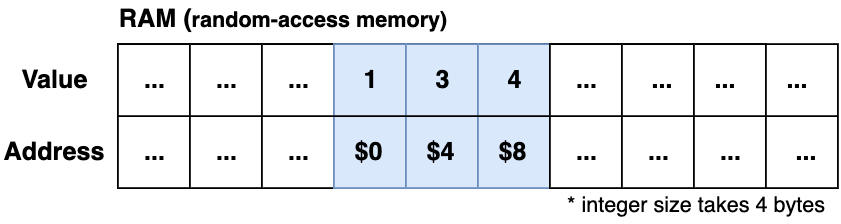

## Array

An array is a <u>contiguous block of data</u> stored sequentially in a computer's RAM. The most common operations with an array are reading and writing to the data.



| Case/Operation | Read   | Insert | Insert (No duplicates) | Search   | Delete   |
| -------------- | ------ | ------ | ---------------------- | -------- | -------- |
| Average        | `O(1)` | `O(1)` | `O(N)`                 | `O(N/2)` | `O(N/2)` |
| Worst-case     | `O(1)` | `O(1)` | `O(N)`                 | `O(N)`   | `O(N)`   |

Arrays have a <u>fixed size</u> once they are first created. In most programs, we don't know the exact amount of required items at the beginning, and this number is calculated or even changes over time. If the program reserves a higher volume, it may lead to wasting the available memory resources. On the other hand, if the initial size is not enough, the array will be overflowed, which causes an exception.

### Arrays in Java

**Arrays** in Java are treated as objects. In the example below, the `digits` variable is a reference to an array, which is stored at an address elsewhere in memory (`digits` holds this address). The array size can't be changed once created.

```java
int[] digits;         // Defines a reference to an array
digits = new int[10]; // Creates the array, and sets "digits" to refer to it

int[] intArray = { 0, 1, 2 }; // Immediate array initialization

int size = digits.length; // Find array size
int digit = digits[5];    // Access array element
```

Java SDK provides an **ArrayList** wrapper class for an array that dynamically manages the size of the underlying array. If the array is about to be fulfilled, it creates a new larger array and copies all the existing items there.

**Notes:**

- An array of integers is automatically initialized to 0 when it’s created.
- For **initialization lists**, the array size is determined by the amount of elements.

## Ordered Array

The search in an Ordered Array is much faster than in an unordered array because of the **Binary Search** algorithm (`O(log N)` vs `O(N)`). On the other side, inserting is slower because we need to keep the elements ordered. The deletion is slow in both variations.

| Case/Operation | Insert | Search     | Delete |
| -------------- | ------ | ---------- | ------ |
| Array          | `O(1)` | `O(N)`     | `O(N)` |
| Ordered Array  | `O(N)` | `O(log N)` | `O(N)` |

**Notes:**

- Ordered arrays are, therefore, useful when searches are frequent, but insertions and deletions are not.

## Dynamic (Resizable) Array

In a dynamic array, the size of the array is managed internally. Typically, it's required to provide the initial array capacity, but it will grow or be reduced depending on the amount of items.

If the number of items in the array is close to the reserved array capacity, the new <u>double-sized array</u> is created, and all the items are copied there.

| Case/Operation | Read   | Insert | Search   | Delete   |
| -------------- | ------ | ------ | -------- | -------- |
| Average        | `O(1)` | `O(1)` | `O(N/2)` | `O(N/2)` |
| Worst-case     | `O(1)` | `O(N)` | `O(N)`   | `O(N)`   |

### Examples



```java
List<Integer> numbers = new ArrayList<>();
```


```python
numbers = []
```


```cpp
vector<int> number;
```


```javascript
const numbers = [];
```


```typescript
const numbers: number[] = [];
```



> In some programming languages, like Python and JavaScript, dynamic arrays are default.


The complete **StaticArray** and **DynamicArray** implementations are available .

