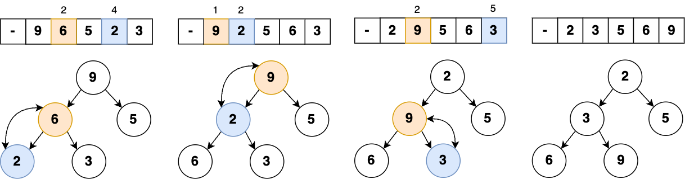

 
The **Heap** is a **Tree**-based data structure where the tree is a complete binary tree. It allows storing duplicates. Despite the **Tree**-based visualization, **Heap** is implemented using an array.
In many cases, the **Heap** data structure is also referred to as a **Priority Queue**.



A **complete binary tree** is a type of binary tree where all the levels are filled completely, except the lowest level nodes, which are filled from as left as possible.


## Types

#### Max-Heap

The key of the root node must be the <u>**greatest**</u> among all of its children. The same rule is applied for all sub-trees.

#### Min-Heap

The key of the root node must be the <u>**minimal**</u> among all of its children. The same rule is applied for all sub-trees.

## Operations

### Elements Access

- Current: `heap[i]`
- Parent: `heap[i / 2]`
- Left Child: `heap[2 * i]`
- Right Child: `heap[2 * i + 1]`


For simplicity in accessing elements, the implementation described below assumes that **heap indexing starts at 1**, not 0. The 0th element is filled with a **null** value.


### Peek

The process of retrieving the top element of the heap without deleting it.



```java
// Time Complexity: O(1)
public T peek() {
  return heap.size() == 1 ? null : heap.get(1);
}
```



### Insertion

1. Insert a new element to the end of the heap array
2. Compare the element's node with its parent (`i/2`)
    - If the parent's value is **larger** than the current node's value (`heap[i/2] > heap[i]`), we swap them and run step №2 again from the new position 
    - If the parent's value is **smaller** or **equal** we exit from the loop



```java
// Time Complexity: O(log N)
public void push(T value) {
  heap.add(value); // add value to the end

  int i = heap.size() - 1;
  while (i > 1 && heap.get(i) < heap.get(i / 2)) {
    // Swap child and parent node values until
    // the parent is less then the inserted value
    swap(i, i / 2);
    i = i / 2;
  }
}
```



### Deletion

The deletion process of the top element of the heap, and then organizing the heap and returning the deleted element with time complexity `O(log N)`.

1. Extract the top value (`heap[1]`)
2. Put the last node to the top (`heap[1] = heap[heap.length - 1]`)
3. Percolate the top node down until it's in the right position:
    - Pick a minimum of two children
    - Compare the picked minimum node to the current element
    - If the child is smaller, we swap the nodes



```java
// Time Complexity: O(log N)
public int poll() {
  if (heap.size() == 1) return null; // Heap is empty
  if (heap.size() == 2) return heap.remove(1); // Heap contains 1 element

  int result = heap.get(1); // Get first (root) element 

  // Move the last value to the root
  heap.set(1, heap.remove(heap.size() - 1));

  // Percolate root value down the heap
  int i = 1;
  while (i * 2 < heap.size()) {
    int minIdx = i * 2;
    int rightChildIdx = i * 2 + 1;

    if (rightChildIdx < heap.size() && heap.get(rightChildIdx) < heap.get(minIdx))
      minIdx = rightChildIdx;

    if (heap.get(i) < heap.get(minIdx)) break;

    swap(i, minIdx);
    i = minIdx;
  }
  
  return result;
}
```



### Heapify

The process of creating a heap from an array.



1. Move the `0`-index element to the end of the array
2. Go to the half of the array (`heap.length / 2`)
3. Percolate the node down until it's in the right position:
    - Pick a minimum of two children (`i/2` and `i/2+1`)
    - Compare the minimum child to the parent
    - If the child is smaller, we swap the node



```java
// Time Complexity: O(N)
private void heapify(int[] items) {
  heap = new ArrayList<>();
  heap.add(null);  // first index element is unused

  // Add all items to the heap
  for (int item : items) heap.add(item);

  // Percolate values down the heap
  for (int i = heap.size() / 2; i >= 1; i--)
    percolateDown(i); // see "poll()" method
}
```



## Usage

- **Priority Queue** is commonly implemented using the **Heap** data structure because it performs its operations in `O(log N)` time
- **Heap Sort** algorithm uses the **Heap** to sort an array in `O(N log N)` time
- Order statistics problems (to find the Kth smallest/largest element in an array) can be efficiently solved with a **Heap**
- In operating systems for load balancing and interrupt handling

## Advantages
- Quick access to the top element - `O(1)`
- Efficient Insertion and Deletion operations - `O(log N)`

## Disadvantages
- Not suitable for retrieving random elements - `O(N)`
- Slower than arrays and linked lists for non-priority queue operations

## Implementation


The complete **Heap** implementation is available .


## Resources

- [📝 6.11 Binary Heap Implementation](https://runestone.academy/ns/books/published/javads/trees_binary-heap-implementation.html)
- [🎓 Algorithms, Part I - Priority Queues](https://www.coursera.org/learn/algorithms-part1)
