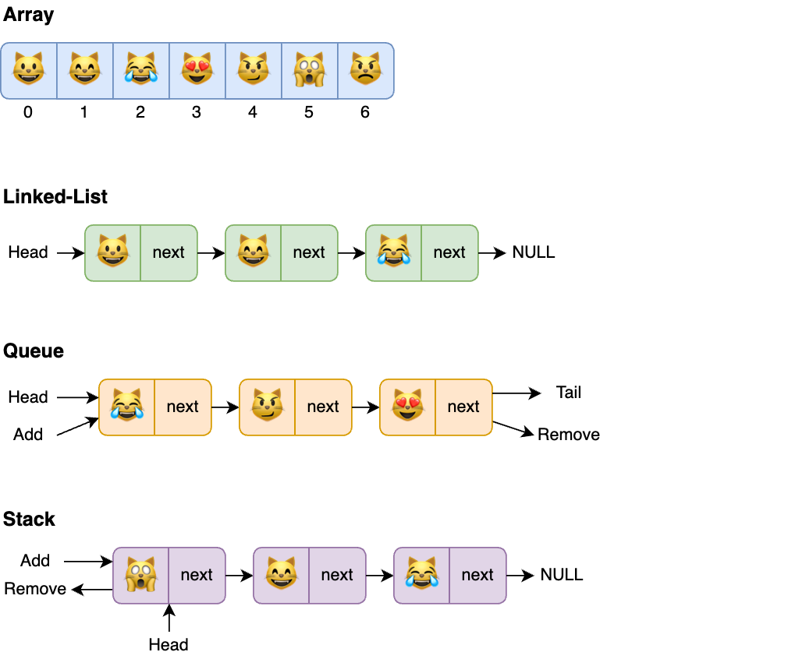
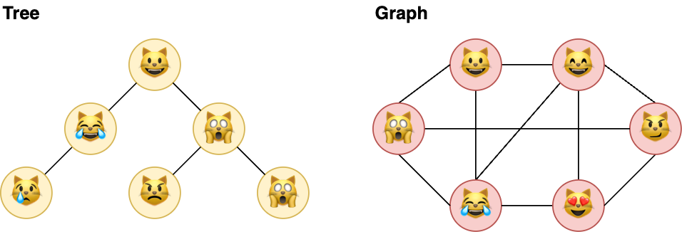

## Description

In coding or software engineering, we _manipulate data_. Most of the time, we are dealing with some sort of **input** data, whether it be a list of strings, numbers, graphs of user connections, etc. On that data we need to _perform specific actions_ and return the result **output** that might be displayed to the user of stored somewhere.

Manipulating data involves structuring that data, organizing, and managing it. The correct choice of data structure allows major improvements in program efficiency.

A **Data Structure** is an arrangement of data in computer's memory. Data structures include arrays, queues, linked lists, stacks, graphs, and others. 

## Classification

The data structure can be **linear** or **non-linear**, depending on how elements are stored.

### Linear Data Structures

In this kind of data structure, the elements are stored sequentially (one after the other). These structures are typically easy to implement but they can be inefficient for data access operations. The common examples of liner structures are **array**, **linked-list**, **stack**, and **queue**.

Linear data structures might be **static** or **dynamic** in terms of memory usage:

- A **Static** data structure has a fixed memory size, making accessing its elements easier. The example is an **array**.
- **Dynamic** data structures do not fix memory size but determine the required amount in runtime. It allows us to use memory space efficiently and extend it on demand. Examples: **queue**, **stack**, and **linked-list**.

 

 

### Non-Linear Data Structures

Elements of non-linear data structures are not stored in an ordered sequence. Instead, they are stored in a specific hierarchy where one element can be connected to a few others. In this case, we cannot traverse all the elements in a single run. Examples: **tree** and **graph**.

 

 

## Overview

| Data Structure | Advantages | Disadvantages |
| --- | --- | --- |
| **Array** | Quick insertion Quick access by index | Slow search Slow deletion Fixed size |
| **Ordered Array** | Quicker search than unsorted array | Slow insertion and deletion Fixed size |
| **Stack** | Provides last-in, first-out access | Slow access to other items |
| **Queue** | Provides first-in, last-out access | Slow access to other items |
| **Linked List** | Quick insertion, deletion | Slow search |
| **Binary Tree** | Quick search, insertion | Complex deletion |
| **Red-Black Tree** | Quick search, insertion, deletion Tree always balanced | Complex |
| **2-3-4 Tree** | Quick search, insertion, deletion Tree always balanced | Complex |
| **Hash Table** | Fast access for known key Fast insertion | Slow, if key isn't known Inefficient memory usage |
| **Heap** | Fast insertion, deletion Fast access to largest item | Slow access to other items |
| **Graph** | Models real-world situations | Some algorithms are slow and complex |

## Resources

- 📝 [Google - Data Structures & Algorithms](https://techdevguide.withgoogle.com/paths/data-structures-and-algorithms/)
- 📹 [The Roadmap - What are Data Structures? | Illustrated Data Structures](https://www.youtube.com/watch?v=9rhT3P1MDHk&list=PLkZYeFmDuaN2-KUIv-mvbjfKszIGJ4FaY&ab_channel=theroadmap)
- 📝 [Programiz - Data Structure and Types](https://www.programiz.com/dsa/data-structure-types)
- 📝 [Geeks For Geeks - Data Structures Tutorial](https://www.geeksforgeeks.org/data-structures/)