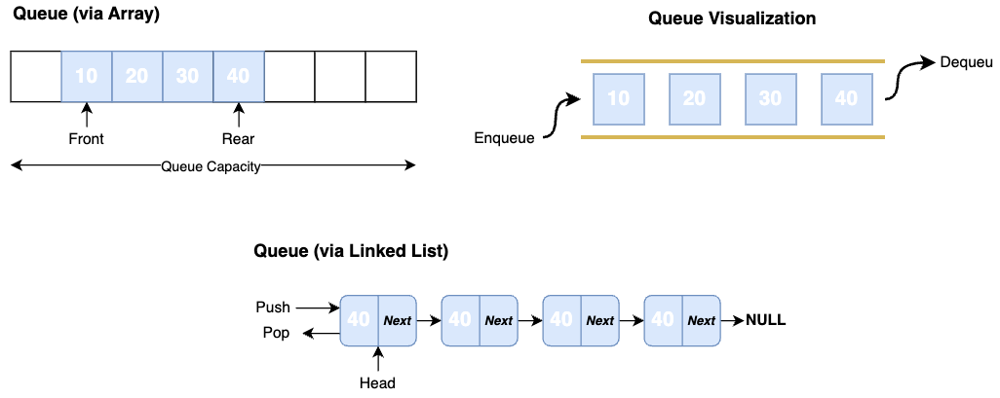

## Overview

Similarly to a **Stack**, a **Queue** is a _linear data structure_ where the elements are inserted and removed in a specific order. It follows the **FIFO** (First In, Last Out) principle, where the first added element is the first one to be removed.



### Queue Types

- **Input Restricted Queue**. A queue, where the elements can be retrieved only from one end, but deletion can be done from both ends.
- **Output Restricted Queue**. A queue, where the elements can be retrieved from both ends, but deletion can be done from only one end.
- **Circular Queue**. A queue, where the last position is connected back to the first position.
- **Dequeue (Double-Ended Queue)**. Insertion and deletion operations can be performed for both ends.
- **Priority Queue**. A queue, where the elements are retrieved based on their priority, not the insertion order.

### Operations

| Operation | Description | Time Complexity |
| --- | --- | --- |
| **Enqueue** | Add an element to the end of the queue | `O(1)` |
| **Dequeue** | Retrieve and remove an element from the start of the queue | `O(1)` |
| **Peek** | Retrieve an element from the start of the queue without removing it | `O(1)` |

### Advantages
- Queues are used in the implementation of other data structures
- Queues provide constant time complexity for its core operations

### Disadvantages
- Not suitable for searching accessing its middle elements
- Limited size on an array implementation
- Additional space required on a linked list implementation

## Use Cases

- Operating systems (CPU, disk scheduling)
- Breath-First Search
- To handle multiple producers by a single consumer

## Implementation

### Custom Implementation

A **Queue** can be represented as an array or a linked list. In the case of an array, we need to store the indexes of the _first_ and _last_ stored elements. For the linked list, we need to have pointers to the _head_ and _tail_ list nodes.


**Queue** implementation using an _array_ causes memory wastage because the space of the dequeued element can stay unused.




```java
public class QueueArray<T> {
  private T[] queue;
  private int front = -1; 
  private int rear = -1; 
  
  public QueueArray(int capacity) {
    this.queue = (T[]) new Object[capacity];
  }

  public void enqueue(T value) {
    if (isFull()) return;

    queue[++rear] = value;
    if (front == -1) front++;
  }

  public T dequeue() {
    if (isEmpty()) return null;

    if (front == rear) {
      T value = queue[front];
      front = rear = -1;
      return value;
    }
    return queue[front++];
  }

  public boolean isEmpty() {
    return front == -1 && rear == -1;
  }

  public boolean isFull() {
    return rear >= (queue.length - 1);
  }
}
```


```java
public class QueueLinkedList<T> {
  private class Node {
    public T value;
    public Node next;
  }

  private Node head;    // "end" of the queue
  private Node tail;    // "start" of the queue

  // Add an element to the start of the queue
  public void enqueue(T value) {
    Node node = new Node();
    node.value = value;

    if (isEmpty()) {
      head = node;
    } else {
      tail.next = node;
    }

    tail = node;
  }

  // Take and remove the element at the end of the queue
  public T dequeue() {
    T value = head.value;

    if (tail == head) tail = head.next;
    head = head.next;

    return value;
  }

  public T peek() {
    return head.value;
  }
}
```




The complete **QueueArray** and **QueueLinkedList** implementations are available .


### Built-in Examples



```java
ArrayDeque<String> queue = new ArrayDeque<>();
    
queue.add("First");
queue.add("Second");
queue.add("Third");

queue.peek();       // "First"
queue.poll();       // "First"
queue.size();       // 2
queue.isEmpty();    // false
```


```java
LinkedList<String> queue = new LinkedList<>();
    
queue.add("First");
queue.add("Second");
queue.add("Third");

queue.peek();       // "First"
queue.poll();       // "First"
queue.size();       // 2
queue.isEmpty();    // false
```


```typescript
const queue: string[] = [];

queue.push("First");
queue.push("Second");
queue.push("Third");

queue[0];           // "First"
queue.shift();      // "First"
queue.length;       // 2      
queue.length === 0; // false
```



### Resources

- 📹 [Queue Data Structure | Illustrated Data Structures](https://www.youtube.com/watch?v=mDCi1lXd9hc&ab_channel=theroadmap)
- 📝 [GeeksForGeeks - Introduction to Queue](https://www.geeksforgeeks.org/introduction-to-queue-data-structure-and-algorithm-tutorials/)
- 📝 [FreeCodeCamp - Queue Data Structure](https://www.freecodecamp.org/news/queue-data-structure-definition-and-java-example-code/)