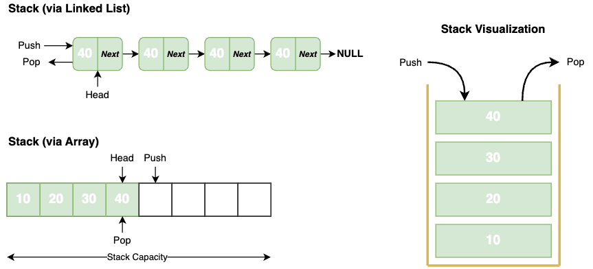

## Overview

A Stack is a _linear data structure_ where the elements are inserted and removed in a particular order. **Stack** examines the item most recently added - **LIFO** (Last In, First Out).

- A **Stack** can be implemented with either an array or a linked list.
- Each stack operation takes constant time (`O(1)`).



### Stack Types

- **Fixed Size**. It has a predefined capacity and cannot be re-sized dynamically in runtime. If the stack is full, pushing a new element will cause an overflow error.
- **Dynamic size**. It can adjust its capacity based on the number of stored elements. It can be implemented using a re-sizable array or a linked list.

### Operations

| Operation | Description | Time Complexity |
| --- | --- | --- |
| **Push** | Insert an element at the top of the stack | `O(1)` |
| **Peek** | Retrieve the top element of the stack without removing it | `O(1)` |
| **Pop** | Retrieve the top element of the stack and removing it | `O(1)` |
| **Size** | Get the number of elements in the stack | `O(1)` |

### Advantages

- Easy to implement
- It has a lot of applications in different algorithms

### Disadvantages

- Random accessing is not possible
- Requires extra memory for pointers if implemented as a LinkedList
- It doesn't provide a dynamic size if implemented as an Array

## Use Cases

- Program execution stack trace (nested and recursive function calls)
- Backtracking (find the path through a maze)
- Depth-First Search
- Implementing Undo/Redo operations in various editor apps
- Balanced Brackets (check if all the opened brackets are closed)
- Browser history navigation

## Implementation

To implement the **Stack**, we need to maintain a pointer referring to the top element.



```java
public class StackArray<T> {
  private T[] stack;
  private int headIndex = -1;

  // Initialize stack with a custom capacity
  public StackArray(int capacity) {
    stack = (T[]) new Object[capacity];
  }

  // Insert a new element onto the stack
  public void push(T value) {
    stack[++headIndex] = value;
  }

  // Retrieve the top element and delete it
  public T pop() {
    T value = stack[headIndex];
    stack[headIndex--] = null;
    return value;
  }

  // Retrieve the top element without deleting it
  public T peek() {
    return stack[headIndex];
  }
}
```


```java
public class StackLinkedList<T> {
  private class Node {
    public T value;
    public Node next;
  }

  private Node head;

  // Insert a new element onto the stack
  public void push(T value) {
    Node node = new Node();
    node.value = value;
    node.next = head;

    head = node;
  }

  // Retrieve the top element and delete it
  public T pop() {
    T value = head.value;
    head = head.next;
    return value;
  }

  // Retrieve the top element without deleting it
  public T peek() {
    return head.value;
  }
}
```




The complete **StackArray** and **StackLinkedList** implementations are available .


### Built-in Examples



```java
Stack<String> stack = new Stack<>();

stack.push("First");
stack.push("Second");
stack.push("Third");

stack.peek();         // "Third"
stack.pop();          // "Third"
stack.size();         // 2
stack.empty();        // false
stack.firstElement(); // "First"
stack.lastElement();  // "Second"
stack.capacity();     // 10
```


```java
Deque<String> stack = new ArrayDeque<>();

stack.push("First");
stack.push("Second");
stack.push("Third");

stack.peek();         // "Third"
stack.pop();          // "Third"
stack.size();         // 2
stack.isEmpty();      // false
stack.peekLast();     // "First"
stack.peekFirst();    // "Second"
stack.getLast();      // "First"
stack.getFirst();     // "Second"
```


```typescript
const stack: string[] = [];

stack.push("First");
stack.push("Second");
stack.push("Third");

stack[stack.length - 1]; // "Third"
stack.pop();             // "Third"
stack.length;            // 2      
stack.length === 0;      // false
```



### Resources

- 📹 [Stack Data Structure | Illustrated Data Structures](https://www.youtube.com/watch?v=I5lq6sCuABE&ab_channel=theroadmap)
- 📝 [GeeksForGeeks - Introduction to Stack](https://www.geeksforgeeks.org/introduction-to-stack-data-structure-and-algorithm-tutorials/?ref=lbp)