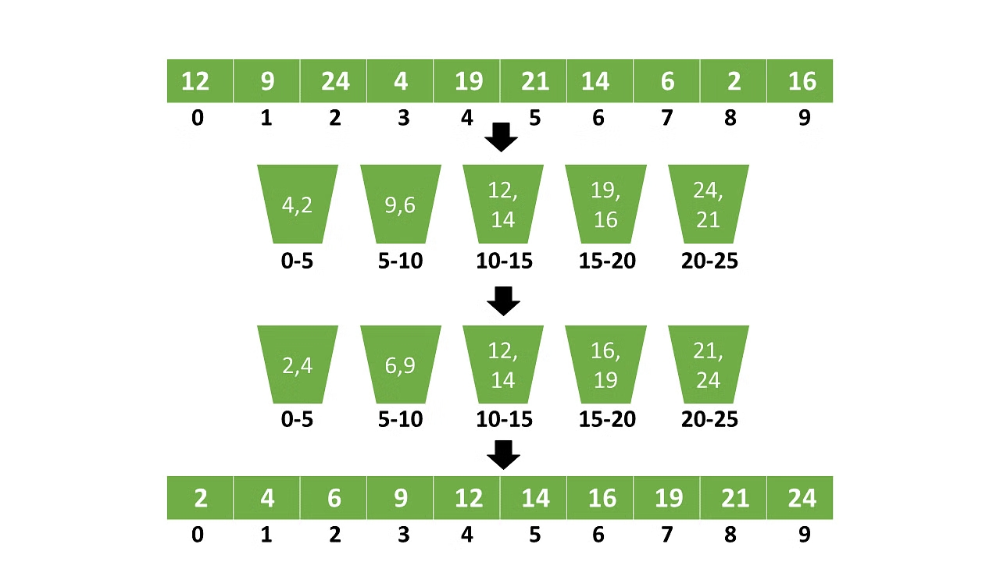

**Bucket sort** involves dividing elements into various groups (buckets). These buckets are created by uniformly distributing the elements. Once elements are distributed, they can be sorted using any other sorting algorithm. Finally, the sorted elements are gathered together in an ordered way.

### Algorithm

1. Partition the range into a fixed number of buckets.
2. Distribute the elements between the appropriate buckets.
3. Sort each bucket individually using some sorting algorithm.
4. Concatenate all the sorted buckets.



### Complexity

| Best | Average | Worst | Space | Stability |
| --- | --- | --- | --- | --- |
| O(n+k) | O(n) | O(n<sup>2</sup>) | O(n+k) | **Yes** |

- **Best Case:** `O(n)`<br/>
  The case when the elements are uniformly distributed in the buckets. It becomes even better if the elements inside the buckets are already sorted.

- **Average Case:** `O(n)`<br/>
  When the elements are distributed randomly, even if the elements are not distributed uniformly, bucket sort runs in linear time.

- **Worst Case:** `O(n^2)`<br/>
  Elements might be in a closed range, which leads to non-uniform distribution. It becomes worse when the elements are in reverse order.

### Advantages

- Bucket sort reduces the number of comparisons
- It's quick because of the uniform distribution of elements

### Disadvantages

- Some extra space is required to sort the buckets

### Common use-cases

- With floating point values
- When input is distributed uniformly over a range

### Implementation



```java
public static void bucketSort(double[] elements) {
  int n = elements.length;

  // 1. Initialize n empty buckets
  @SuppressWarnings("unchecked")
  Vector<Double>[] buckets = new Vector[n];
  for (int i = 0; i < n; i++)
    buckets[i] = new Vector<Double>();

  // 2. Distribute elements among the buckets
  for (double element : elements) {
    int bucketIndex = (int) (element * n);
    buckets[bucketIndex].add(element);
  }

  // 3. Sort individual buckets
  for (Vector<Double> vector : buckets) {
    Collections.sort(vector);
  }

  // 4. Gather bucket elements
  for (int i = 0, j = 0; i < n; i++) {
    for (Double element : buckets[i]) {
      elements[j++] = element;
    }
  }
}
```




The complete **Bucket Sort** implementation is available .

